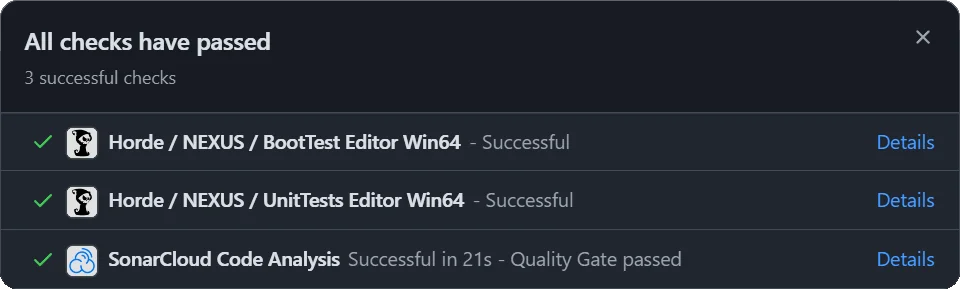

# Automation

Every change to `main` is exercised through CI before it shows up green on GitHub. This page describes what runs, where, and how often.

## Pipeline

Every `~5 min` the `main` branch is synchronized to a Perforce depot which gets picked up by our [Horde](https://horde.dotbunny.com:5001/project/nexus) instance. This triggers our [Test Runner](https://github.com/dotBunny/NEXUS/blob/main/TestProject/Build/Graph/TestRunner.xml) within a minute to run a `Boot Test`, as well as `Unit Tests` in the Editor (_Win64_). Horde then updates the commit status message in [GitHub](https://github.com/dotBunny/NEXUS/commits/main/) for the associated tests.



We use Horde + Perforce (rather than GitHub Actions) because the framework reuses Unreal's [BuildGraph](https://dev.epicgames.com/documentation/en-us/unreal-engine/buildgraph-script-anatomy-in-unreal-engine) tooling — `TestRunner.xml` layers directly onto Epic's `BuildAndTestProject.xml`. That gives us the same parallel-agent topology and shared-DDC behavior Epic uses internally.

## Scheduled Tests

| Test | Description | Cadence |
| :-- | :-- | :-- |
| `BootTest Editor Win64` | Compiles the project and verifies the Editor boots. | `1m` |
| `UnitTests Editor Win64` | Runs the NEXUS unit-test suite (`NEXUS.UnitTests`) in the Editor under `-nullrhi`. | `1m` |
| `PerfTests Editor Win64` | Runs the NEXUS performance-test suite (`NEXUS.PerfTests`) in the Editor. | `1d` |
| `FuncTests Editor Win64` | Runs project-level functional tests (`Project.`) in the Editor with rendering. | `1d` |

## Where Results Land

- **GitHub commit status** — the green/red dot next to a commit on the [NEXUS commit list](https://github.com/dotBunny/NEXUS/commits/main). The status name matches the test label column above.
- **Horde dashboard** — the [NEXUS project page](https://horde.dotbunny.com:5001/project/nexus) on the Horde server has the full job history, per-step logs, and the BuildGraph DAG.
- **Test reports** — each job archives the JSON test report and the Unreal Editor log, surfaced through Horde-side annotations so failures bubble to the top.

While thorough automation is a core pillar of the framework, real-world feedback from users still catches things that scheduled runs do not — please bubble up issues you see while using NEXUS in your own projects.

## Running Tests Locally

The same Editor automation suites can be invoked locally — useful when iterating on a fix before pushing. The exact commands and prerequisites are documented in the `running-tests` skill at [`TestProject/.claude/skills/running-tests/`](https://github.com/dotBunny/NEXUS/blob/main/TestProject/.claude/skills/running-tests/SKILL.md). Quick reference:

```powershell
# Unit tests (no rendering needed)
& "<UEROOT>\Engine\Binaries\Win64\UnrealEditor-Cmd.exe" "<NEXUSROOT>\TestProject\NEXUS.uproject" `
  -unattended -nopause -testexit="Automation Test Queue Empty" `
  -ExecCmds="Automation RunTest NEXUS.UnitTests;Quit" -nullrhi
```

Drop `-nullrhi` for functional tests; swap `NEXUS.UnitTests` for `NEXUS.PerfTests` for performance runs.

## Extras

### Code Coverage

A quick little command to help out with determining code coverage.

```shell
OpenCppCoverage.exe ^
--modules "**NEXUS**" --cover_children --optimized_build ^
--excluded_modules "**NEXUSModulesRules**" --excluded_modules "**NexusSharedSamples**" --excluded_modules "**Editor.dll" ^
--sources "Plugins\ActorPools\Source\NexusActorPools" ^
--sources "Plugins\Core\Source\NexusCore" ^
--sources "Plugins\DynamicRefs\Source\NexusDynamicRefs" ^
--sources "Plugins\Guardian\Source\NexusGuardian" ^
--sources "Plugins\Multiplayer\Source\NexusMultiplayer" ^
--sources "Plugins\Picker\Source\NexusPicker" ^
--sources "Plugins\UI\Source\NexusUI" ^
--excluded_sources .gen. --excluded_sources **\Tests\** --export_type html:TestProject\Saved\CodeCoverage\Report --export_type cobertura:TestProject\Saved\CodeCoverage\Report\cobertura.xml ^
-- D:\EGS\UE_5.7\Engine\Binaries\Win64\UnrealEditor.exe D:\Repositories\dotBunny\NEXUS\TestProject\NEXUS.uproject ^
-unattended -nopause -testexit="Automation Test Queue Empty" -ReportExportPath="Staging\TestResults" -log ^
-ExecCmds="Automation RunTest NEXUS.UnitTests+Tests.Nexus;Quit"
```