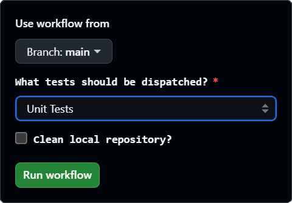

# Contributing

Thank you for your interest in contributing to the **NEXUS** Framework! ♥️ We appreciate all forms of contributions, big and small — every little bit helps move the needle forward.

Bug reports, bug fixes, documentation additions, features, code, coffee, etc., benefit everyone.

While items on the Roadmap correspond to our own needs and ambitions, that doesn’t mean that contributions should be limited to just those things. If you want to drop in a feature that you think would benefit others, *make a Pull Request!* (against `dev`).

## Coding Standard

We follow the published [Epic C++ Coding Standard](https://dev.epicgames.com/documentation/en-us/unreal-engine/epic-cplusplus-coding-standard-for-unreal-engine) wherever possible. There are some minor cases where we will diverge with an opinionated purpose, with inspirations from Michael Allar’s [UE5 Style Guide](https://github.com/Allar/ue5-style-guide/tree/v2) as well.

:::info[Editor Config]

Included with the project is an [EditorConfig](https://github.com/dotBunny/NEXUS/blob/main/TestProject/.editorconfig) which attempts to enforce our coding standard while working on the **TestProject**.

:::

### Choices

- Prefer to use `int32` over `int` to match typedef and remove any ambiguity between 32-bit and 64-bit values.

### Resharper Warnings

We disable warnings which are considered expected behaviour.

#### Potential GC Of Private Raw Pointers

```cpp
// ReSharper disable once CppUE4ProbableMemoryIssuesWithUObjectsInContainer
```

#### Enumeration Naming

```cpp
// ReSharper disable IdentifierTypo, CppUE4CodingStandardNamingViolationWarning
...
// ReSharper enable IdentifierTypo, CppUE4CodingStandardNamingViolationWarning
```

### SonarQube Analysis

[](https://sonarcloud.io/summary/overall?id=dotBunny_NEXUS&branch=main)

A special thanks to the folks at [SonarSource](https://www.sonarsource.com/) for the free static analysis of the framework, on _every_ commit. :heart:

#### Tags

We primarily are using a tag based exclusion method when a rule needs to be violated.

```cpp
// #SONARQUBE-DISABLE-<LANGUAGE>_<RULE> <reason>
...
// #SONARQUBE-ENABLE
```

#### Source File Exclusions

- `.github/**`
- `SourceAssets/**`
  
#### Ignore Issues on Multiple Criteria

| Rule Key Pattern | File Path Pattern | Choice |
| :-- | :-- | :-- |
| [`cpp:S3471`](https://sonarcloud.io/organizations/dotbunny/rules?open=cpp%3AS3471&rule_key=cpp%3AS3471), [`cpp:S3576`](https://sonarcloud.io/organizations/dotbunny/rules?open=cpp%3AS3576&rule_key=cpp%3AS3576) |  `**` | This is a developer choice; where the `override` and `virtual` specifiers are used easily identify methods being replaced from the `Super`. This **also** matches the practice done in the Unreal Engine codebase. |

## AI Policy

**Touchy subject!** At times, we have used [JetBrains AI](https://www.jetbrains.com/ai/) to generate the initial code summaries/documentation. We then review and edit them accordingly; this has allowed us to accelerate the code documentation process. A common prompt we have used is:

```prompt title="AI Prompt"
id like a blurb explaining what this class does and is used for
```

Where the class/file and classes/files that references the class are attached for context. This is the extent to which AI is involved in this project's codebase.

## Automation

Every commit to the `main` branch (and PRs before being merged) undergoes an [initial smoke test](https://github.com/dotBunny/NEXUS/actions/workflows/push-unit-tests.yml), followed by more intensive tests (including daily [performance](https://github.com/dotBunny/NEXUS/actions/workflows/schedule-performance-tests.yml) and [functional](https://github.com/dotBunny/NEXUS/actions/workflows/dispatch-functional-tests.yml) tests, as well as [packaging](https://github.com/dotBunny/NEXUS/actions/workflows/dispatch-buildcookrun.yml)). This allows us to have some level of confidence in the framework and its capabilities.

There is also a [manual test dispatcher](https://github.com/dotBunny/NEXUS/actions/workflows/manual-tests.yml) (for approved contributors), which allows us to run tests ad hoc as needed. We also have some built GitHub actions which parse both the results JSON and the Unreal Editor log to bubble up details for ease of access.



While thorough testing is a core pillar of the framework, it is also important that we listen to real-world feedback from users of the framework to provide further validation of NEXUS. That’s a call out to everyone using the plugin to bubble up things when they happen!


## Assisting With Documentaion

The documentation is meant to be a living document that allows for easy additions and corrections. The documentation is statically generated from a GitHub repository that can be easily edited. Each page of the documentation has a corresponding **Edit this page** link at the bottom. 

*Let's not kid ourselves...* We are all a little lacking in documenting our work area, so this is our best bet at creating a spot to collate formalized documentation. Code documentation should still be present to mark up methods and other elements. 

For more information about how to work with the documentation, please see its [repository](https://github.com/dotBunny/NEXUS.Docs).

## Source Assets

All of the [source assets](https://github.com/dotBunny/NEXUS/tree/main/SourceAssets) used by the **NEXUS** Framework are included in the repository. We elected to use [Affinity Designer](https://affinity.serif.com/en-us/designer/), [Affinity Photo](https://affinity.serif.com/en-us/photo/), and [Blender](https://www.blender.org/) as our tools of choice. This should allow for easier access for other developers who are tired of Adobe. 