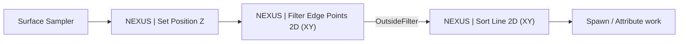

import DocCardList from '@theme/DocCardList';

# Elements

The [PCG](https://dev.epicgames.com/documentation/en-us/unreal-engine/procedural-content-generation-framework-in-unreal-engine) nodes NEXUS ships, all under the **NEXUS** category in the PCG graph editor. Mirrors the layout of `NexusCore/Public/PCG/Elements/`.

They exist because a handful of jobs come up constantly and PCG's stock nodes solve them awkwardly. A grid of points is easy to produce and hard to turn into *an ordered boundary with corners identified* — which is what you need before you can place bones, walls, or junctions along it. Others are small on their own but tedious to rebuild out of primitives each time: offsetting and turning alternate rows, snapping a random quarter-turn, reading a marker component back as a point.

A typical layout chain flattens a sampled volume onto one plane, keeps only its border, then walks that border into an ordered line with each point classified:

## What Is Here

| Node | Does |
| :-- | :-- |
| [Set Position Z](set-position-z.md) | Snaps every point to one world Z, so the 2D nodes downstream are working on an actual plane. |
| [Filter Edge Points 2D (XY)](filter-edge-points-2d-xy.md) | Splits a filled grid into its interior and its border, optionally peeling several rings deep. |
| [Sort Line 2D (XY)](sort-line-2d-xy.md) | Walks a border into an ordered chain, naming corners, walls and segments as it goes. |
| [Adjust Rows](adjust-rows.md) | Groups points into rows, then offsets and turns alternate ones — a running-bond layout, interlocked. |
| [Random Step Rotation](random-step-rotation.md) | Adds a random whole number of fixed-size turns to each point's rotation. |
| [Get Component Points](get-component-points.md) | Emits one point per [Target Point](../target-point-component.md) marker on the actor running the graph. |

World Assembly ships two further nodes that read live junction data out of the world rather than shaping points. They are documented alongside the component they read — see [Junction Component → PCG Integration](../../../../world-assembly/types/junction-component.md#pcg-integration).

## The Settings / Element Split

Every node here is a pair, which is PCG's own convention rather than anything NEXUS invented:

- **`UN…Settings`** (a `UPCGSettings`) is the node as you see it in the graph — its title, colour, pins, and authored properties.
- **`FN…Element`** (an `IPCGElement`) is the executor. It holds no state; it reads the settings and transforms the data.

The pages below document the settings half, since that is the half you configure. Where the element half carries behaviour worth knowing — caching, threading, testable helpers — it is called out on the page.

## Node Colours

Node title colour groups the nodes by what they do, using the [shared palette constants](../../color.md#constants):

| Constant | Nodes |
| :-- | :-- |
| `SortElement` | Sort Line 2D (XY), Adjust Rows, Random Step Rotation — anything that reorders or reorients points. |
| `FilterElement` | Filter Edge Points 2D (XY) — anything that splits a set. |
| `GetElement` | Get Component Points — anything that reads state in and emits points. |

<DocCardList />
