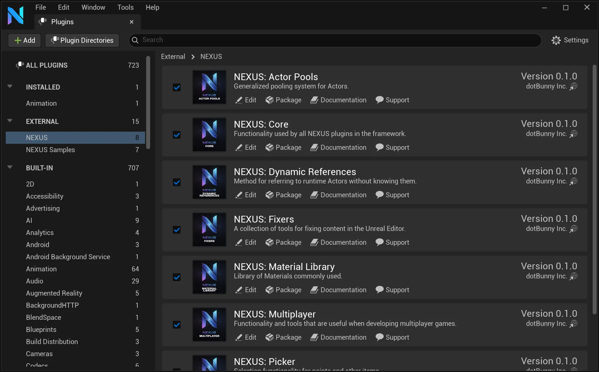
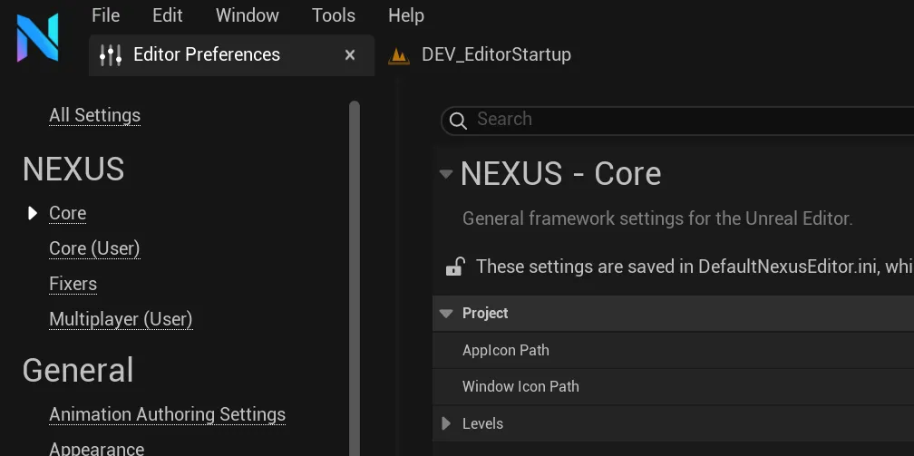

# Configuration

## Plugins À La Carte

By going to the `Edit -> Plugins` you can configure what parts of the **NEXUS** Framework are loaded.

### NEXUS

A full list of the available plugins in the **NEXUS** Framework, with only [NEXUS: Core](/docs/plugins/core/) being enabled by default. This pattern enables users to selectively utilize only what they need for their project, minimizing any additional overhead that plugins may cause.

:::tip

Don't forget to update any build targets with references to any plugins used.

:::

### NEXUS Samples

For many plugins, there is a counterpart plugin that houses sample content. They’re broken out into individuals to allow for fine-grain control of inclusion into your project. Additionally, there is a [TestProject](/docs/getting-started/test-project/) at the root of the repository, which serves as a showcase project for all the plugins and hosts all our functional tests

## Editor Preferences

Depending on the plugin, corresponding entries will appear in the **NEXUS** section of the **Editor Preferences**.

:::info

Any section ending with `(User)` denotes that all settings in that category are saved on the local users machine, and are not shared amongst other developers.

:::