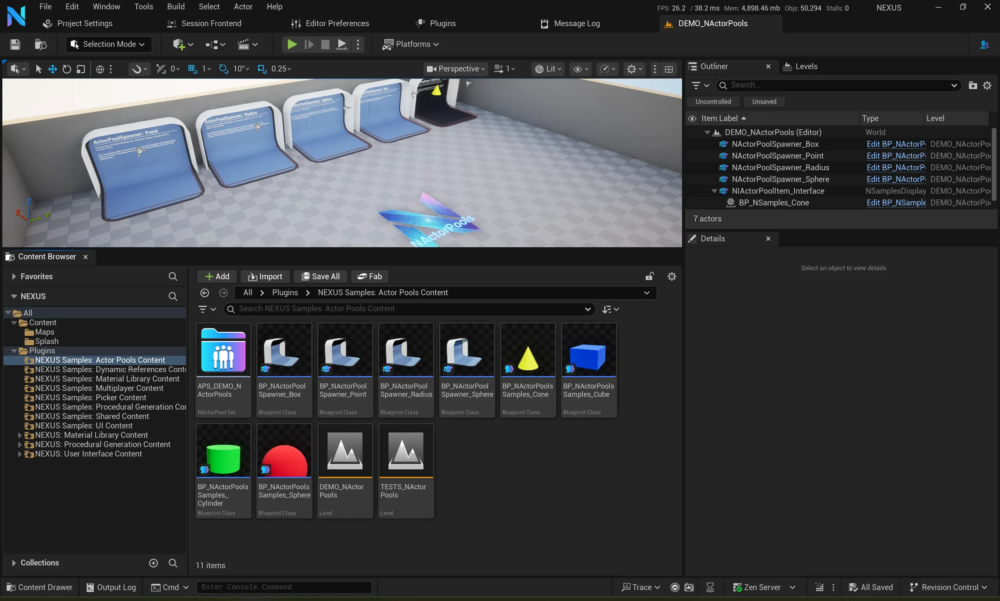

# Test Project

Included with the framework is a project that serves two purposes.

Primarily to demonstrate some of the functionality provided by the framework and its plugins in an easy-to-consume manner. Content is on display in a dedicated `DEMO_` prefixed levels for each respective plugin, with example Blueprint-based content to view as well.

The secondary part is where the `DEMO_` prefixed levels are used as sub-levels to the `TEST_` prefixed levels that then run functional tests on the content displays.

## Finding

The project is right at the root of the repository, under the `TestProject` folder. There is a `NEXUS.uproject` that can be quickly opened using a rocket-build there.

## Controls

The samples project contains some custom input to assist with taking screenshots for this documentation.

|Key|Description|
|:--|---|
|`Tab`, `}`| Select next `NSamplesDisplayActor`'s camera. |
| `{` | Select previous `NSamplesDisplayActor`'s camera. |
| `Backspace` | Toggle the HUD's visibility. |
| `\` | Return camera view to pawn. |
| `F12` | Take hi-rez screenshot, saving to the default `<ProjectFolder>\Saved\Screenshots`. |
| `F10` | Start automatic screenshot run. |
| `=` | Increase screenshot resolution multiplier. |
| `-` | Decrease screenshot resolution multiplier. |