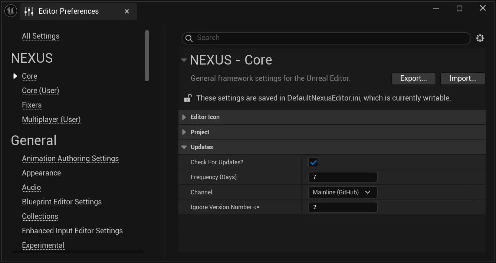
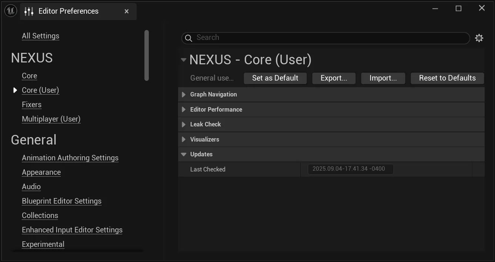

# Updates

A simple system to notify you developers of when updates are available to the **NEXUS** Framework.

## Settings

Customizing the behaviour and frequency of the update check can be done in the Editor Preferences under  `NEXUS > Core > Updates`.

| Setting | Description | Default |
| --- | :-- | :-- | 
| `Check For Updates` | Should update checks be made?  | `true` |
| `Frequency (Days)` | After how many days should an update check be made. | `7` |
| `Channel` | What channel to monitor for updates: `Mainline`, `Development` or a `Custom` one. | `Mainline` |
| `Custom Query URI` | [`Channel==Custom`] A fully qualified URI to the `NCoreMinimal.h` file located in a custom repository to be checked as the source of updates. | `<empty>` |
| `Custom Update URI` |  [`Channel==Custom`] A fully qualified URI to open when an updated is detected and requested. | `<empty>` |
| `Ignore Version Number <=` | A project settable version number that is compared against `N_VERSION_NUMBER` to determine if an update should be ignored. Allowing developers to set up ignores for the notification project-wide based on customized versions. | `N_VERSION_NUMBER` |

## Last Checked

There is a locally saved timestamp in a developer's workspace that is viewable in `NEXUS > Core (User) > Updates`.

