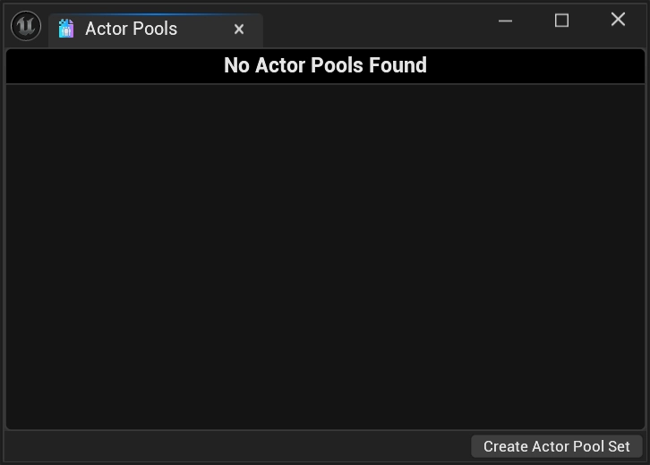
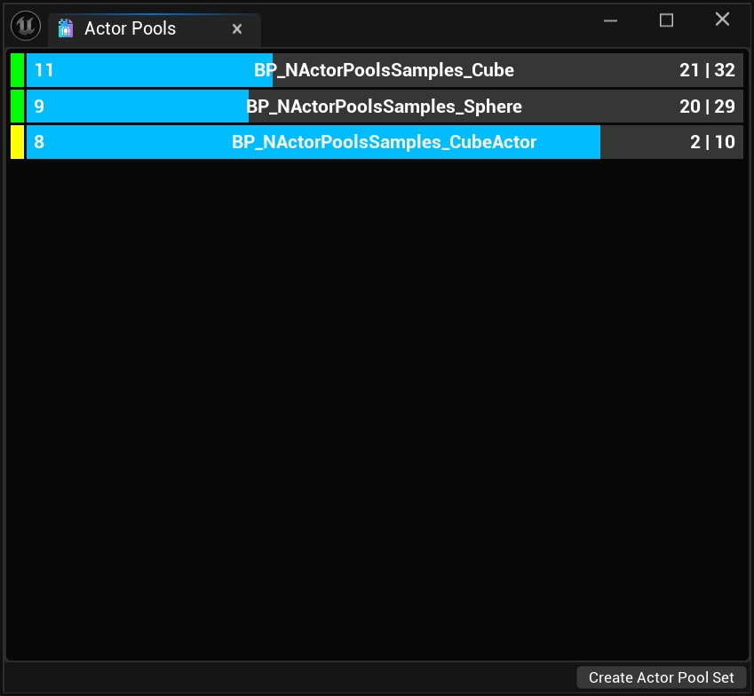

import TypeDetails from '../../../src/components/TypeDetails';

# Developer Overlay

<TypeDetails icon="/assets/svg/actor-pools/actor-pool.svg" iconType="img" base="UNDeveloperOverlay" type="UNActorPoolsDeveloperOverlay" typeExtra="" headerFile="NexusActorPools/Public/NActorPoolsDeveloperOverlay.h" />

By going to `Tools > NEXUS > Actor Pools`, you can create an [UNEditorUtilityWidget](/docs/plugins/ui/editor-types/editor-utility-widget/) wrapped version of `/NexusActorPools/WB_NActorPoolsDeveloperOverlay` which will show the real-time stats of all `FNActorPools`.

## Understanding The Bars

The number at the left-most part of the progress bar represents the total number of `AActors` that are currently considered available (**in**) to **Spawn** from the [FNActorPool](types/actor-pool.md). For the pools above, this would be `12` for the `BP_NActorPoolsSamples_Cube` pool, and `8` for the `BP_NActorPoolsSamples_Sphere` pool.

In the middle of the progress bar is the `AActor`/[FNActorPool](types/actor-pool.md) name, as well as the `UWorld` that the pool is located in.

The final set of numbers represents the total number of `AActors` that are currently spawned (**out**) from the [FNActorPool](types/actor-pool.md), and the total number of `AActors` that the [FNActorPool](types/actor-pool.md) has under it's ownership. In the case of the pools above, this would be `21` spawned and `21` owned `AActors` for the `BP_NActorPoolsSamples_Cube` pool, and `33` spawned and `29` owned `AActors` for the `BP_NActorPoolsSamples_Sphere` pool.

:::info

An `*` beside the [FNActorPool](types/actor-pool.md) name indicates that the `AActor` does not implement the `INActorPoolItem` interface.

:::

The actual progress bar itself represents the overall health of the [FNActorPool](types/actor-pool.md) in terms of how many `AActors` are available to be spawned in contrast to the overall owned `AActors`.

:::tip

This overlay (`WB_NActorPoolsDeveloperOverlay`) can be included in packaged builds and  will function just like an `UUserWidget`-based widget.

:::

## Editor-Only Features

At the bottom of the `EditorUtilityWidget` is a button bar that houses the `Create Actor Pool Set` button.

Clicking this button will save out a [UNActorPoolSet](types/actor-pool-set.md) based on the currently known [FNActorPool](types/actor-pool.md).