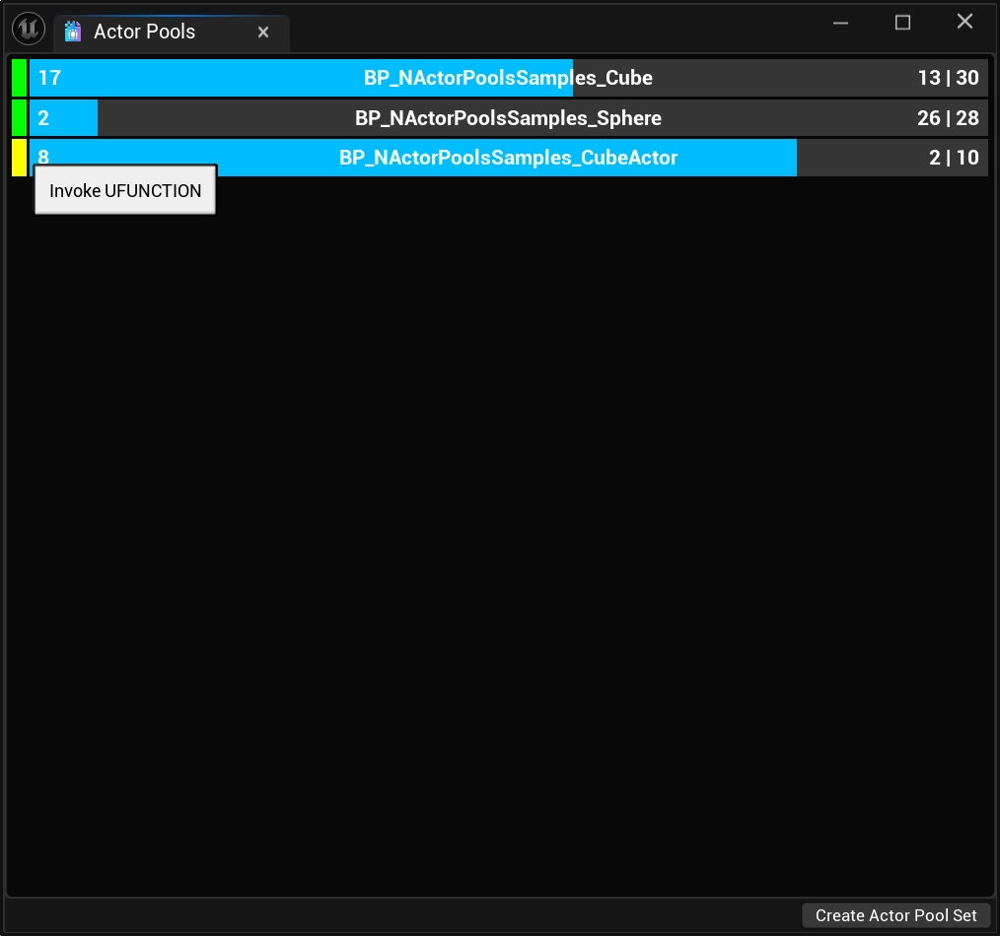
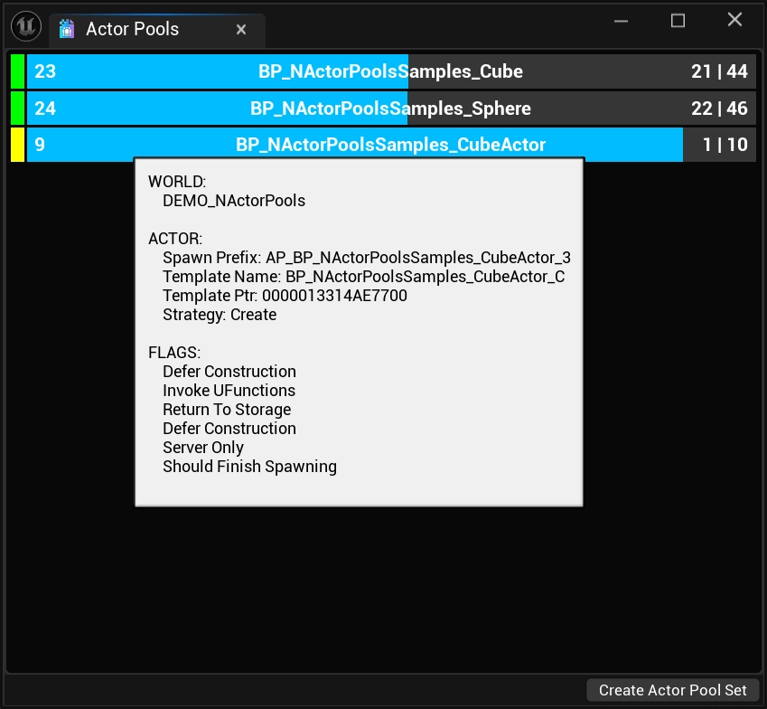

import TypeDetails from '../../../src/components/TypeDetails';

# Developer Overlay

<TypeDetails icon="/assets/svg/actor-pools/actor-pool.svg" iconType="img" base="UNDeveloperOverlay" type="UNActorPoolsDeveloperOverlay" typeExtra="" headerFile="NexusActorPools/Public/NActorPoolsDeveloperOverlay.h" />

By going to `Tools > NEXUS > Actor Pools`, you can create an [UNEditorUtilityWidget](/docs/plugins/ui/editor-types/editor-utility-widget/) wrapped version of `/NexusActorPools/WB_NActorPoolsDeveloperOverlay` which will show the real-time stats of all `FNActorPools`.

:::tip

This overlay (`WB_NActorPoolsDeveloperOverlay`) can be included in packaged builds and  will function just like an `UUserWidget`-based widget.

:::

## Understanding The Bars

### Text
The number at the left-most part of the progress bar represents the total number of `AActors` that are currently considered available (**in**) to **Spawn** from the [FNActorPool](types/actor-pool.md). For the pools above, this would be `11` for the `BP_NActorPoolsSamples_Cube` pool, and `9` for the `BP_NActorPoolsSamples_Sphere` pool.

In the middle of the progress bar is the `AActor`/[FNActorPool](types/actor-pool.md) name.

The final set of numbers represents the total number of `AActors` that are currently spawned (**out**) from the [FNActorPool](types/actor-pool.md), and the total number of `AActors` that the [FNActorPool](types/actor-pool.md) has under it's ownership. In the case of the pools above, this would be `21` spawned and `32` owned `AActors` for the `BP_NActorPoolsSamples_Cube` pool, and `20` spawned and `29` owned `AActors` for the `BP_NActorPoolsSamples_Sphere` pool.

## Callback Color Coding

At the start of the bar entry for an [FNActorPool](types/actor-pool.md) is a color swatch. This is an _important_ indicator of the performance cost incurred during the different events that occur with the pool.

| Color | Description |
| :-- | :-- |
| <code class="swatch blue">Blue</code> | No callbacks are made by the [FNActorPool](types/actor-pool.md). | 
| <code class="swatch green">Green</code> | The [FNActorPool](types/actor-pool.md)'s template `AActor` class implements the [INActorPoolitem](types/actor-pool-item.md) interface, providing the fastest possible callbacks for the [FNActorPool](types/actor-pool.md). |
| <code class="swatch yellow">Yellow</code> | The [FNActorPool](types/actor-pool.md) has been directed (via settings flags) to invoke any **UFUNCTION** methods (`OnCreatedByActorPool`, `OnSpawnedFromActorPool`, `OnReturnToActorPool`, and `OnDestroyedByActorPool`) found on the `AActor`. |

## Tooltips

### Swatch Tooltip

A simple reminder of what the color specifically means when it comes to the performance cost of events triggered by the [FNActorPool](types/actor-pool.md).

### Progress Bar Tooltip

A more complex tooltip indicating what `UWorld` a [FNActorPool](types/actor-pool.md) resides in as well as details related to its function.

| Item | Description |
| :-- | :-- |
| Spawn Prefix | The prefix of `AActors` spawned from this [FNActorPool](types/actor-pool.md). This is useful to visually verify ownership of `AActors` to a specific [FNActorPool](types/actor-pool.md). This is not available available in **release** builds. |
| Template Name | The name of the template (thing that will be spawned) associated with the [FNActorPool](types/actor-pool.md). This effectively should always be the center-text of the progress bar, without the `_C` suffix. |
| Template Ptr | The raw pointer to the template, this is useful for debugging issues where duplicate pools have been made for `AActors`; this can originate from custom-loading solutions. |
| Strategy | The `AActor` creation [strategy](types/actor-pool-settings.md#creation-strategies) that the [FNActorPool](types/actor-pool.md) is using. |

The last section of the tooltip lists all of the flags that are set via the pools [settings](types/actor-pool-settings.md).

## Editor-Only Features

At the bottom of the `EditorUtilityWidget` is a button bar that houses the `Create Actor Pool Set` button.

Clicking this button will write out a [UNActorPoolSet](types/actor-pool-set.md) based on the currently known [FNActorPool](types/actor-pool.md).

:::warning 

The asset still needs to be saved to disk as it was written out during **Play-In-Editor**.

:::