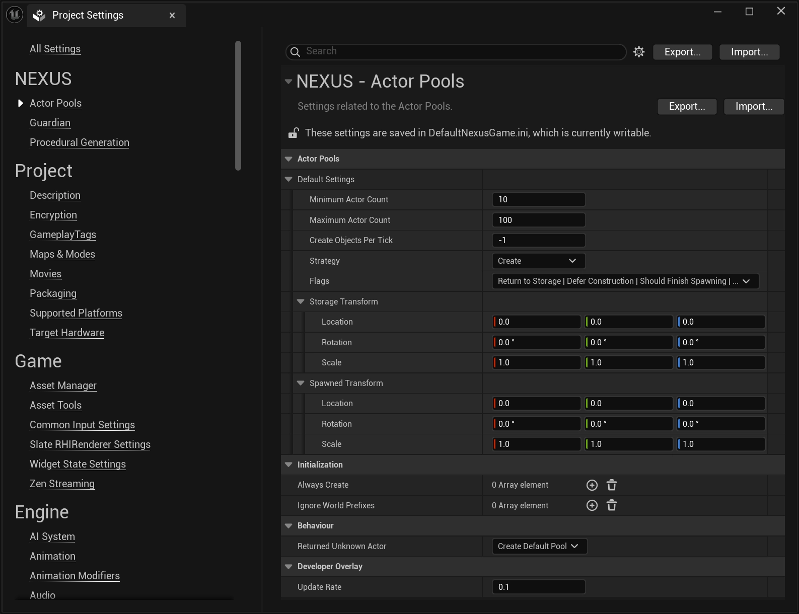

# Settings

From the `Edit > Project Settings` window, find the **Actor Pools** section.

## Configuration Options

| Setting | Description | Default |
| --- | :-- | :-- | 
| `Default Settings` | Used when creating an [FNActorPool](types/actor-pool.md) without providing a [FNActorPoolSettings](types/actor-pool-settings.md); this often occurs when you request a specific `AActor` without having already created an [FNActorPool](types/actor-pool.md) for it and follows that prescribed behaviour.  | `FNActorPoolSettings` |
| `Always Create` | An array of [UNActorPoolSet](types/actor-pool-set.md) that will always have their corresponding [FNActorPool](types/actor-pool.md) created when a world is loaded. | `TArray<UNActorPoolSet>` |
| `Ignore World Prefixes` | Prefixes of worlds to be ignored when automatically populating pools, for example `DEV_`. | `TArray<FString>` |
| `Returned Unknown Actor` | What should happen when an `AActor` is returned through the [UNActorPoolSubsystem](types/actor-pool-subsystem.md) which has no [FNActorPool](types/actor-pool.md) associated to it. | `ENActorPoolUnknownBehaviour::Destroy` |
| `Update Rate` |  How often the `UNActorPoolsDeveloperOverlay` should pool `FNActorPool` for statistics. | `0.1f` |