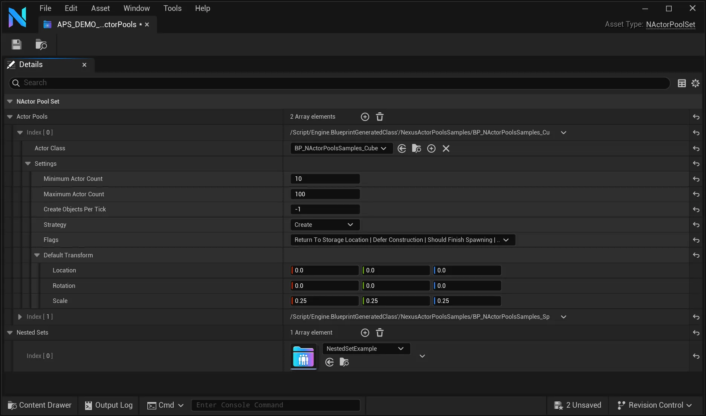

import TypeDetails from '../../../../src/components/TypeDetails';
import Tabs from '@theme/Tabs';
import TabItem from '@theme/TabItem';

# Actor Pool Set

<TypeDetails icon="/assets/svg/actor-pools/actor-pool-set.svg" iconType="img" base="UDataAsset" type="UNActorPoolSet" typeExtra="" headerFile="NexusActorPools/Public/NActorPoolSet.h" />

A `UDataAsset` that serves as a collection of preconfigured [FNActorPoolSettings](actor-pool-settings.md) to allow for easily warming up [NActorPools](actor-pool.md) with the given context. One compelling usage of these sets is to process a level on save, or cook and determine a good amount of the spawnable actors and create an `NActorPoolSet` per level. That way, when a level is loaded, you can apply its `NActorPoolSet` and have all of the spawnable `AActor` prewarmed.

## Creating

From the **Content Browser**, right-click to bring up the **context menu** and navigate to the **NEXUS** submenu. From there, you should have an option to create an `NActorPool Set`.


## Editing 

By double-clicking on a `UNActorPoolSet` asset, it will open the *default* Data Asset editor window. From there, you create entries in the array for the specific `AActor` and its corresponding settings.



## Applying

Once you have a valid reference to the desired `UNActorPoolSet`, you instruct the [UNActorPoolSubsystem](actor-pool-subsystem.md) to apply the given set.

<Tabs>
  <TabItem value="blueprint" label="Blueprint" default attributes={{className: 'tab-blueprint' }}>
    <iframe src="https://blueprintue.com/render/ftq66hj3/" allowfullscreen="yes" scrolling="no" class="blueprintue" style={{ height : '325px' }}></iframe>
  </TabItem>
  <TabItem value="native" label="C++" attributes={{className: 'tab-native' }}>
```cpp title="Apply UNActorPoolSet"
UNActorPoolSubsystem::Get(GetWorld())->ApplyActorPoolSet(TargetActorPoolSet);
```    
  </TabItem>
</Tabs>
