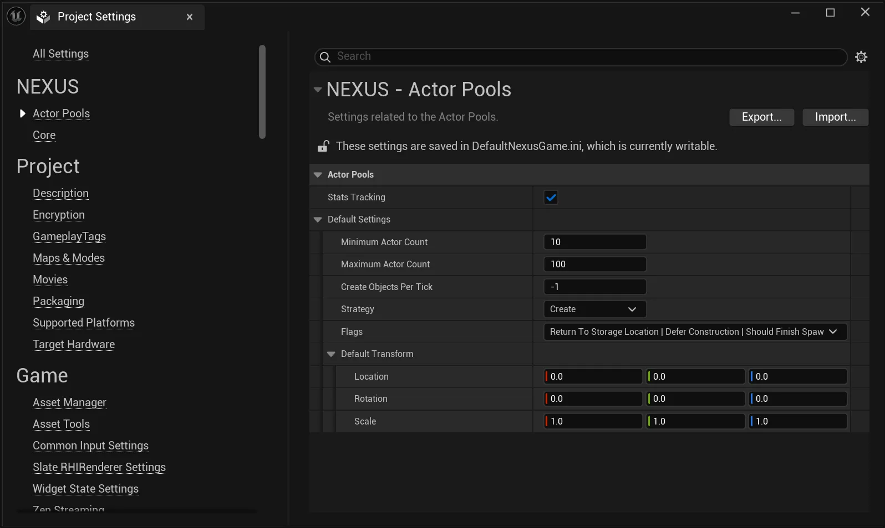

import TypeDetails from '../../../../src/components/TypeDetails';

# Actor Pool Settings

<TypeDetails icon="native-struct" base="UStruct" type="FNActorPoolSettings" typeExtra="" headerFile="NexusActorPools/Public/NActorPoolSettings.h" />

A Blueprint-compatible struct that defines configuration parameters for managing object pooling inside of a [NActorPool](actor-pool.md). This struct provides comprehensive settings to control how actors are created, managed, and recycled.

## Highlights

- **Pool Size Management**: Controls minimum (default: 10) and maximum (default: 100) actor counts in the pool
- **Performance Optimization**: Configurable objects-per-tick creation limit and pool expansion policies
- **Flexible Strategies**: Supports different pooling strategies through the `ENActorPoolStrategy` enum
- **Spawn Behavior Control**: Options for deferred construction, finish spawning behavior, and location management
- **Return Mechanics**: Configurable return location and movement behavior for recycled actors

## Configuration Options

- `MinimumActorCount` / `MaximumActorCount`: Define pool size boundaries
- `CreateObjectsPerTick`: Throttles object creation for performance (-1 for unlimited)
- `bAllowCreateMoreObjects`: Enables pool expansion beyond maximum when needed
- `Strategy`: Determines the pooling approach (Create, Reuse, etc.)
- `bDeferConstruction`: Controls whether actor construction is deferred when creating new actors.
- `bShouldFinishSpawning`: Manages FinishSpawning calls for non-INActorPoolItem actors

This settings struct is essential for fine-tuning actor pool performance and behavior in games that require efficient object management, such as those with many spawnable entities like NPCs, projectiles, or environmental objects.

## Project-Wide Defaults

From the `Edit > Project Settings` window, find the **NEXUS** section; there should be a `Actor Pools` option which will display the default settings used when an `AActor` is requested from an unitialized pool.

