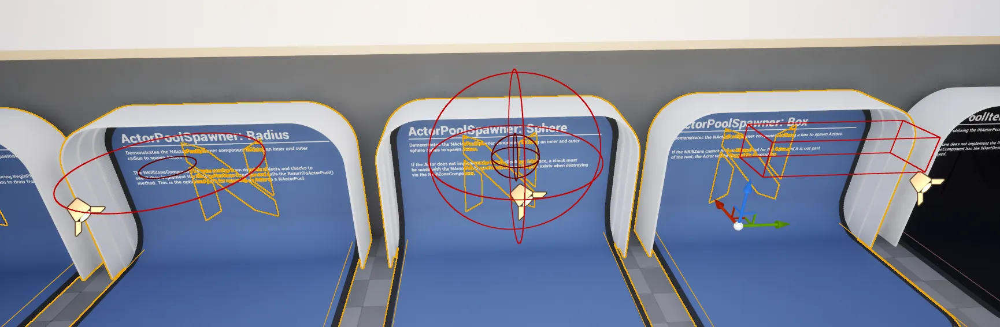

import TypeDetails from '../../../../src/components/TypeDetails';

# Actor Pool Spawner Component

<TypeDetails icon="/assets/svg/actor-pools/actor-pool-spawner-component.svg" iconType="img" base="UActorComponent" type="UNActorPoolSpawnerComponent" typeExtra="" headerFile="NexusActorPools/Public/NActorPoolSpawnerComponent.h" />

A fundamental spawning component which will interact with the [UNActorPoolSubsystem](actor-pool-subsystem.md) to periodically spawn defined `AActors` in predefined distributions (shapes).

:::warning

This is a rudimentary example of how to spawn things; it has some use cases in a shipping game, but should not be the primary spawing source.

:::

## Component Settings

| Setting | Type | Description | Default |
| :-- | :-- | :-- | :-- |
| Spawning Enabled | `bool` | Is the component going to Spawn enemies when ticked? | `true` |
| Server Authoritative | `bool` | Should the spawner only spawn on servers, ignoring itself on client-only. | `true` |
| Spawn Rate | `float` | The rate at which things should be spawned. | `0.5f` |
| Offset | `FVector` | Offset from the component location to treat as the origin when calculating a position to spawn an `AActor`. | `(0,0,0)` |
| Distribution | `ENActorPoolSpawnerDistribution`  | The specific distribution-shape to use when selecting a point/location to spawn an `AActor` at. | `APSD_Point` |
| Distrubtion Range | `FVector` | The axis-based ranges to use when outlining the shapes size, and or any sort of exclusionary range. | `(1.f,20.f,20.f)`|
| Spline Level Reference | `FComponentReference` | When `ASPD_Spline` is selected as `Distribution`, this option will be visible to select a SplineComponent in the current level. | `nullptr` |
| Count | `int` | The number of items to spawn at any given spawn event. | `1` |
| Randomize Seed | `bool` | Should a random seed be selected on `BeginPlay()` for this component?| `false` |
| Seed | `int` | The seed used for all random selection related to this component. | `0` |
| Templates | `FNActorPoolSpawnerTemplate[]` | A weighted collection of `AActors` and their default `FNActorPoolSettings` for usage with the component. | `Empty` |

## Distribution Types

| Native | Display | Description |
| :-- | :-- | :-- |
| `APSD_Point` | Point | Always spawn at the given component's location + `Offset`. | 
| `APSD_Radius` | Radius | Selects a point at the given component's location + `Offset`, with a minimum radius of `DistributionRange.X` and a maximum radius of `DistributionRange.Y` on the horizontal axis. |
| `APSD_Sphere` | Sphere | Selects a point at the given component's location + `Offset`, in a sphere, with a minimum radius of `DistributionRange.X` and a maximum radius of `DistributionRange.Y`. | 
| `APSD_Box` | Box | Selects a point at the given component's location + `Offset`, in an axis-aligned box, using the `DistributionRange` for size. |
| `APSD_Spline` | Spline | Selects a point along the target `SplineLevelReference`.  | 