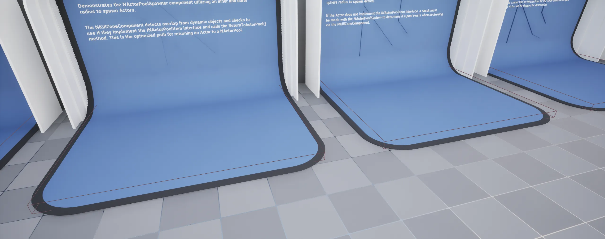

import TypeDetails from '../../../../src/components/TypeDetails';

# Kill Zone Component

<TypeDetails icon="/assets/svg/actor-pools/kill-zone-component.svg" iconType="img" base="UActorComponent" type="UNKillZoneComponent" typeExtra="" headerFile="NexusActorPools/Public/NKillZoneComponent.h" />

A kill plane implementation built to automatically pool properly configured `AActor` upon overlap.



:::info

By default the component will automatically change its collision profile to `OverlapAllDynamic`.

:::

## Component Settings

| Setting | Type | Description | Default |
| :-- | :-- | :-- | :-- |
| Ignore Static Actors | `bool` | Ignore static (Non-movable) actors that trigger an overlap event. | `true` |
| Non-INActorPoolItem Behavior | `ENKillZoneBehavior` | What should occur for an `AActor` that doesn't implement the `INActorPoolItem` interface and doesn't have an existing `FNActorPool`. | `ApplyFellOutOfWorld` |

### Behaviors

| Value | Behavior |
| :-- | :-- |
| `Ignore` | Leave the `AActor` alone — no return, no destroy, no damage. |
| `ReturnToActorPool` | Force the `AActor` back to its [FNActorPool](actor-pool.md) (or destroy it if no pool exists). |
| `ApplyFellOutOfWorld` | Apply the world fall damage type to the `AActor`, matching engine kill-volume behavior. *(default)* |


## UFunctions

The methods exposed to Blueprint.

### Get Kill Count

```cpp
/**
  * Gets the internal counter tracking the number of AActors the component has killed.
  * @return The kill count.
  */
int32 GetKillCount() const { return KillCount; }
```

### Set Kill Count

```cpp
/**
  * Sets the internal counter tracking the number of AActors the component has killed.
  * @param NewKillCount The new value to use as the kill count.
  */
void SetKillCount(const int32 NewKillCount) { KillCount = NewKillCount; }
```

### Reset Kill Count

```cpp
/**
  * Resets the internal counter tracking the number of AActors the component has killed to 0.
  */
void ResetKillCount() { KillCount = 0; }
```

