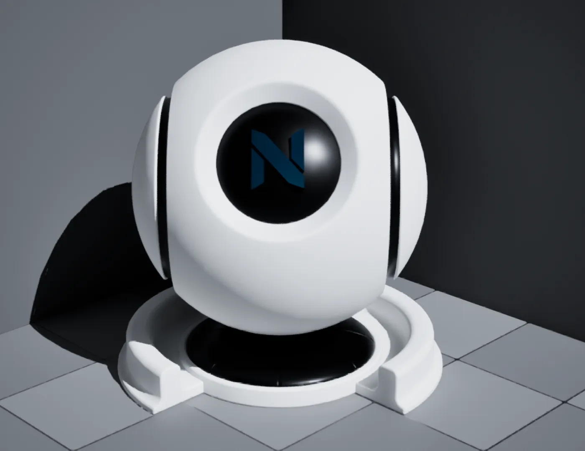

import DocCardList from '@theme/DocCardList';
import PluginDetails from '../../../src/components/PluginDetails';

# Blockout

<PluginDetails moduleName="NexusBlockout" />

## Material Library

A library of pre-built materials to use with your content.

### Debug Text

A selection of distance-field based font material instances (prefixed with `MI_NDebugText_`) used with text `UTextRenderComponent`.

## Samples

The `DEMO_NBlockout` sample map is available once you have enabled the `NEXUS Samples: Blockout` plugin. This is found in the `NEXUS Samples` category in the `Edit > Plugins` window.