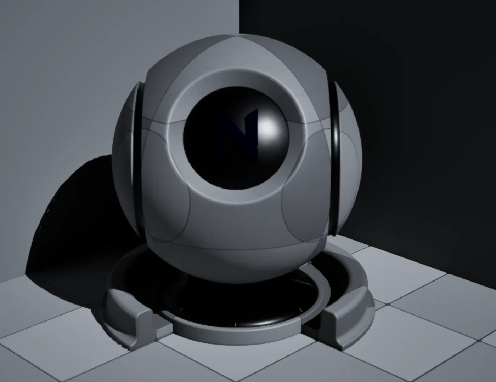
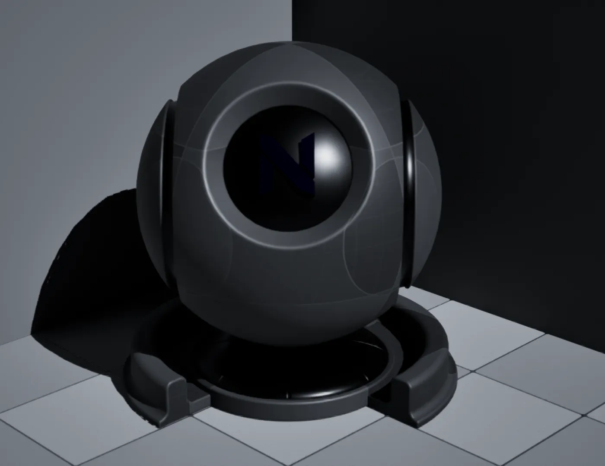
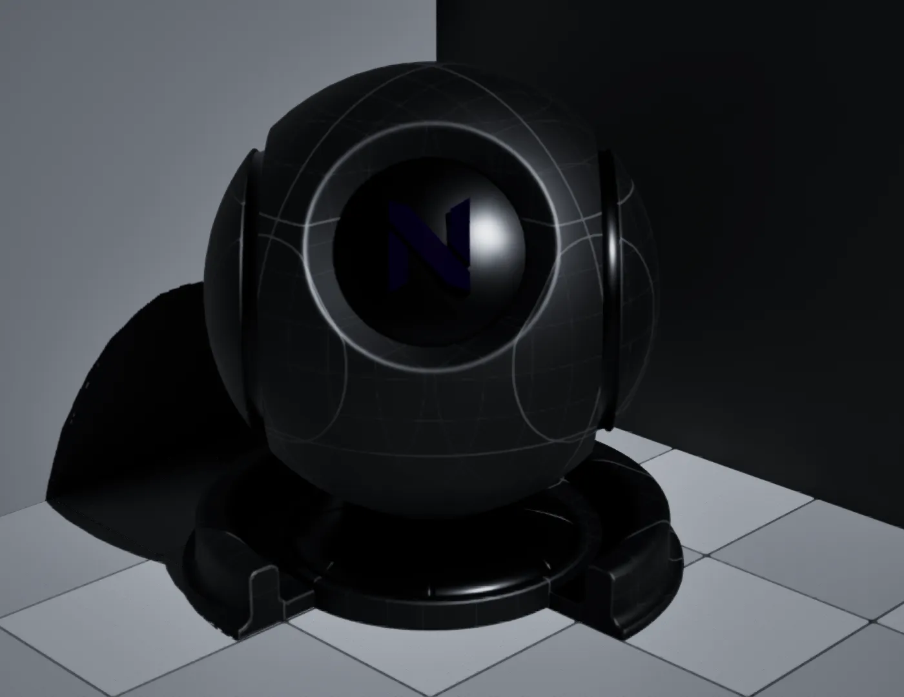
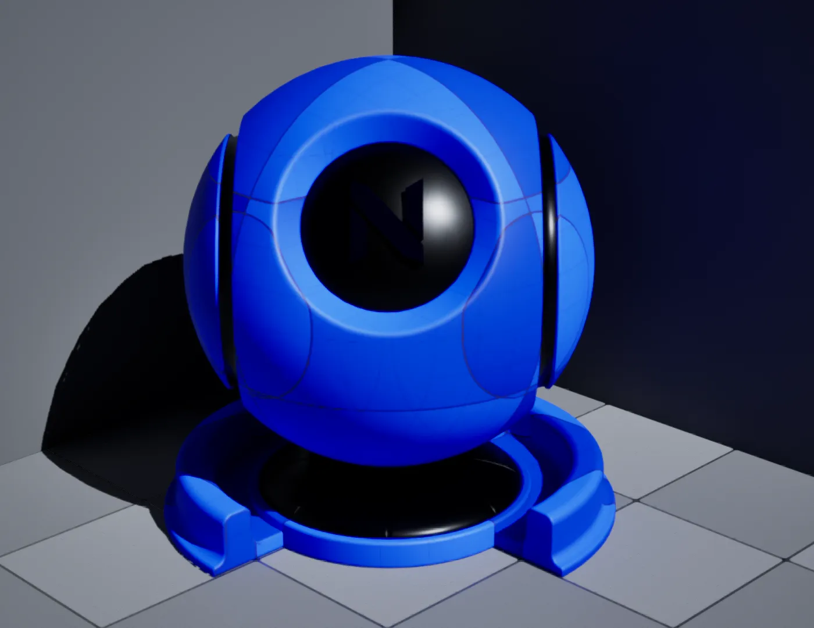
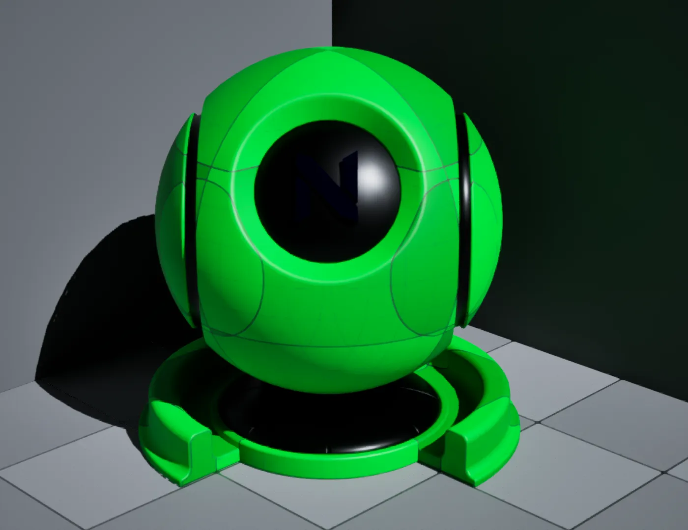
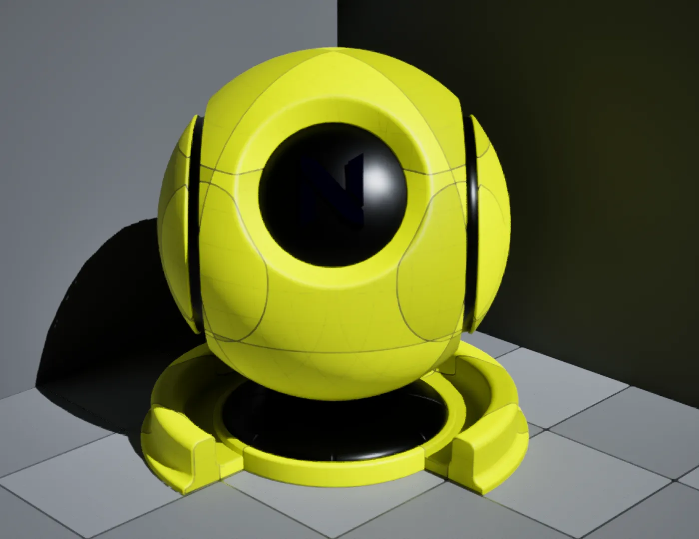
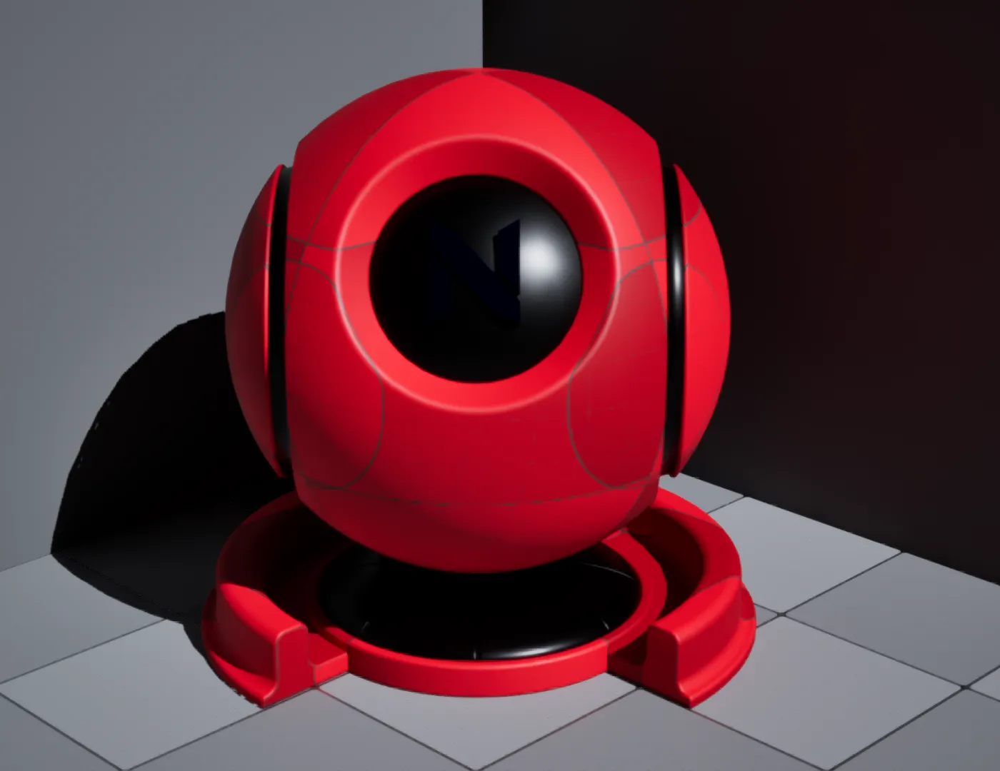

# Grid

An automatic world or localspace grid with tint and line colors, material instances (prefixed with `MI_NGrid_`).

:::tip

This material is **entirely** based off of the public works of [**Nick Mower**](https://techarthub.com/making-a-procedural-grid-material-in-unreal-engine/) and [**Ben Golus**](https://bgolus.medium.com/the-best-darn-grid-shader-yet-727f9278b9d8#56b0). Thanks to these two amazing developers for their efforts and willingness to share with the community! ♥️

:::

## Shades

## Colors

