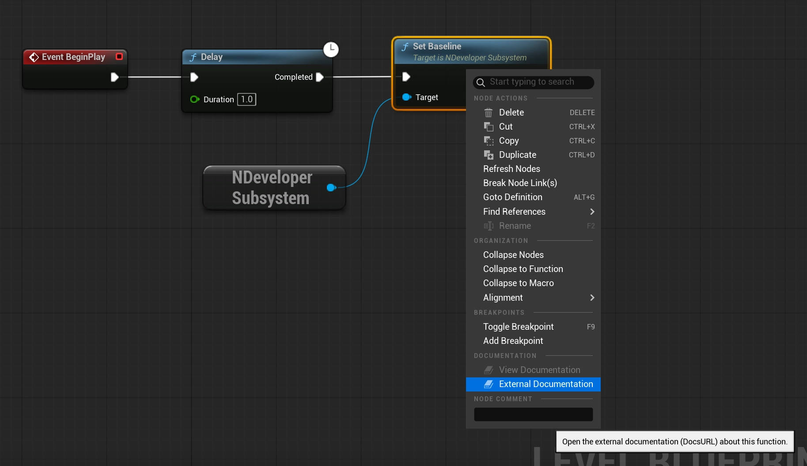

# External Documentation

Adds an `External Documentation` option to the context menu of _Call Function_ graph nodes.



Add a `DocsURL` value to a `UFUNCTION` and it will be detected and used with the context menu command.

```cpp
UFUNCTION(BlueprintCallable, DisplayName = "Set Baseline", Category = "NEXUS|Developer",
  meta=(DocsURL="https://nexus-framework.com/docs/plugins/core/types/developer-subsystem/#setting-a-baseline"))
void SetBaseline();
```

:::warning

Yes, we have hijacked the `DocsURL` option, but we feel like it is globally understood and should not conflict with anything.

:::