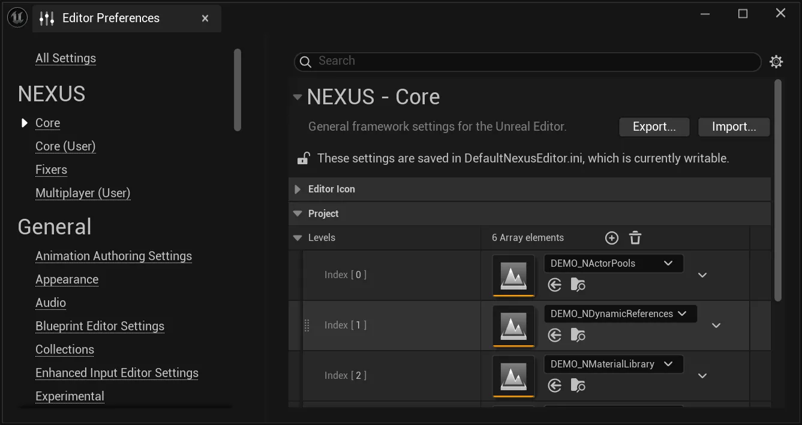

# Project Levels

A collection of project-specific levels set project-wide for ease of access to a core set of maps. Useful for creating a list of frequently accessed or important maps, accessible via the `File > Project Levels` menu entry.

## Settings

The configuration is available in the Editor Preferences under  `NEXUS > Core > Project > Levels`.

