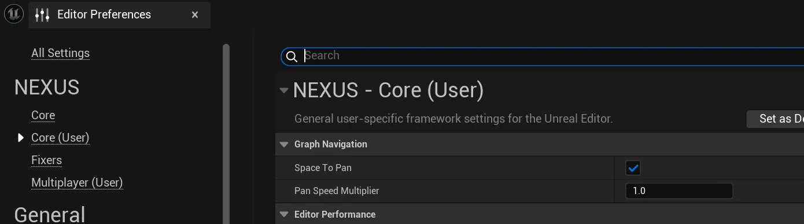

# Graph Navigation

A particularily interesting problem emerged when we started using laptops with Unreal Engine, a distinct inability to easily move around graphs. 

We added [FNEditorInputProcessor](../types/input-processor.md) to create a processing layer that could be queried and even respond to specific situations.

## Settings

|Setting|Description|Default|
|:--|:--|:--|
|Space To Pan| | `true` |
|Pan Speed Multiplier| | `1.0f` |

Razer Blades
::: info
We've heard that some laptops touch pad works to navigate around graphs --- so far this has been predominantly macOS users.
:::