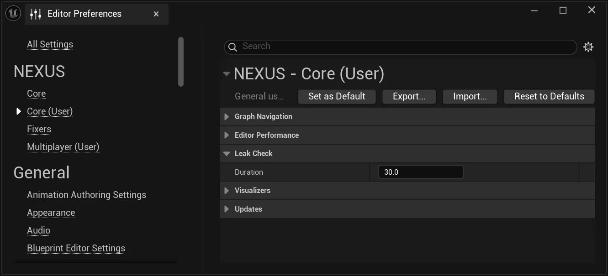

# Leak Check

A spot-check function which fires off a configurable, timed-delayed task in the editor to look at any created `UObjects`.

:::info

If a leak is detected, a `FNObjectSnapshotDiff` will be written out to the projects log folder with the prefix `NEXUS_LeakCheck_*`.

:::

## Settings 

The configuration of the delay is a user-defined setting, available in a developer's Editor Preferences under  `NEXUS > Core (User) > Leak Check > Duration`.

