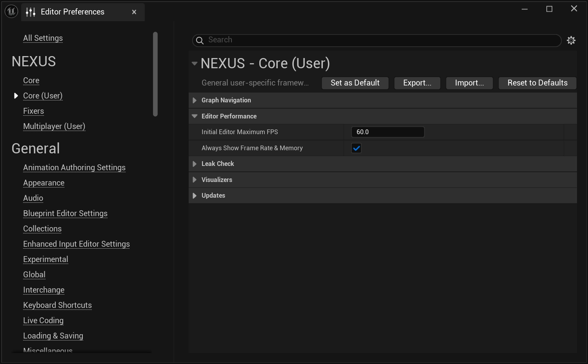

# Performance

Some performance settings we thought should be available, by default.

## Framerate Limit
As our GPUs go **vroooooooom** more and more, the need to limit the editor's framerate becomes more in focus. This feature sets the editor's maximum framerate on start so that you don't have to.

:::info

This only occurs when the Unreal Editor is user-controlled. 

:::

## Always Show Metrics

A quick toggle to ensure that the Unreal Editor's Performance setting for showing its framerate and memory metrics is on by **default**.

## Settings

The configuration for these features is available in the Editor Preferences under  `NEXUS > Core (User) > Editor Performance`.

