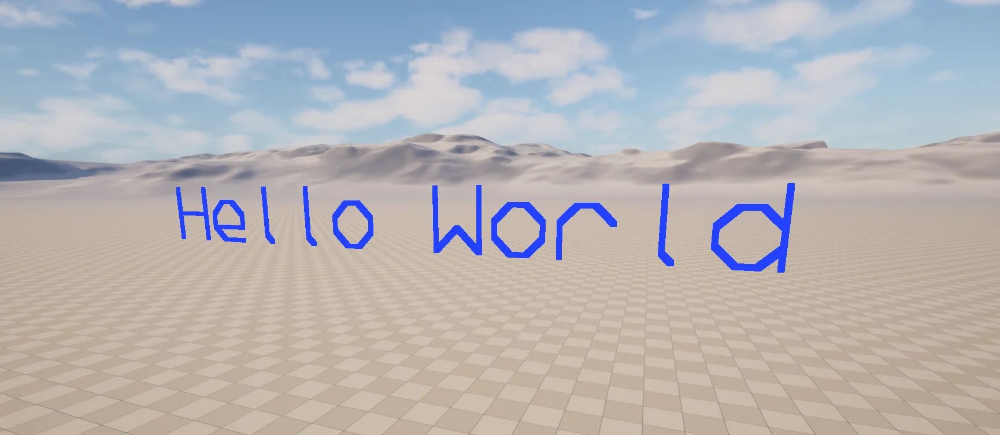

import TypeDetails from '../../../../src/components/TypeDetails';
import VersionBadge from '../../../../src/components/VersionBadge';

# Developer Library

<TypeDetails icon="ue-blueprint-function-library" base="UBlueprintFunctionLibrary" type="UNDeveloperLibrary" typeExtra="" headerFile="NexusCore/Public/Developer/NDeveloperLibrary.h" />

A small collection of functionality to wrap the usage of developer tools.

## UFunctions

### Debug

#### Get UObject Count

```cpp
/**
  * Gets the current number of known UObjects by looking at the global UObject array and subtracting the number of available spots.
  * @return The number of objects.
  */
static int32 GetCurrentObjectCount() { return FNDeveloperUtils::GetCurrentObjectCount(); };
```

### Snapshots

#### Create UObject Snapshot

Captures a minimal data structure (`FNObjectSnapshotEntry`) about all currently known `UObjects`, recording:

:::info

If you are just looking to capture the current state of things to a file check out the `N.Developer.Snapshot` [console command](../console-commands.md).

:::

- Serial number
- Number of references
- Is it flagged for Garbage Collection?
- Is it part of a root set?
- It's name and full name where possible.
- A `TWeakObjectPtr` to the object.
  
:::warning

This process can cause a bit of a performance hit depending on the number of objects that you have currently created.

:::

```cpp
/**
  * Captures a minimal data structure about all currently known UObjects.
  * @return The FNObjectSnapshot recording structure.
  */
static FNObjectSnapshot CreateObjectSnapshot() { return FNObjectSnapshotUtils::Snapshot(); }
```

#### Create UObject Snapshot Diff

Compares two already created `FNObjectSnapshots` to formulate a difference report of what changed.

:::warning

This process can cause a bit of a performance hit as it will itterate over potentially a large array of `FNObjectSnapshotEntry`.

:::

```cpp
/**
  * Compares two already created snapshots to formulate a difference report of what changed.
  * @param OldSnapshot Original FNObjectSnapshot created as the baseline.
  * @param NewSnapshot The FNObjectSnapshot to compare the baseline against.
  * @param bRemoveKnownLeaks Should known objects that leak be removed from tracking.
  * @return A FNObjectSnapshotDiff structure outlining the differences.
  */
static FNObjectSnapshotDiff CreateSnapshotDiff(const FNObjectSnapshot& OldSnapshot, const FNObjectSnapshot& NewSnapshot, const bool bRemoveKnownLeaks = false)
{
  return FNObjectSnapshotUtils::Diff(OldSnapshot, NewSnapshot, bRemoveKnownLeaks);
}
```

#### Get UObject Snapshot Entry Summary

```cpp
/**
  * Get an output-friendly string from an FNObjectSnapshotEntry.
  * @param Entry The entry to generate a string from.
  * @return The output-friendly string.
  */
static FString GetObjectSnapshotEntrySummary(const FNObjectSnapshotEntry& Entry) { return Entry.ToString(); }
```

```txt title="Snapshot Entry Line"
(0) [R] [G] Package /Script/DeveloperSettings
```

| Reference Count | Is Root Set? | Is Flagged For GC? | FullName |
|:--|:-:|:-:|:--|
|(0) | [R] | [G] | Package /Script/DeveloperSettings |

:::info

The *Reference Count* does not always seem to be accurate as polled from the `UObject`, and the *FullName* is replaced with the `FName` if the `UObject` is no longer valid.

:::

#### Get UObject Snapshot Summary

Get an output-friendly `FString` that summarizes the contents of a `FNObjectSnapshot`.

```txt title="Example Content"
Captured %i Objects (%i Untracked)
```

```cpp
/**
  * Get an output-friendly string that summarizes the contents of an FNObjectSnapshot.
  * @param Snapshot The snapshot to generate a string from.
  * @return The output-friendly string.
  */
```

#### Get UObject Snapshot Detailed Summary

```cpp
/**
  * Get an output-friendly string that provides a more in-depth output detailing the contents of an FNObjectSnapshot.
  * @param Snapshot The snapshot to generate a detailed string from.
  * @return The output-friendly string.
  */	
static FString GetObjectSnapshotDetailedSummary(const FNObjectSnapshot& Snapshot) { return Snapshot.ToDetailedString(); }
```

```txt title="Example Content"
Captured %i Objects (%i Untracked)
...
```

#### Get UObject Snapshot Diff Summary

Get an output-friendly `FString` that summarizes the number of changes found in a `FNObjectSnapshotDiff`.

```txt title="Example Content"
Total %i (%i Changes | %i Previously Untracked | %i Currently Untracked) - Added %i / Maintained %i / Removed %i
```

```cpp
/**
  * Get an output-friendly string that summarizes the contents of an FNObjectSnapshotDiff.
  * @param Diff The FNObjectSnapshotDiff to generate a string from.
  * @return The output-friendly string.
  */
static FString GetObjectSnapshotDiffSummary(const FNObjectSnapshotDiff& Diff) { return Diff.ToString(); }
```

#### Get UObject Snapshot Diff Detailed Summary

Get an output-friendly `FString` that contains a list of all changes found in an `FNObjectSnapshotDiff` in a formatted manner.

```txt title="Example Content"
Captured %i Objects (%i Changes)
Previously %i Untracked Objects | Currently %i Untracked Objects
Added (%i):
...
Maintained (%i)
...
Removed (%i):
...
```

```cpp
/**
  * Get an output-friendly string that provides a more in-depth output detailing the contents of an FNObjectSnapshotDiff.
  * @param Diff The FNObjectSnapshotDiff to generate a detailed string from.
  * @return The output-friendly string.
  */	
static FString GetObjectSnapshotDiffDetailedSummary(const FNObjectSnapshotDiff& Diff) { return Diff.ToDetailedString(); }
```

#### Output Snapshot To Log

Simple way to output the contents of a `FNOjectSnapshotDiff` to `LogNexus`.

```txt title="Example Log Output"
[FNObjectSnapshotDiff::DumpToLog] Captured %i Objects (%i Changes)
Previously %i Untracked Objects | Currently %i Untracked Objects
Added (%i):
...
Maintained (%i)
...
Removed (%i):
...
```

```cpp
/**
  * Output an FNObjectSnapshotDiff's detailed summary to LogNexus.
  * @param Diff The FNObjectSnapshotDiff to generate output from.
  */
static void DumpSnapshotDiffToLog(const FNObjectSnapshotDiff& Diff) { Diff.DumpToLog(); }
``` 


### Drawing

#### Draw Debug String<VersionBadge version="0.2.3" branch="main" type="header" />

Renders a `FString` in the `UWorld` via a pseudo `DebugDrawLine` utiling the `FNPrimitiveFont`.



```cpp
/**
  * Draw a string via ULineBatchComponent.
  * @param WorldContextObject Object that provides the context of which world to operate in.
  * @param String The string to draw out.
  * @param Position The world position to start drawing the string at.
  * @param Rotation The world rotation to apply to the drawing, the base orientation is backwards facing. 
  * @param bPersistentLines Should the drawn lines be permanent?
  * @param LifeTime How long should the lines last if not permanent?
  * @param DepthPriority What priority should they be drawn at?
  * @param ForegroundColor The color to use when drawing the lines for the string.
  * @param Scale The multiplier to apply to glyph size.
  * @param LineHeight The height used to represent a line.
  * @param Thickness The thickness of the lines used to draw glyphs.
  * @param bInvertLineFeed Should new lines be stacked on top of older lines?
  * @param bDrawBelowPosition Should the top of the first line align with the position?
  */
static void DrawDebugString(const UObject* WorldContextObject, FString String, const FVector Position,
  const FRotator Rotation, const bool bPersistentLines = false, const float LifeTime=-1.f, const uint8 DepthPriority = 0,
  const FLinearColor ForegroundColor = FLinearColor::White, const float Scale = 1,
  const float LineHeight = 4.f, const float Thickness = 8.f, const bool bInvertLineFeed = false,
  const bool bDrawBelowPosition = true)
{
  const UWorld* InWorld = GEngine->GetWorldFromContextObject(WorldContextObject, EGetWorldErrorMode::ReturnNull);
  if (InWorld == nullptr) return;
  FNDrawDebugHelpers::DrawDebugString(InWorld, String, Position, Rotation, bPersistentLines, LifeTime, 
    DepthPriority, ForegroundColor, Scale, LineHeight, Thickness, bInvertLineFeed, bDrawBelowPosition);		
}
```