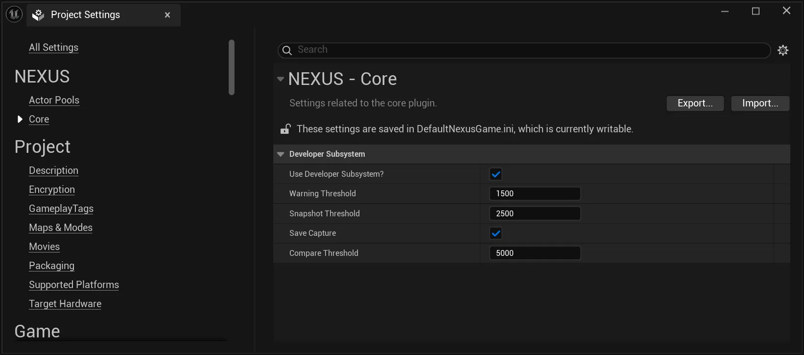

import TypeDetails from '../../../../src/components/TypeDetails';
import Tabs from '@theme/Tabs';
import TabItem from '@theme/TabItem';

# Developer Subsystem

<TypeDetails icon="ue-world-subsystem" base="UTickableWorldSubsystem" type="UNDeveloperSubsystem" typeExtra="" headerFile="NexusCore/Public/Developer/NDeveloperSubsystem.h" />

A management subsystem to monitor object usage/counts and capture and compare when triggered.

:::tip

You do not need the automatic checking of this system! You can use `N.Developer.CacheSnapshot` and the `N.Developer.CompareSnapshot` console commands to create your own diffs! Check out the other [console commands](../console-commands.md)!

:::

## Setting A Baseline

The automated system requires a baseline point to be effective in its calculations. Mainly because there is going to be a period where you are creating numerous `UObjects`, and you don't want the system to consider those objects in its calculation. So when you are ready for it to start watching, call the `SetBaseline()` command.

<Tabs>
  <TabItem value="blueprint" label="Blueprint" default attributes={{className: 'tab-blueprint' }}>
    <iframe src="https://blueprintue.com/render/jg3v_i32/" allowfullscreen="yes" scrolling="no" class="blueprintue" style={{ height : '325px' }}></iframe>
  </TabItem>
  <TabItem value="native" label="C++" attributes={{className: 'tab-native' }}>
```cpp title="Set Delayed Baseline"
FTimerHandle SetBaselineTimerHandle;
GetWorld()->GetTimerManager().SetTimer(SetBaselineTimerHandle, UNDeveloperSubsystem::Get(GetWorld()), &UNDeveloperSubsystem::SetBaseline,1.0f, false);
```    
  </TabItem>
</Tabs>

## Settings



| Setting | Description | Default |
| :-- | --- | :-- |
| Object Monitoring | Should the `UNDeveloperSubsystem` be created? This is necesary for object monitoring to occur. | `false` |
| Warning Threshold | The number of `UObjects` added after setting the baseline when a warning message will be thrown. | `25000` |
| Snapshot Threshold | The number of `UObjects` added after after setting the baseline when a `FNObjectSnapshot` will be taken of the currnet `UObjects`. | `30000` |
| Save Capture? | Should the `FNObjectSnapshot` captured be outputted to the project's log folder with a prefix of `NEXUS_Snapshot_*`. | `false` |
| Compare Threshold | The number of `UObjects` added after after setting the baseline when another `FNObjectSnapshot` will be taken, and then compared against the previous. This will then output the detailed summary of the compare to the project's log folder wih the prefix `NEXUS_Compare_*`. | `40000` |
