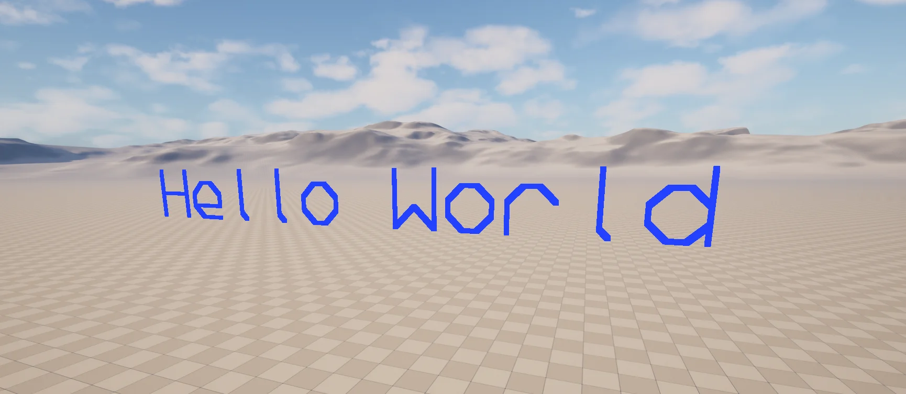

import TypeDetails from '../../../../../src/components/TypeDetails';

# Primitive Font

<TypeDetails icon="native-class" base="class" type="FNPrimitiveFont" typeExtra="" headerFile="NexusCore/Public/Developer/NPrimitiveFont.h" />

A simple glyph collection that can be rendered via PDI or `ULineBatchComponent`. Provides line-based primitive rendering of ASCII strings for debug and developer visualisation, without relying on UE's Slate or UMG text systems. Glyph data is built once during module startup by `FNCoreModule`.



## FNPrimitiveFontPoint

A single glyph-grid point used when rasterising characters. Coordinates are stored in the font's internal grid space (not world units); pairs of points are interpreted as line-segment endpoints by the drawing helpers.

```cpp
struct FNPrimitiveFontPoint
{
    /** X coordinate of the point within the glyph grid. */
    int8 X;
    /** Y coordinate of the point within the glyph grid. */
    int8 Y;
};
```

## Methods

### Is Initialized

Indicates whether the glyph table has been populated and the font is safe to use.

```cpp
static bool IsInitialized();
```

### Initialize

Populates the glyph table; called once by `FNCoreModule::StartupModule()`.

```cpp
static void Initialize();
```

### Get Glyph

Returns the points that describe the glyph for a given ASCII character. An "undefined" glyph is returned for non-printable input.

```cpp
FORCEINLINE static TArray<FNPrimitiveFontPoint>& GetGlyph(const char InChar);
```

### Draw PDI

Draw a string via a `FPrimitiveDrawInterface`.

```cpp
/**
 * Draw a string via a PDI.
 * @param PDI The interface to use for drawing the string.
 * @param String The string to draw out.
 * @param Position The world position to start drawing the string at.
 * @param Rotation The world rotation to apply to the drawing, the base orientation is backwards facing. 
 * @param ForegroundColor The color to use when drawing the lines for the string.
 * @param Scale The multiplier to apply to glyph size.
 * @param LineHeight The height used to represent a line.
 * @param Thickness The thickness of the lines used to draw glyphs.
 * @param bInvertLineFeed Should new lines be stacked on top of older lines?
 * @param bDrawBelowPosition Should the top of the first line align with the position?
 * @param DepthPriorityGroup What depth should the string be drawn at?
 */
static void DrawPDI(FPrimitiveDrawInterface* PDI, FString& String, const FVector& Position,
  const FRotator& Rotation, FLinearColor ForegroundColor = FLinearColor::White, float Scale = 1,
  float LineHeight = 4.f, float Thickness = 8.f, const bool bInvertLineFeed = false,
  const bool bDrawBelowPosition = true, const ESceneDepthPriorityGroup DepthPriorityGroup = SDPG_World);
```

### Draw Batch String

Draw a string via a `ULineBatchComponent`.

```cpp
/**
 * Draw a string via a LineBatchComponent.
 * @param LineBatch The LineBatchComponent to use for drawing the string.
 * @param String The string to draw out.
 * @param Position The world position to start drawing the string at.
 * @param Rotation The world rotation to apply to the drawing, the base orientation is backwards facing. 
 * @param ForegroundColor The color to use when drawing the lines for the string.
 * @param Scale The multiplier to apply to glyph size.
 * @param LineHeight The height used to represent a line.
 * @param Thickness The thickness of the lines used to draw glyphs.
 * @param LifeTime The lifetime of the string in seconds, -1 for infinite.
 * @param bInvertLineFeed Should new lines be stacked on top of older lines?
 * @param bDrawBelowPosition Should the top of the first line align with the position?
 * @param DepthPriorityGroup What depth should the string be drawn at?
 */
static void DrawBatchString(ULineBatchComponent* LineBatch, FString& String, const FVector& Position,
  const FRotator& Rotation, FLinearColor ForegroundColor = FLinearColor::White, float Scale = 1,
  float LineHeight = 4.f, float Thickness = 8.f, float LifeTime = 0.f, const bool bInvertLineFeed = false,
  const bool bDrawBelowPosition = true, const ESceneDepthPriorityGroup DepthPriorityGroup = SDPG_World);
```

## See Also

- [Draw Debug Helpers](../draw-debug-helpers.md) — `DrawString` is the world-batched entry point that wraps this font.
- [Developer Library](developer-library.md) — Blueprint exposure of `Draw Debug String`.
