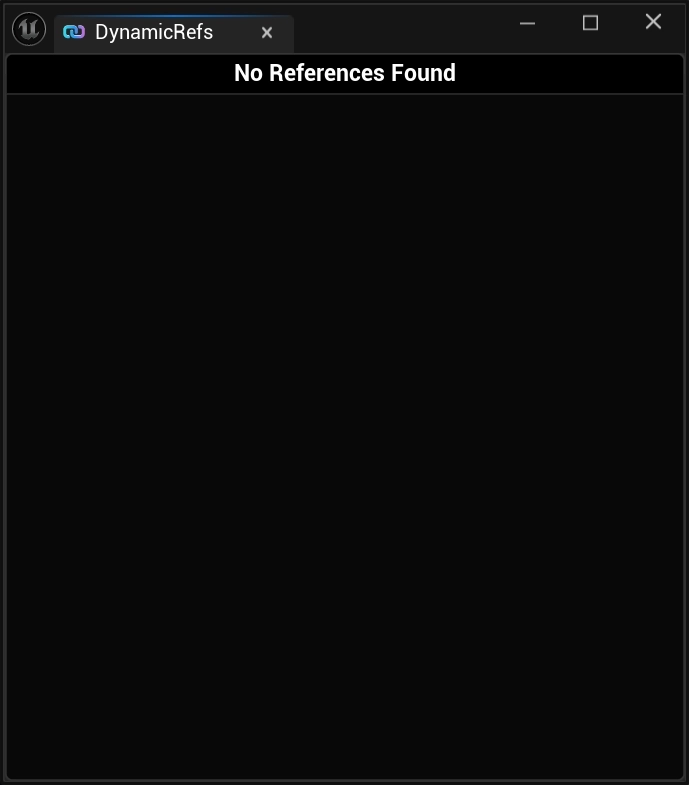
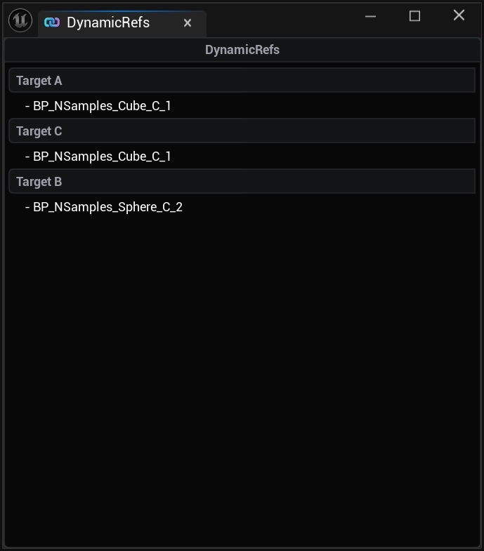

import TypeDetails from '../../../src/components/TypeDetails';

# Developer Overlay

<TypeDetails icon="/assets/svg/dynamic-references/dynamic-ref-component.svg" iconType="img" base="UNDeveloperOverlay" type="UNDynamicRefsDeveloperOverlay" typeExtra="" headerFile="NexusDynamicRefs/Public/NDynamicRefsDeveloperOverlay.h" />

By going to `Tools > NEXUS > Dynamic References`, you can create an [UNEditorUtilityWidget](/docs/plugins/ui/editor-types/editor-utility-widget/) wrapped version of `/NexusDynamicRefs/WB_NDynamicRefsDeveloperOverlay` which will list every live [ENDynamicRef](types/dynamic-ref.md) slot and `FName` bucket registered with the [UNDynamicRefSubsystem](types/dynamic-ref-subsystem.md).

## Layout

The overlay is split into two stacked lists, each preceded by a header that auto-hides when its list is empty:

| Section | Contents |
| :-- | :-- |
| `Dynamic References` | Every populated [ENDynamicRef](types/dynamic-ref.md) slot, one row per slot. |
| `Named References` | Every populated `FName` bucket, one row per bucket. |

Each row is a [UNDynamicRefListViewEntry](types/dynamic-ref-list-view-entry.md) bound to a [UNDynamicRefObject](types/dynamic-ref-object.md) wrapper. Inside each row, a nested list contains one button per `UObject` currently registered to that slot/bucket. When no references are present in any world, the overlay displays a `No References Found` banner.

## Multi-World Support

The overlay subscribes to `OnPostWorldInitialization` and `OnWorldBeginTearDown` and automatically binds to every `Game` / `PIE` world's [UNDynamicRefSubsystem](types/dynamic-ref-subsystem.md). Each subsystem's `OnAdded` / `OnRemoved` delegates feed the same lists, so a PIE session with both server and client worlds shows the union of their registrations.

## Click Handling

`UNDynamicRefsDeveloperOverlay` exposes a `BlueprintAssignable` delegate, `OnButtonClicked(UObject* TargetObject)`, that fires whenever a row's per-object button is pressed. The shipped Blueprint subclass wires this to actor selection in the editor — clicking a row's button selects that `AActor` in the level outliner. Subclasses can override this binding to drive any other inspection workflow (focus camera, open property editor, log a stack trace, etc.).
