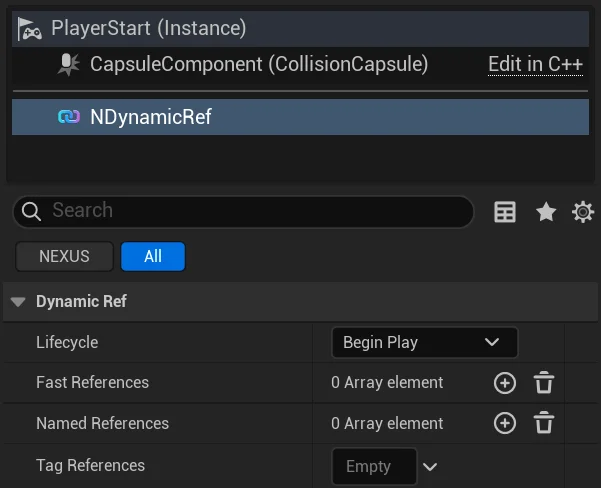
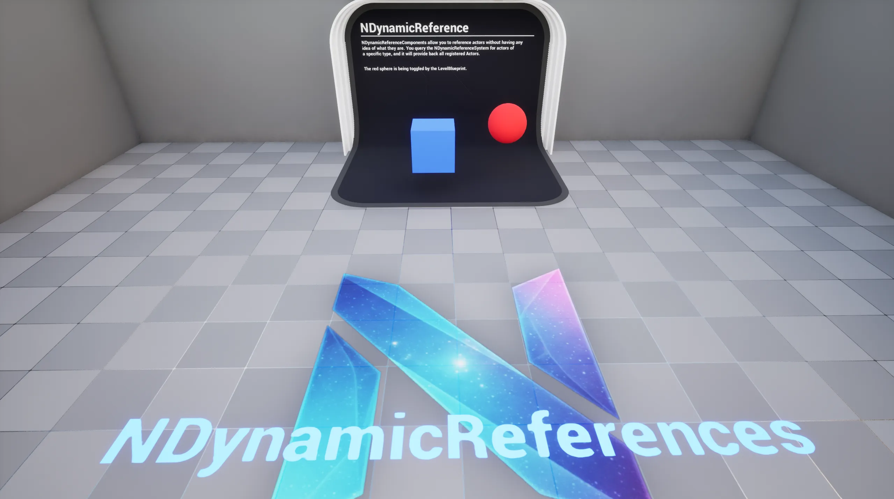

import DocCardList from '@theme/DocCardList';
import PluginDetails from '../../../src/components/PluginDetails';
import Tabs from '@theme/Tabs';
import TabItem from '@theme/TabItem';

# Dynamic References

<PluginDetails moduleName="NexusDynamicRefs" />

This plugin functions in a **service locator pattern** for `AActors` with some benefits:

- **Decoupling**: Removes hard dependencies between `AActors`.
- **Flexibility**: Easy to add/remove `AActors` from reference groups at runtime.
- **Scalability**: Can handle many `AActors` of the same type without performance issues.
- **Blueprint Integration**: Fully accessible from Blueprint for designers. 

Utilizing this pattern allows for developers to reference collections of typed objects safely without any direct knowledge of them at author-time.

## Add Component

Add a [UNDynamicRefComponent](types/dynamic-ref-component.md) to an `AActor` (*most likely you're doing this on a `Blueprint`*), and assign its References from the details inspector. A single component can claim any combination of three keying modes:

- **Fast References** — fixed [ENDynamicRef](types/dynamic-ref.md) slots, fast array-backed lookup.
- **Named References** — free-form `FName` buckets for keys that aren't covered by the enum.
- **Tag References** — `FGameplayTagContainer` entries, stored in the same named map under each tag's `TagName`.

## Getting Actor References

Accessing the [UNDynamicRefSubsystem](types/dynamic-ref-subsystem.md#getting-actors), referenced `AActors` can be queried by slot, by `FName`, or by `FGameplayTag` (single or [container](types/dynamic-ref-subsystem.md#tag-containers)).

## Samples

The `DEMO_NDynamicRefs` sample map is available once you have enabled the `NEXUS Samples: Dynamic References` plugin. This is found in the `NEXUS Samples` category in the `Edit > Plugins` window.

The map has a singular example showcasing the [UNDynamicRefComponent](types/dynamic-ref-component.md) and its various uses. The level blueprint demonstrates how to access an `AActor` by its `ENDynamicRef`.