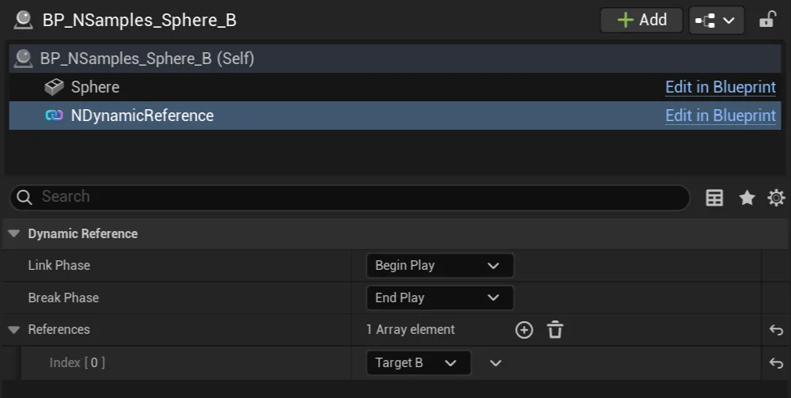

import Tabs from '@theme/Tabs';
import TabItem from '@theme/TabItem';

# Quickstart

## Add Component

Add a [UNDynamicReferenceComponnet](types/dynamic-reference-component.md) to an `AActor` (*most likely your doing this on a `Blueprint`*), and assign it's References from the details inspector.

## Getting Actor References

Accessing the [UNDynamicReferencesSubsystem](types/dynamic-reference-subsystem.md#getting-actor-references), referenced `AActors` can be queried.