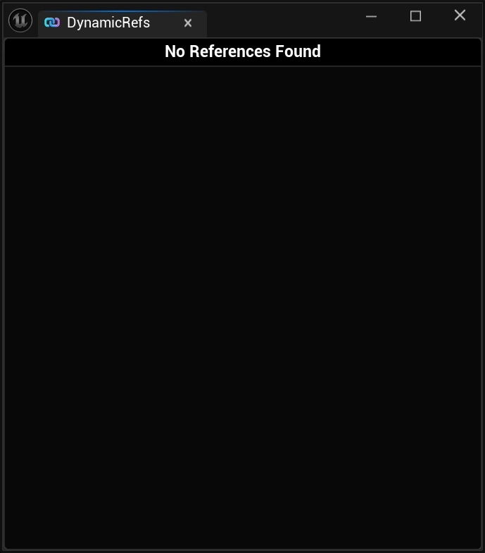
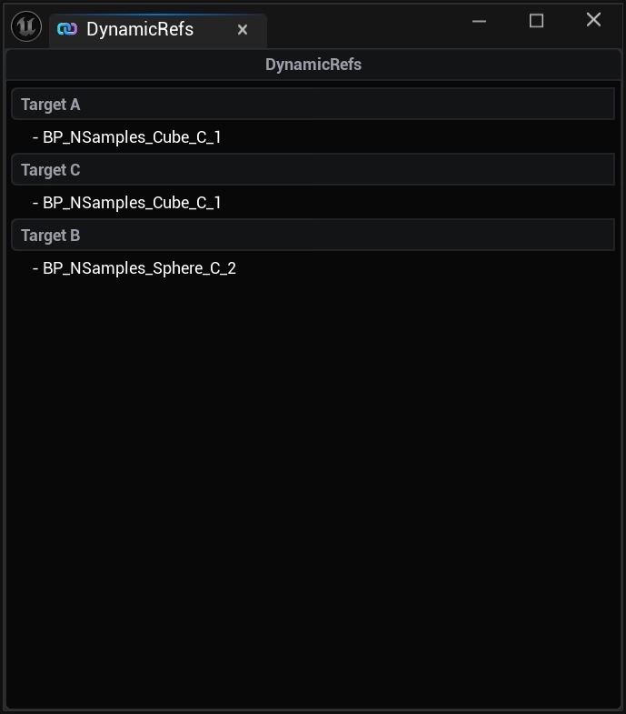
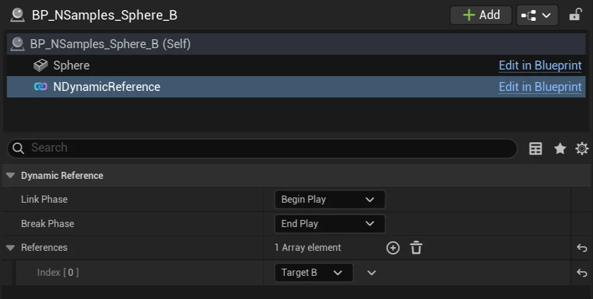

import Tabs from '@theme/Tabs';
import TabItem from '@theme/TabItem';

# Quickstart

## Developer Overlay

By going to `Tools > NEXUS > Dynamic References`, you can create an [UNEditorUtilityWidget](/docs/plugins/ui/editor-types/editor-utility-widget/) wrapped version of `/NexusDynamicRefs/WB_NDynamicRefsDeveloperOverlay` which will show all known `NDynamicRef`.

## Add Component

Add a [UNDynamicRefComponnet](types/dynamic-ref-component.md) to an `AActor` (*most likely your doing this on a `Blueprint`*), and assign it's References from the details inspector.

## Getting Actor References

Accessing the [UNDynamicRefSubsystem](types/dynamic-ref-subsystem.md#getting-actors), referenced `AActors` can be queried.