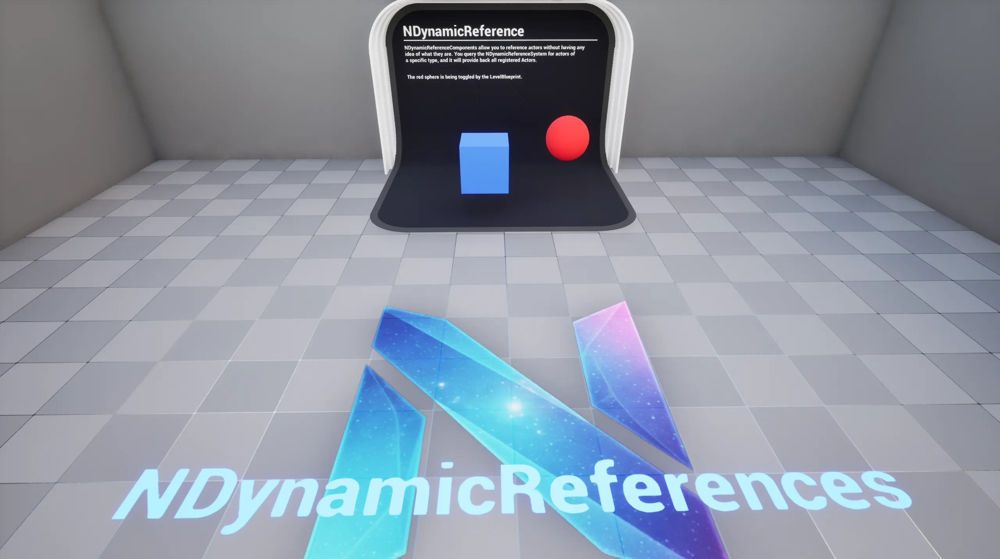

# Samples

The `DEMO_NDynamicReferences` sample map is available once you have enabled the `NEXUS Samples: Dynamic References` plugin. This is found in the `NEXUS Samples` category in the `Edit > Plugins` window.

The map has a singular example showcasing the [UNDynamicReferenceComponent](types/dynamic-reference-component.md) and its various uses. The level blueprint demonstrates how to access an `AActor` by it's `ENDynamicReference`.