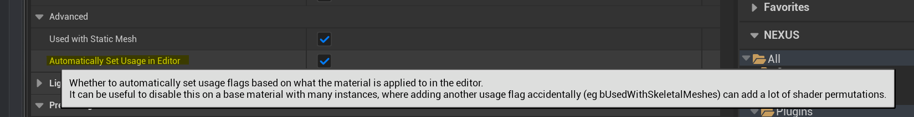
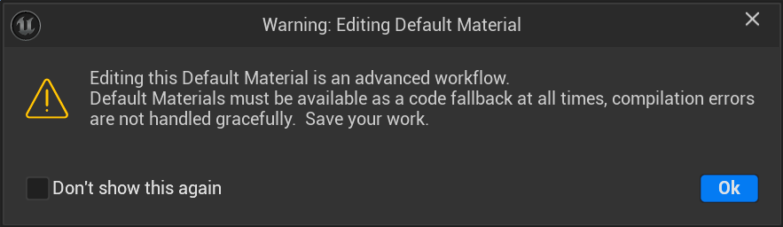

# NEngineContentValidator

A single path validator ensuring changes to Engine Content bubble up.

## Engine: Content Changed
This validator looks at assets being saved and triggers when the asset lives inside of Unreal Engine's content (`/Engine/`).

:::warning

By default, this validator will throw a **warning** and flag an asset as **invalid**.

::: 

This is useful as an early warning sign of inadvertently changing core content, which is often overwritten or replaced during different operations: version upgrades, installation verification, dependency check, etc. 

Depending on your environment, you may also not be able to submit to version control any changes inside of the `/Engine/` folder without elevated permissions/review. 

:::info

While there is no officially stated best-practice for when you explicitly need to alter content in this folder, general advice would be to duplicate the content you require altering to your local project, and make the changes there.

:::

### Config

The severity and behaviour of this validator can be configured, project-wide in `Editor Preferences > NEXUX > Fixers > Engine: Content Change`

### Gotcha (Materials)

One culprit that can cause changes to be reflected in the Engine Content comes from Materials and the default behaviour of applying flag changes based on their usage.

A contrived example of this would be if you used the `WorldGridMaterial` on a Niagara visual effect with mesh particles. This would automatically toggle on the `Used with Niagara Mesh Particles` flag on the material; a change would happen with very little awareness to the user outside of their initial assignment action.

Because of this scenario, it can be recommended that for your own base materials you disable the `Automatically Set Usage In Editor` setting.

Why isn't this disabled for the Editor materials? Great question! _crickets ..._

### Critical Workflows

Some assets identified as **Default Materials** inside of `/Engine/` are so critical that they have explicit warnings when you go to open them for editing. Unfortunately, there are many scenarios where such expressive warnings are not presented to the user, like in the above scenario. This further validates the importance of contributors being able to reason about what's in their changelists.

