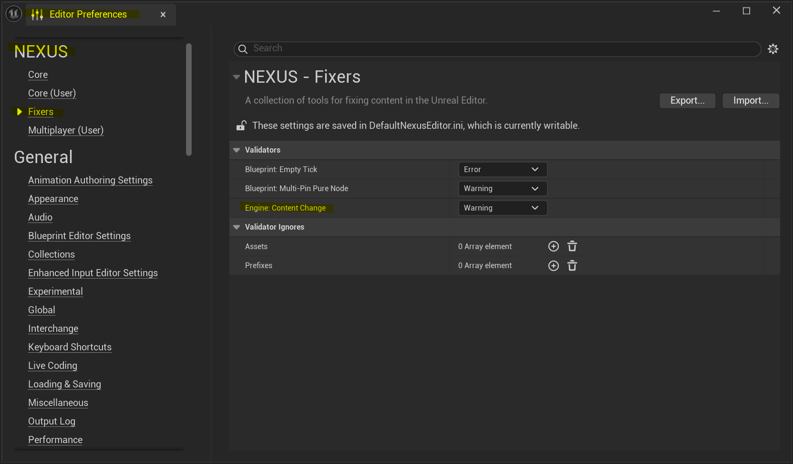

# NEngineContentValidator

A single path validator ensuring changes to Engine Content bubble up.

## Engine: Content Changed
This validator looks at assets being saved and triggers when the asset lives inside of Unreal Engine's content (`/Engine/`).

:::warning

By default, this validator will throw a **warning** and flag an asset as **invalid**.

::: 

This is useful as an early warning sign of inadvertently changing core content, which is often overwritten or replaced during different operations: version upgrades, installation verification, dependency check, etc. 

Depending on your environment, you may also not be able to submit to version control any changes inside of the `/Engine/` folder without elevated permissions/review. 

:::info

While there is no officially stated best-practice for when you explicitly need to alter content in this folder, general advice would be to duplicate the content you require altering to your local project, and make the changes there.

:::

### Config

The severity and behaviour of this validator can be configured, project-wide in `Editor Preferences > NEXUX > Fixers > Engine: Content Change`

