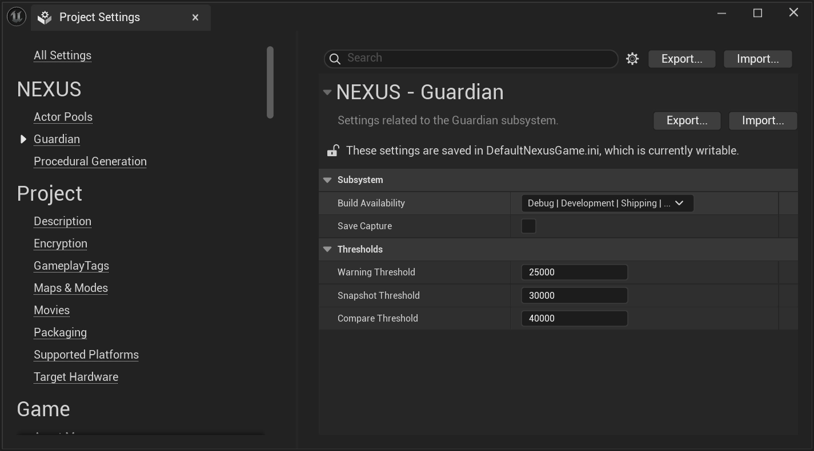

import DocCardList from '@theme/DocCardList';
import PluginDetails from '../../../src/components/PluginDetails';

# Guardian

<PluginDetails moduleName="NexusGuardian" />

## Settings

| Setting | Description | Default |
| :-- | --- | :-- |
| Use Developer Subsystem | Should the Developer Subsystem be created? It is required for `UObject` monitoring, and you still must call `UNDeveloperSubsystem::SetBaseline()`! | `false` |
| Warning Threshold | The number of `UObjects` added after setting the baseline when a warning message will be thrown. | `25000` |
| Snapshot Threshold | The number of `UObjects` added after after setting the baseline when a `FNObjectSnapshot` will be taken of the currnet `UObjects`. | `30000` |
| Save Capture? | Should the `FNObjectSnapshot` captured be outputted to the project's log folder with a prefix of `NEXUS_Snapshot_*`. | `false` |
| Compare Threshold | The number of `UObjects` added after after setting the baseline when another `FNObjectSnapshot` will be taken, and then compared against the previous. This will then output the detailed summary of the compare to the project's log folder wih the prefix `NEXUS_Compare_*`. | `40000` |