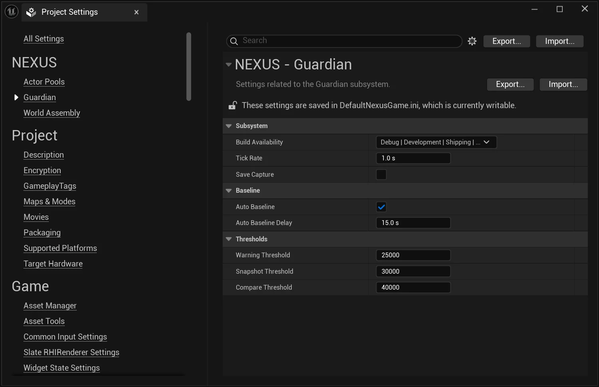

# Project Settings

From the `Edit > Project Settings` window, find the **Guardian** section.

## Configuration Options

| Setting | Description | Default |
| :-- | --- | :-- |
| `Build Availability` | Bitmask of `ENBuildConfigurationAvailability` flags (`Debug`, `Development`, `Shipping`, `Test`, `Editor`) controlling which build configurations the [UNGuardianSubsystem](types/guardian-subsystem.md) is created in. Set to `None` (`0`) to disable the subsystem entirely. | `Debug`, `Development`, `Test`, `Editor` (everything except `Shipping`) |
| `Save Capture` | When `true`, snapshot and compare results are written to the project's `Saved/Logs` folder with the prefix `NEXUS_Snapshot_*` and `NEXUS_Compare_*`. Disk output is not required for comparison — snapshots are also held in memory. | `false` |
| `Warning Threshold` | The number of `UObjects` added after [`SetBaseline()`](types/guardian-subsystem.md) at which a warning is logged. | `25000` |
| `Snapshot Threshold` | The number of `UObjects` added after baseline at which an `FNObjectSnapshot` is captured. The snapshot is held in memory and (if `Save Capture` is enabled) written to disk. | `30000` |
| `Compare Threshold` | The number of `UObjects` added after baseline at which a second snapshot is captured and diffed against the first. The detailed compare summary is written to the project log folder when `Save Capture` is enabled. | `40000` |

:::info

The threshold fields are disabled in the editor when `Build Availability` is set to `None`, since the subsystem will not be created and the values would have no effect.

:::

:::tip

The defaults intentionally fire the warning, snapshot, and compare actions across a `15,000`-object spread (`25k` → `30k` → `40k`). If your project routinely creates more than `25k` `UObjects` after a stable baseline, raise all three thresholds proportionally rather than disabling them — the staged ladder is what makes the leak detection useful.

:::
