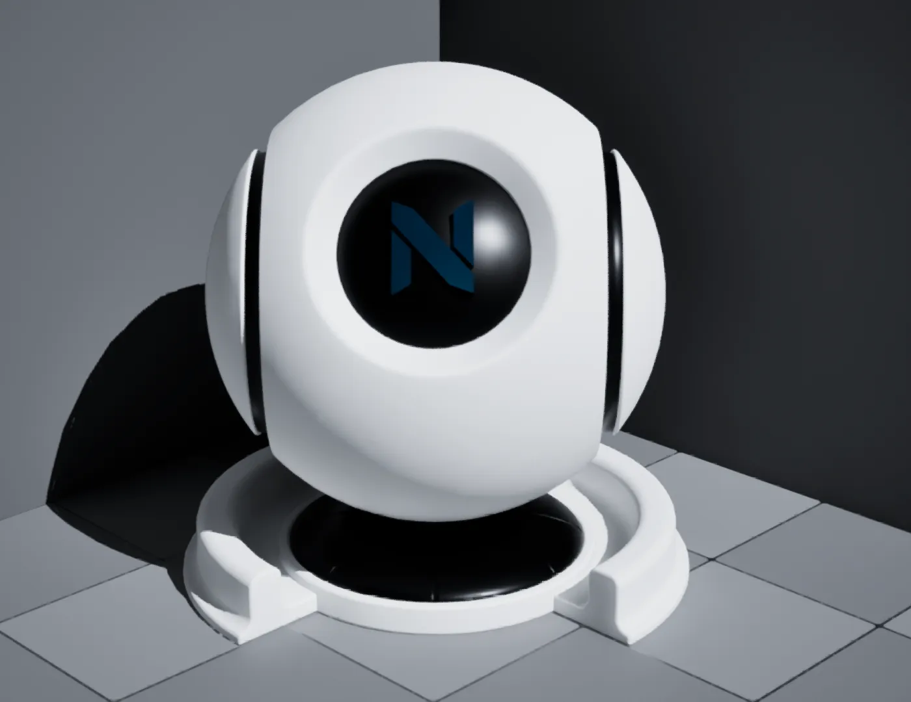
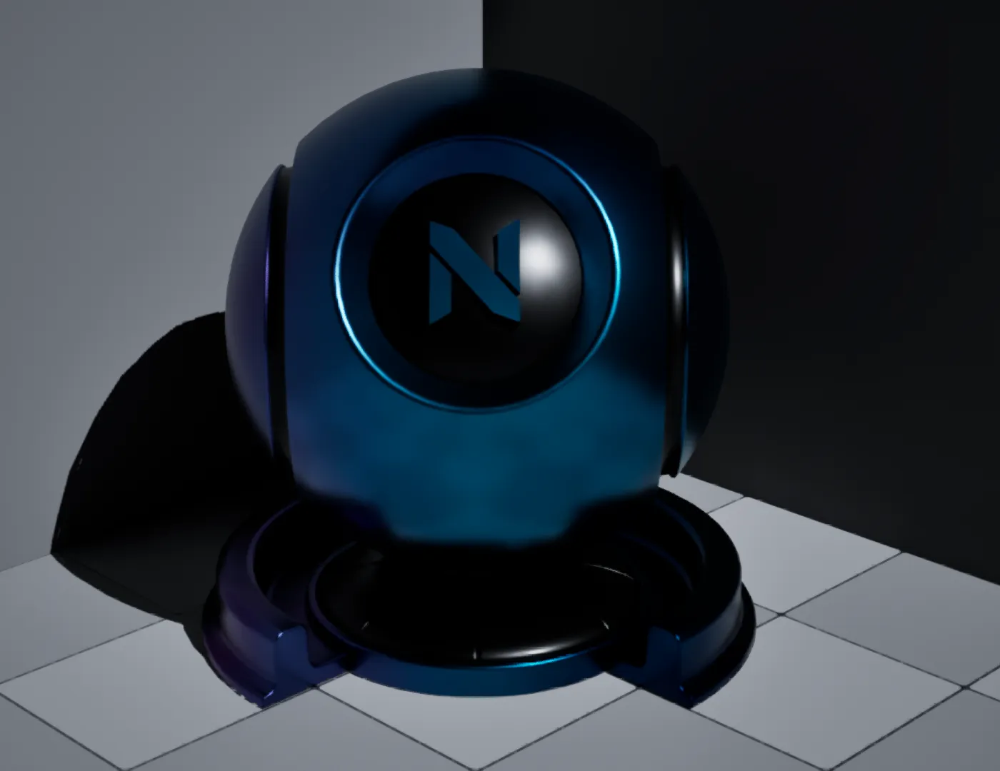
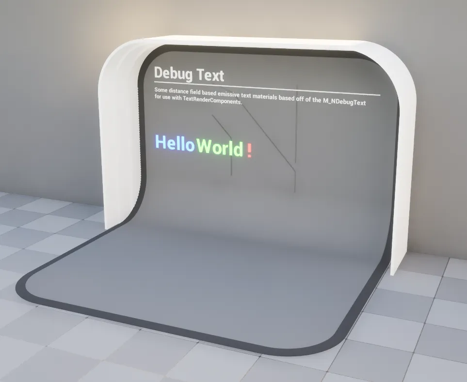

import DocCardList from '@theme/DocCardList';
import PluginDetails from '../../../src/components/PluginDetails';

# Material Library

<PluginDetails moduleName="NexusMaterialLibrary" />

## Materials

A library of pre-built materials to use with your content.

## Debug Text

A selection of distance-field based font material instances (prefixed with `MI_NDebugText_`) used with text `UTextRenderComponent`.

<DocCardList />
