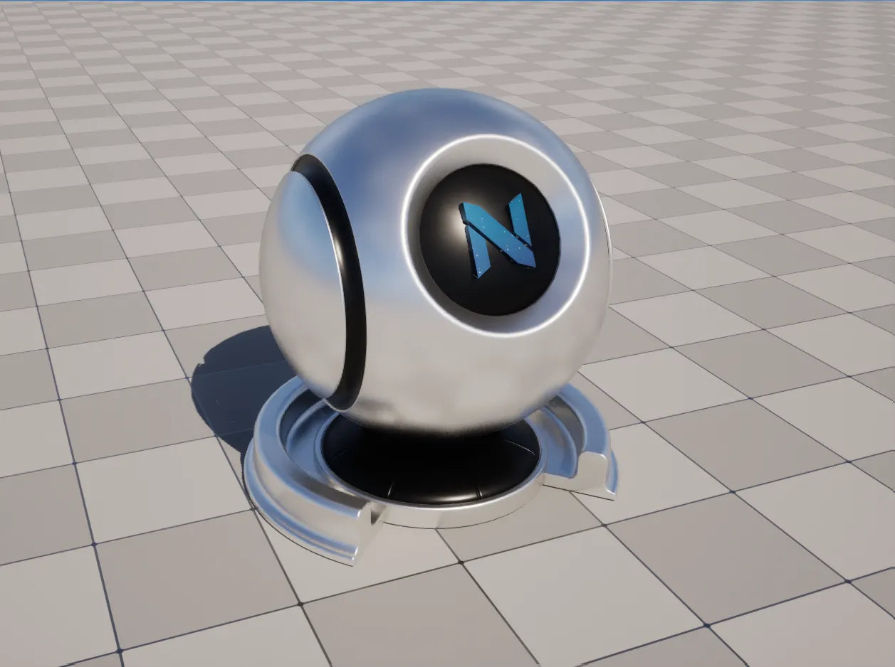
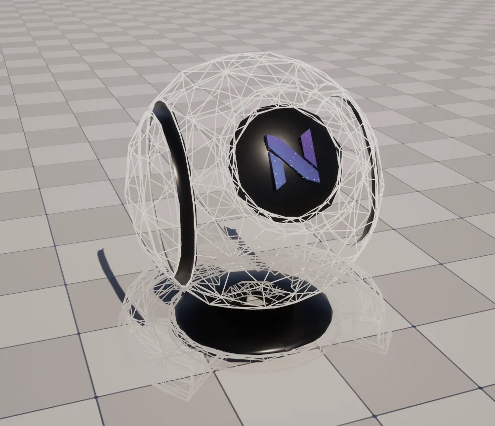

import DocCardList from '@theme/DocCardList';
import PluginDetails from '../../../src/components/PluginDetails';

# Material Library

<PluginDetails moduleName="NexusMaterialLibrary" />

## Debug

A selection of colored material instances (prefixed with `MI_NDebug_`) useful for prototyping and simple tests. 

## Metal

### Metal: Anodized

A selection of metal-based material instances (prefixed with `MI_NMetal_Anodized_`) useful to portray the look of anodized metals (usually aluminum).

## Specialty

### Debug Text

A selection of distance-field based font material instances (prefixed with `MI_NDebugText_`) used with text `UTextRenderComponent`.

### Wireframe

### NEXUS

<DocCardList />
