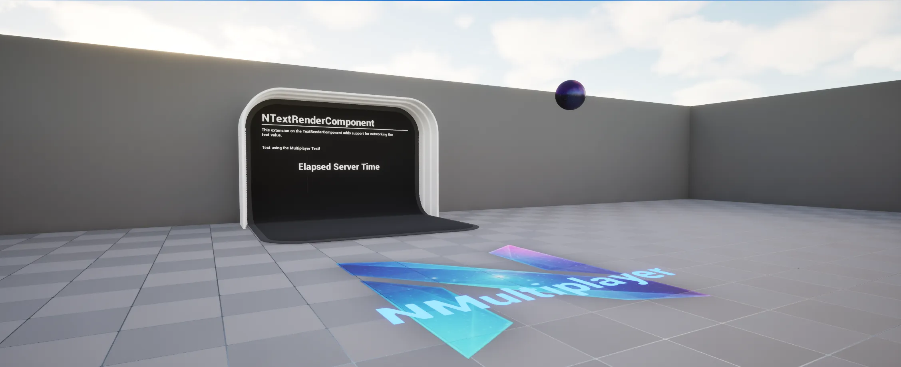

import DocCardList from '@theme/DocCardList';
import PluginDetails from '../../../src/components/PluginDetails';

# Multiplayer

<PluginDetails moduleName="NexusMultiplayer" />

This plugin is built to assist with the development of networked games by building ontop of the existing network stack.

- **Multiplayer Test:** Simple and quick testing of the multiplayer experience.
- **Authority Validation:** Optimized functionality for determining roles and levels of authority.

## Samples

The `DEMO_NMultiplayerLibrary` sample map is available once you have enabled the `NEXUS Samples: Multiplayer Library` plugin. This is found in the `NEXUS Samples` category in the `Edit > Plugins` window.

The map is pretty empty currently as most of the functionality added by the library is either in native land, or is actually tooling built ontop of the editor.