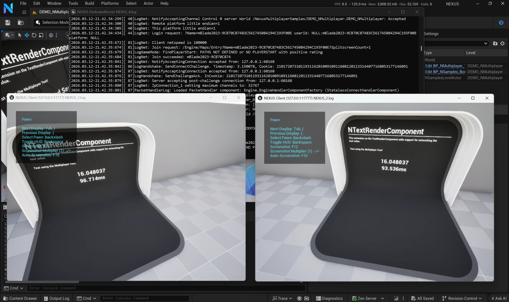
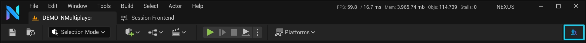
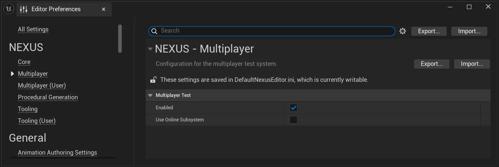
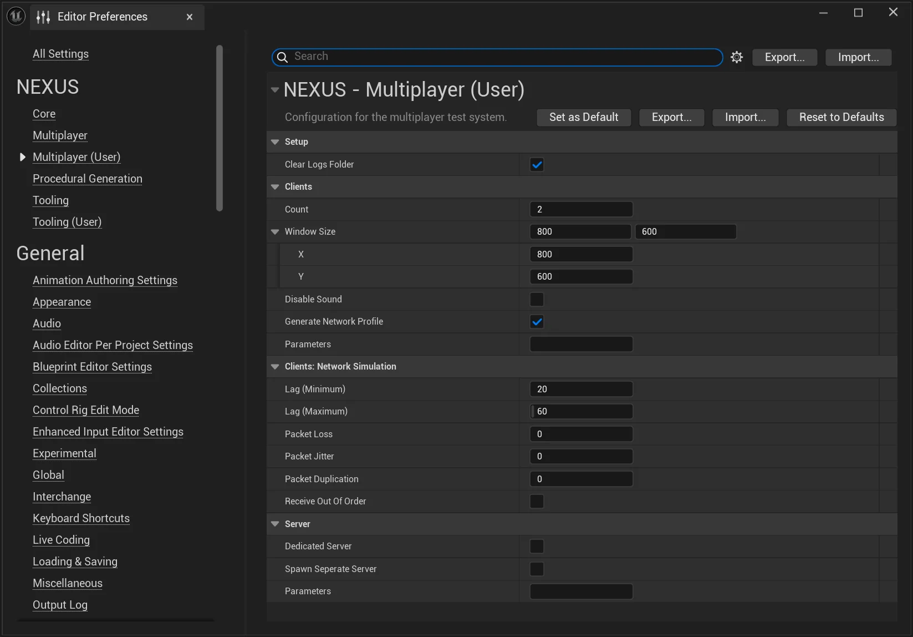

# Multiplayer Test

The **Multiplayer Test** quickly assumes a pivotal role in the development of a multiplayer game, enabling developers to validate their work efficiently in a locally bootstrapped multi-client setup.

After some possible [initial configuration](#user-settings), clicking the button on the right side of the editor's header launches the preconfigured sessions directly into the current level. Clicking the button again tears it all down.

*One click to get to testing. It's just that simple!*

## Project-Level Settings

The project-level toggles live under `Edit > Editor Preferences > Multiplayer` and travel with the project (stored in `NexusEditor.ini`). These control whether the test surface is exposed at all and how authentication is configured for the spawned session — both apply to every developer working on the project.

| Setting | Description | Default |
| :-- | --- | :-- |
| Enabled | Toggles whether the **Multiplayer Test** entry is added to the editor's play menu and toolbar. Turning this off removes the test button without uninstalling the plugin. | `true` |
| Use Online Subsystem | Should authentication use the Online Subsystem when the test session is launched? | `false` |

See [UNMultiplayerEditorSettings](editor-types/multiplayer-editor-settings.md) for the type backing these.

## User Settings

While the default settings should get most developers started, every game has its unique take on multiplayer and online services. The per-user knobs live under `Edit > Editor Preferences > Multiplayer (User)` and are stored in your local `NexusUserSettings.ini`, so they don't pollute the project's shared configuration. These back [UNMultiplayerEditorUserSettings](editor-types/multiplayer-editor-user-settings.md).

### Setup

| Setting | Description | Default |
| :-- | --- | :-- |
| Clear Logs Folder | Clear the (not-in-use) log files prior to running a test. Useful for keeping each session's log output isolated. | `false` |

### Clients

| Setting | Description | Default |
| :-- | --- | :-- |
| Count | The number of client instances to spin up. | `2` |
| Window Size | The size of the windows to create for the clients. | `800x600` |
| Disable Sound | Disables sounds on the spawned clients. | `false` |
| Generate Network Profile | Should a profile be captured of network traffic for each client? | `false` |
| Parameters | Additional launch parameters to pass to the client being launched. | `<none>` |

#### Clients: Network Simulation

| Setting | Description | Default |
| :-- | --- | :-- |
| Lag (Minimum) | The minimum amount of network lag (ms) to be simulated on top of the existing round trip time. | `20` |
| Lag (Maximum) | The maximum amount of network lag (ms) to be simulated on top of the existing round trip time. | `60` |
| Packet Loss | An amount of packet loss (%) to be simulated. | `0` |
| Packet Jitter | An amount of packet jitter (ms) to be simulated. | `0` |
| Packet Duplication | An amount of packet duplication (%) to be simulated. | `0` |
| Receive Out Of Order | Forces network packets to be received out of order. | `false` |

### Server

| Setting | Description | Default |
| :-- | --- | :-- |
| Generate Network Profile | Should a profile be captured of network traffic for the server? This option is **hidden** (and has no effect) when the clients variant is enabled, since the per-client profile already covers the relevant traffic. | `false` |
| Dedicated Server | Spawn a dedicated server for clients to connect to. | `true` |
| Spawn Separate Server | A rarely used option that will launch a separate server (possibly hidden in-process depending on `RunUnderOneProcess`) even if the net mode does not require a server (such as Standalone). If the net mode requires a server (such as Client) a server will be launched for you (regardless of this setting). | `false` |
| Parameters | Additional launch parameters to pass to the server being launched. These parameters are on top of the existing client parameters. |`<none>` |

## Network Profiler

One of the options available for the **Multiplayer Test** is to generate a network profile alongside the test, which is stored in the local `<PROJECT_DIRECTORY>/Saved/Profiling/` folder. 
These profiles can provide vital information about the makeup of your network communications and reveal crucial optimization opportunities. 

:::warning
This [tool](https://dev.epicgames.com/documentation/en-us/unreal-engine/using-the-network-profiler-in-unreal-engine) is **NOT** bundled with the downloadable Epic Game Launcher version of the Unreal Engine, and must be built from [source](https://github.com/EpicGames/UnrealEngine/tree/master/Engine/Source/Programs/NetworkProfiler). There is a [public rewrite](https://github.com/ryanjon2040/UnrealNetworkProfiler) of the tool available from 2021, but is not as feature complete as the internal tool.
:::

When the tool (`NetworkProfiler.exe`) is present in the engines' folder under `Binaries/DotNet`, the **NexusCoreEditor** will automatically add an entry into the `Tools > Profile` menu.

