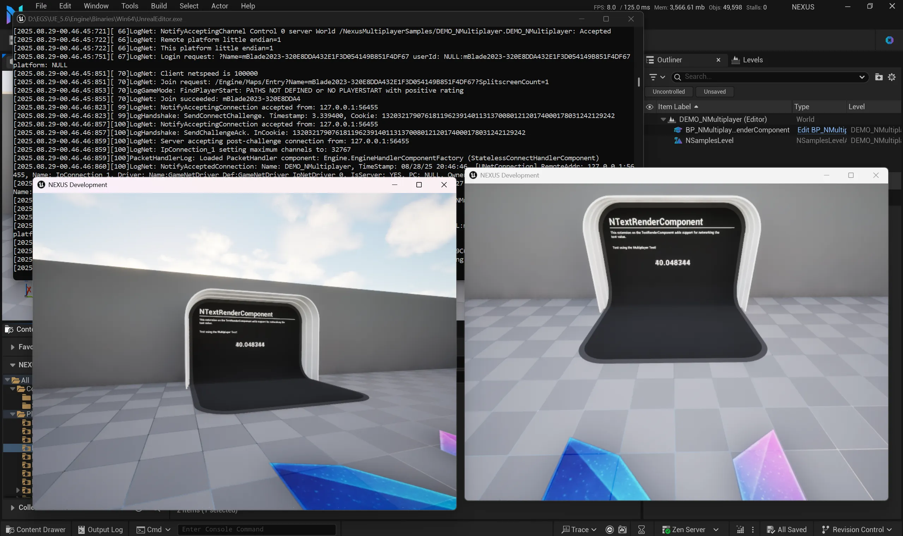
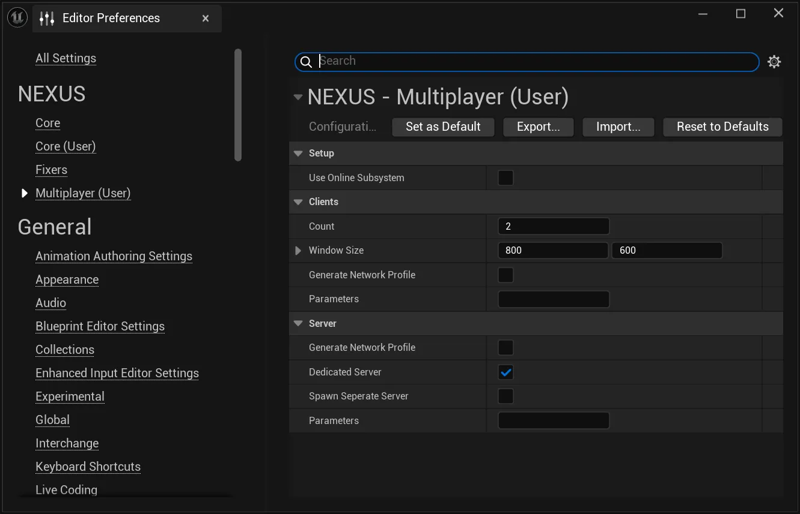

# Multiplayer Test

The **Multiplayer Test** quickly assumes a pivotal role in the development of a multiplayer game, enabling developers to validate their work efficiently in a locally bootstrapped multi-client setup.

After some possible [initial configuration](#settings), clicking the button on the right side of the editor's header launches the preconfigured sessions directly into the current level. Clicking the button again tears it all down. 

*One click to get to testing. It's just that simple!*

## Settings

While the default settings should get most developers started, every game has its unique take on multiplayer and online services. Thus, a more robust set of configuration can be accessed via `Edit > Editor Preferences > Multiplayer (User)`.

### Setup 
| Setting | Description | Default |
| :-- | --- | :-- |
| Use Online Subsystem | Should authentication use the Online Subsystem? | `false` |

### Clients

| Setting | Description | Default |
| :-- | --- | :-- |
| Count | The number of client instances to spin up. | `2` |
| Window Size | The size of the windows to create for the clients. | `800x600` |
| Generate Network Profile | Should a profile be captured of network traffic for each client? | `false` |
| Parameters | Additional launch parameters to pass to the client being launched." | `<none>` |

### Server

| Setting | Description | Default |
| :-- | --- | :-- |
| Generate Network Profile | Should a profile be captured of network traffic for the server? This option is **forced on** when the clients variant is toggled on. | `false` |
| Dedicated Server | Spawn a dedicated server for clients to connect to. | `true` |
| Seperate Server | A rarely used option that will launch a separate server (possibly hidden in-process depending on RunUnderOneProcess) even if the net mode does not require a server (such as Standalone). If the net mode requires a server (such as Client) a server will be launched for you (regardless of this setting). | `false` |
| Parameters | Additional launch parameters to pass to the server being launched. These parameters are on top of the existing client parameters. |`<none>` |

:::tip

Network profiles are stored in `<PROJECT_DIRECTORY>/Saved/Profiling/`

:::