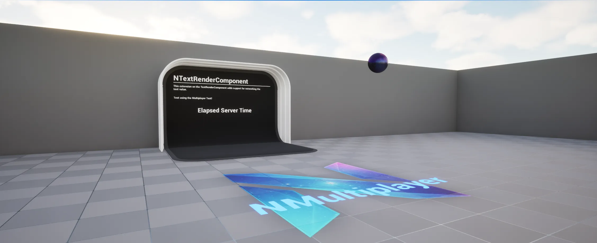

# Samples

The `DEMO_NMultiplayerLibrary` sample map is available once you have enabled the `NEXUS Samples: Multiplayer Library` plugin. This is found in the `NEXUS Samples` category in the `Edit > Plugins` window.

The map is pretty empty currently as most of the functionality added by the library is either in native land, or is actually tooling built ontop of the editor.