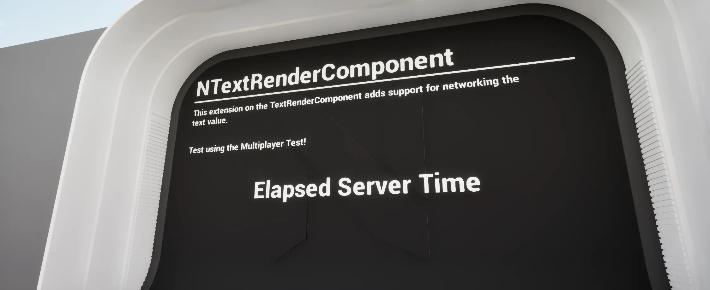

import TypeDetails from '../../../../src/components/TypeDetails';

# Text Render Component

<TypeDetails icon="ue-actor-component" base="UActorComponent" type="UNTextRenderComponent" typeExtra="" headerFile="NexusMultiplayer/Public/UTextRenderComponent.h" />



## Functions

```cpp
UFUNCTION(BlueprintCallable, DisplayName="Set From Name", Category = "NEXUS|Multiplayer")
void SetFromName(const FName& NewValue);

UFUNCTION(Server, Reliable, BlueprintCallable, DisplayName="Set From Name (Server)", Category = "NEXUS|Multiplayer")
void Server_SetFromName(const FName& NewValue);
```

```cpp

UFUNCTION(BlueprintCallable, DisplayName="Set From String", Category = "NEXUS|Multiplayer")
void SetFromString(const FString& NewValue);

UFUNCTION(Server, Reliable, BlueprintCallable, DisplayName="Set From String (Server)", Category = "NEXUS|Multiplayer")
void Server_SetFromString(const FString& NewValue);
```

```cpp

UFUNCTION(BlueprintCallable, DisplayName="Set From Text",  Category = "NEXUS|Multiplayer")
void SetFromText(const FText& NewValue);

UFUNCTION(Server, Reliable, BlueprintCallable, DisplayName="Set From Text (Server)", Category = "NEXUS|Multiplayer")
void Server_SetFromText(const FText& NewValue);
```

## Component Settings

| Setting | Type | Description | Default |
| :-- | :-- | :-- | :-- |
| Allow RPC | `bool` | Allow client calls to `Server_` function variants to set the content of the text renderer. | `false` |


