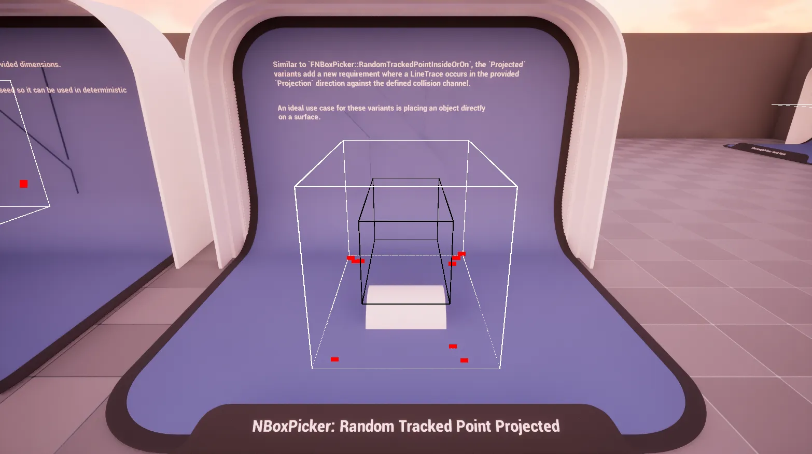

import TypeDetails from '../../../../src/components/TypeDetails';

# Box

<TypeDetails icon="ue-blueprint-function-library" base="UBlueprintFunctionLibrary" type="UNBoxPickerLibrary" typeExtra="/ FNBoxPicker" headerFile="NexusActorPools/Public/NBoxPickerLibrary.h" />

Provides various functions for generating points inside or on the surface of the **`FBox`** using different random generation strategies (deterministic, non-deterministic, seeded).

The `UNBoxPickerLibrary` wraps the native `FNBoxPicker` functionality in a **Blueprint** friendly manner. Should you be wanting to utilize a picker in _native_ code it is best to directly reference `FNBoxPicker` directly to avoid the abstraction layer as it has a similar API.

## Methods

### Next Point

 

Gets the next deterministic point inside or on an `FBox`.

:::info

Uses `FNRandom::Deterministic` to ensure reproducible results.

:::

### Random Point

Gets a random point inside or on an `FBox`.

:::info

Uses `FNRandom::NonDeterministic` to produce pseudo-random results.

:::

### One-Shot Point

Gets a random point inside or on an  `FBox` using a one-shot seed.

### Tracked Point

Gets a random point inside or on an `FBox` using a tracked seed. The seed altered for each `Count`.

## FNBoxPickerParams

### Base
|Parameter|Type|Description|Default|
|:--|:--|:--|:--|
| Count | `int` | The number of points to generate in a single pass. | `1` |
| CachedWorld | `TObjectPtr<UWorld>` | The world for line tracing and drawing. | |
| ProjectionMode | `ENPickerProjectionMode` | Should the point be projected somewhere? | `ENPickerProjectionMode::None` |
| Projection | `FVector` | Direction and distance for the line trace. | `FVector(0,0,-500.f)` |
| CollisionChannel | `TEnumAsByte<ECollisionChannel>` | The collision channel to use for tracing. | `ECC_WorldStatic` |

### Box
|Parameter|Type|Description|Default|
|:--|:--|:--|:--|
| Origin | `FVector` | The center point when attempting to generate new points. | `FVector::ZeroVector` |
| MinimumDimensions | `FBox` | The minimum dimensions to use when generating a point. | `FBox(ForceInit)` |
| MaximumDimensions | `FBox` | The maximum dimensions to use when generating a point. | `FBox(ForceInit)` |