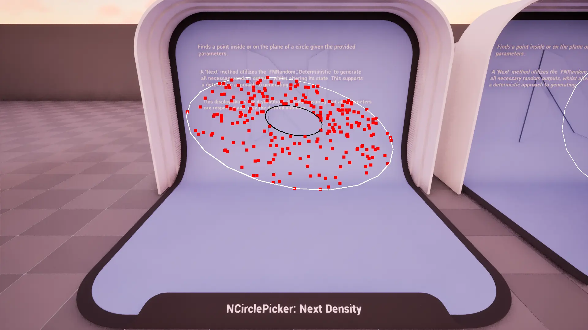
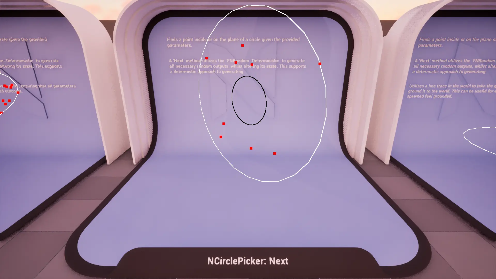
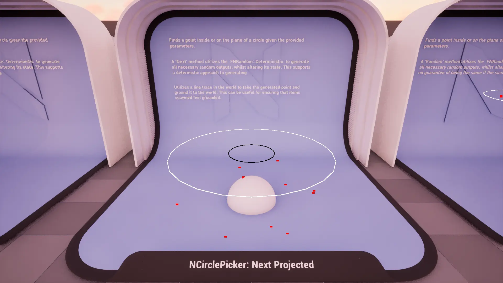
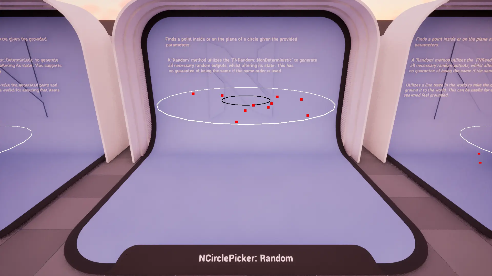
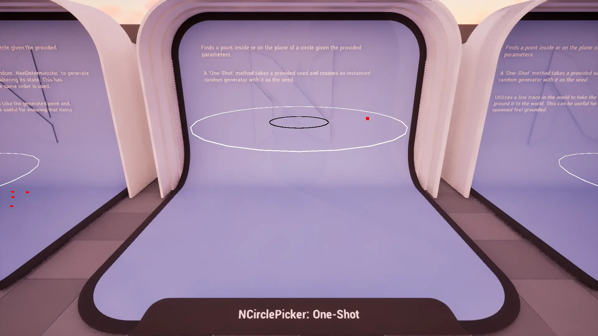
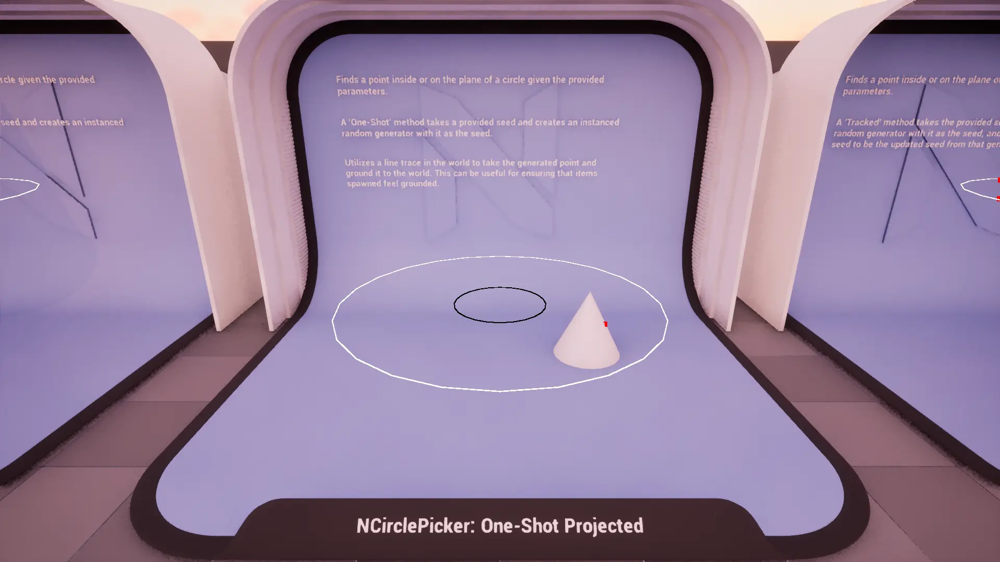
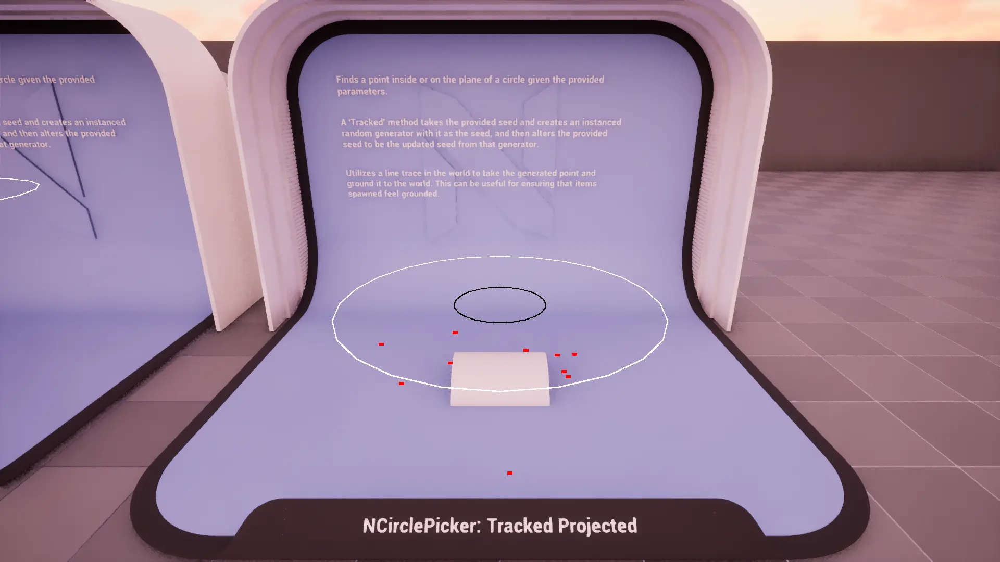

import TypeDetails from '../../../../src/components/TypeDetails';

# Circle

<TypeDetails icon="ue-blueprint-function-library" base="UBlueprintFunctionLibrary" type="UNCirclePickerLibrary" typeExtra="/ FNCirclePicker" headerFile="NexusActorPools/Public/NCirclePickerLibrary.h" />

Provides various functions for generating points in the plane of a **circle** using different random generation strategies (deterministic, non-deterministic, seeded).

The `UNCirclePickerLibrary` wraps the native `FNCirclePicker` functionality in a **Blueprint** friendly manner. Should you be wanting to utilize a picker in _native_ code it is best to directly reference `FNCirclePicker` directly to avoid the abstraction layer as it has a similar API.

## Methods

### Next Point

Generates a deterministic point inside or on the perimeter of a circle.

:::info

Uses `FNRandom::Deterministic` to ensure reproducible results.

:::

### Random Point

Generates a random point inside or on the perimeter of a circle.

:::info

Uses `FNRandom::NonDeterministic` to produce pseudo-random results.

:::

### One-Shot Point

Generates a random point inside or on the perimeter of a circle using a provided seed. Useful for one-time random point generation with reproducible results.

### Tracked Point

Generates a random point inside or on the perimeter of a circle while tracking the random seed state. Updates the seed value to enable sequential random point generation.

## FNCirclePickerParams

### Base
|Parameter|Type|Description|Default|
|:--|:--|:--|:--|
| Count | `int` | The number of points to generate in a single pass. | `1` |
| CachedWorld | `TObjectPtr<UWorld>` | The world for line tracing and drawing. | |
| ProjectionMode | `ENPickerProjectionMode` | Should the point be projected somewhere? | `ENPickerProjectionMode::None` |
| Projection | `FVector` | Direction and distance for the line trace. | `FVector(0,0,-500.f)` |
| CollisionChannel | `TEnumAsByte<ECollisionChannel>` | The collision channel to use for tracing. | `ECC_WorldStatic` |

### Circle
|Parameter|Type|Description|Default|
|:--|:--|:--|:--|
| Origin | `FVector` | The center point when attempting to generate new points. | `FVector::ZeroVector` |
| MinimumRadius | `float` | The minimum radius of the circle (inner bound). | `0.f` |
| MaximumRadius | `float` | The maximum radius of the circle (outer bound). | `10.f` |
| Rotation | `FRotator` | The rotation of the circle plane. | `FRotator::ZeroRotator` |