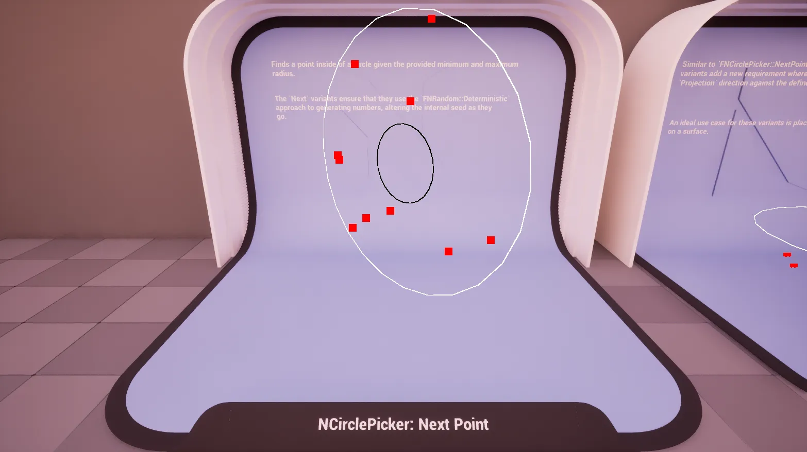
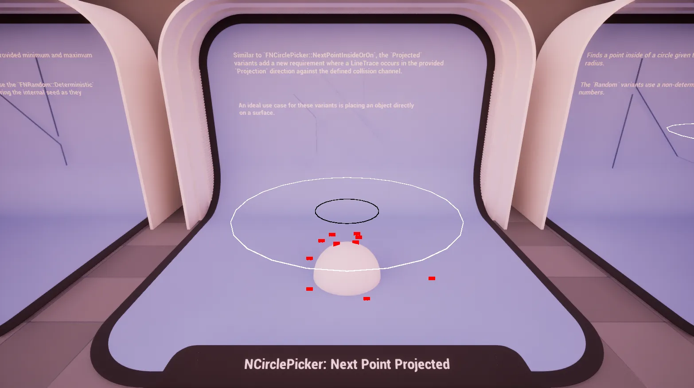
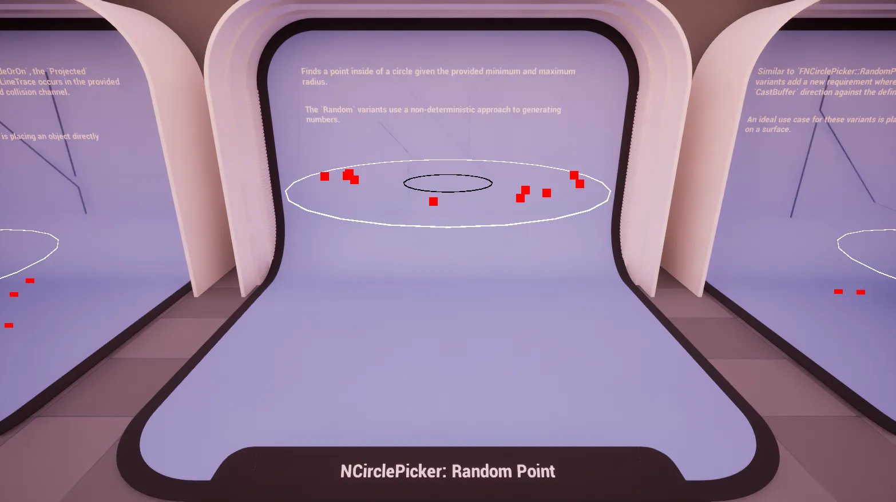
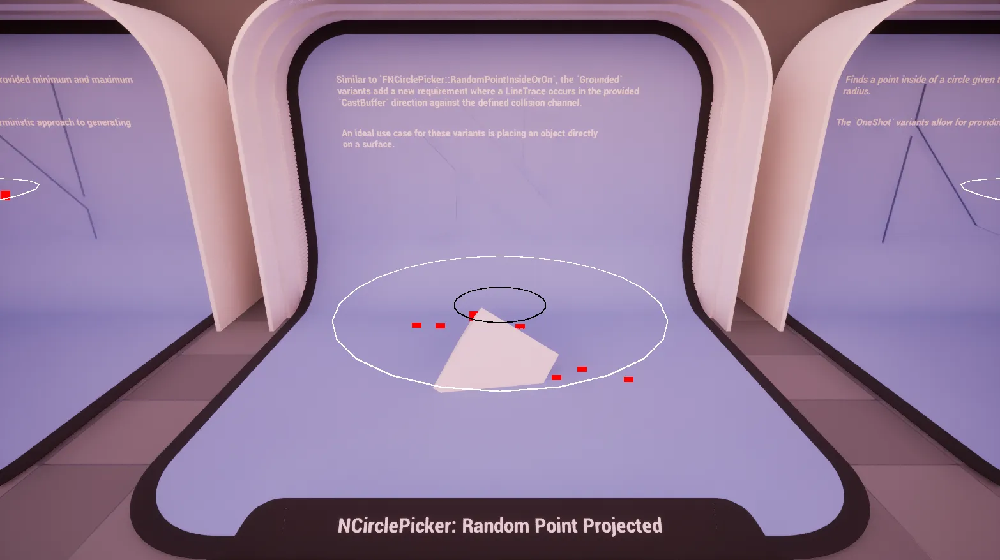
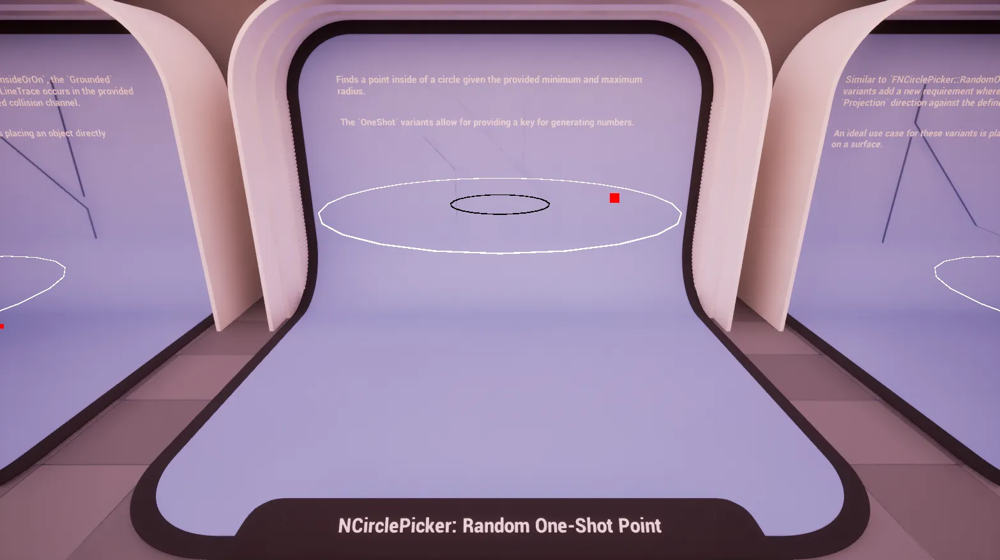
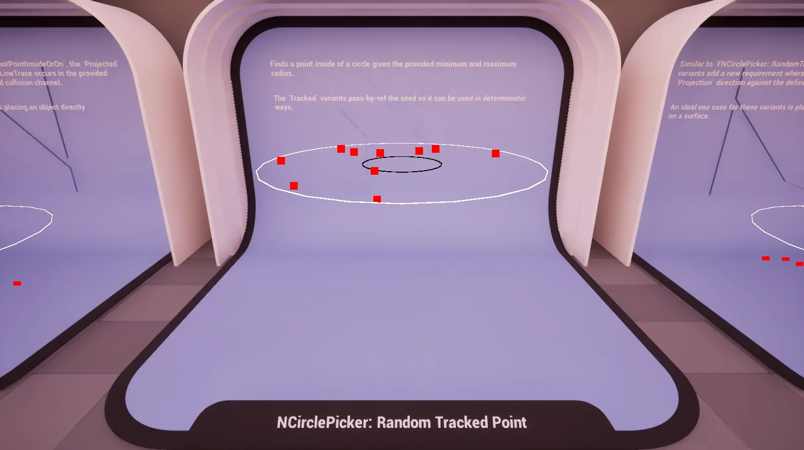
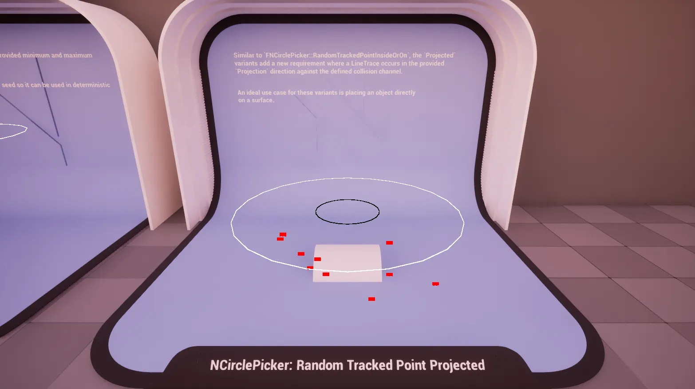

import TypeDetails from '../../../../src/components/TypeDetails';

# Circle

<TypeDetails icon="ue-blueprint-function-library" base="UBlueprintFunctionLibrary" type="UNCirclePickerLibrary" typeExtra="/ FNCirclePicker" headerFile="NexusActorPools/Public/NCirclePickerLibrary.h" />

Provides various functions for generating points in the plane of a **circle** using different random generation strategies (deterministic, non-deterministic, seeded).

The `UNCirclePickerLibrary` wraps the native `FNCirclePicker` functionality in a **Blueprint** friendly manner. Should you be wanting to utilize a picker in _native_ code it is best to directly reference `FNCirclePicker` directly to avoid the abstraction layer as it has a similar API.

## Methods

### Next Point (IO)

 

Generates a deterministic point ***[i]nside or [o]n*** the perimeter of a circle.

:::info

Uses `FNRandom::Deterministic` to ensure reproducible results.

:::

### Next Point Projected (IO)

Generates a deterministic point ***[i]nside or [o]n*** the perimeter of a circle, then projects it to the world. The point is projected in the given direction until it hits something in the world.

:::info

Uses `FNRandom::Deterministic` to ensure reproducible results.

:::

### Random Point (IO)

Generates a random point ***[i]nside or [o]n*** the perimeter of a circle. Uses the non-deterministic random generator for true randomness.

### Random Point Projected (IO)

Generates a random point ***[i]nside or [o]n*** the perimeter of a circle, then projects it to the world. The point is projected in the given direction until it hits something in the world.

### Random One-Shot Point (IO)

Generates a random point ***[i]nside or [o]n*** the perimeter of a circle using a provided seed. Useful for one-time random point generation with reproducible results.

### Random One-Shot Point Projected (IO)

Generates a random point ***[i]nside or [o]n*** the perimeter of a circle using a provided seed, then projects it to the world. The point is projected in the given direction until it hits something in the world.

### Random Tracked Point (IO)

Generates a random point ***[i]nside or [o]n*** the perimeter of a circle while tracking the random seed state. Updates the seed value to enable sequential random point generation.

### Random Tracked Point Projected (IO)

Generates a random point ***[i]nside or [o]n*** the perimeter of a circle while tracking the random seed state, then projects it to the world. Updates the seed value to enable sequential random point generation. The point is projected in the given direction until it hits something in the world.

## Parameters

|Variant|Parameter|Type|Description|Default|
|:--|:--|:--|:--|:--|
| _Base_ | Origin | `FVector&` | The center world point of the circle. ||
| _Base_ | MinimumRadius | `float` | The minimum radius of the circle (inner bound). ||
|  _Base_ | MaximumRadius | `float` |The maximum radius of the circle (outer bound). ||
|  _Base_ | Rotation | `FRotator` | Optional rotation to apply to the circle plane | `FRotator::ZeroRotator`|
| **Projected** | WorldContextObject | `UObject*` | Object that provides access to the world, usally auto-filled in Blueprint. | `WorldContext` |
| **Projected** | Projection | `FVector` | Direction and distance for the line trace. | `FVector(0,0,-500.f)` |
| **Projected** | CollisionChannel | `ECollisionChannel` | The collision channel to use for tracing. | `ECC_WorldStatic` |
| **Tracked** | Seed | `int32&` | The seed to be used when generating, and altered for determinism. | |
| **One-Shot** | Seed | `int32` | The throw-away seed used when generating. | |