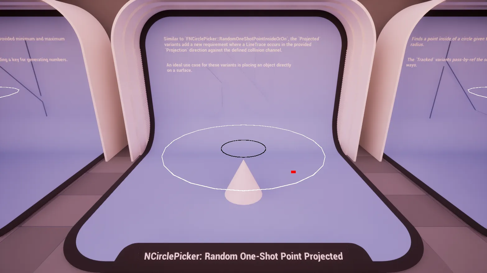

import TypeDetails from '../../../../src/components/TypeDetails';

# Circle

<TypeDetails icon="ue-blueprint-function-library" base="UBlueprintFunctionLibrary" type="UNCirclePickerLibrary" typeExtra="/ FNCirclePicker" headerFile="NexusActorPools/Public/NCirclePickerLibrary.h" />

The `UNCirclePickerLibrary` wraps the native `FNCirclePicker` functionality in a **Blueprint** friendly manner. Should you be wanting to utilize a picker in _native_ code it is best to directly reference `FNCirclePicker` directly to avoid the abstraction layer as it has a similar API.

## Deterministic

### Next Point (Inside Or On)

Generates a deterministic point inside or on the perimeter of a circle. Uses the deterministic random generator to ensure reproducible results.

|Parameter|Type|Description|Default|
|:--|:--|:--|---|
| Origin | `FVector&` |The center world point of the circle. ||
| MinimumRadius | `float` | The minimum radius of the circle (inner bound). ||
| MaximumRadius | `float` |The maximum radius of the circle (outer bound). ||
| Rotation | `FRotator` | Optional rotation to apply to the circle plane | `FRotator::ZeroRotator`|

### Next Point Projected (Inside Or On)

Generates a deterministic point inside or on the perimeter of a circle, then projects it to the world. The point is projected in the given direction until it hits something in the world.

## Random

### Random Point (Inside Or On)

Generates a random point inside or on the perimeter of a circle. Uses the non-deterministic random generator for true randomness.

### Random Point Projected (Inside Or On)

Generates a random point inside or on the perimeter of a circle, then projects it to the world. The point is projected in the given direction until it hits something in the world.

## One-Shot

### Random One-Shot Point (Inside Or On)

Generates a random point inside or on the perimeter of a circle using a provided seed. Useful for one-time random point generation with reproducible results.

### Random One-Shot Point Projected (Inside Or On)

Generates a random point inside or on the perimeter of a circle using a provided seed, then projects it to the world. The point is projected in the given direction until it hits something in the world.

## Tracked

### Random Tracked Point (Inside Or On)

Generates a random point inside or on the perimeter of a circle while tracking the random seed state. Updates the seed value to enable sequential random point generation.

### Random Tracked Point Projected (Inside Or On)

Generates a random point inside or on the perimeter of a circle while tracking the random seed state, then projects it to the world. Updates the seed value to enable sequential random point generation. The point is projected in the given direction until it hits something in the world.

