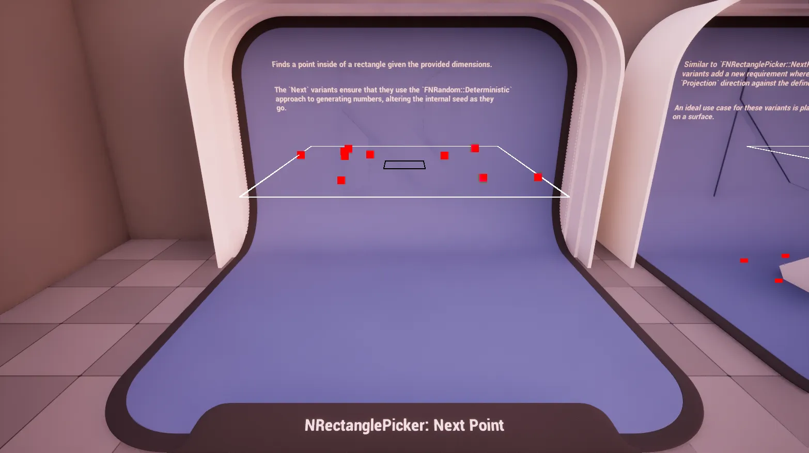
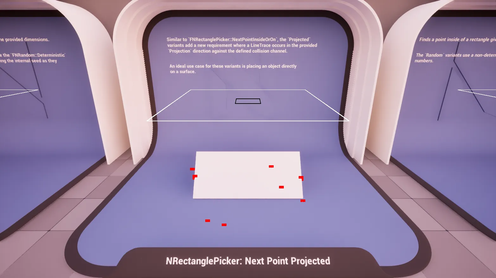
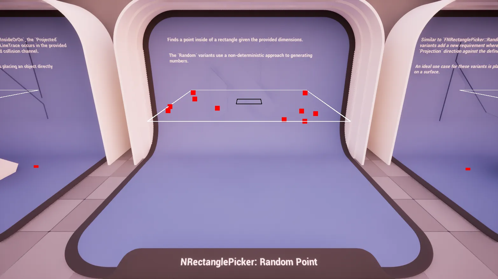
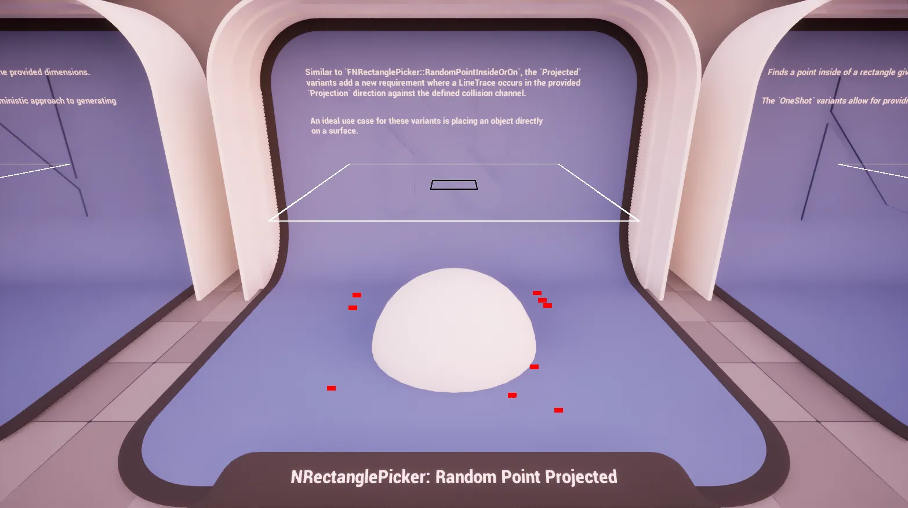
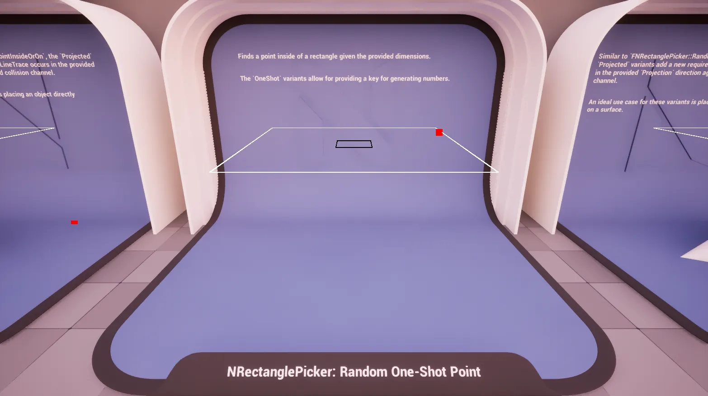
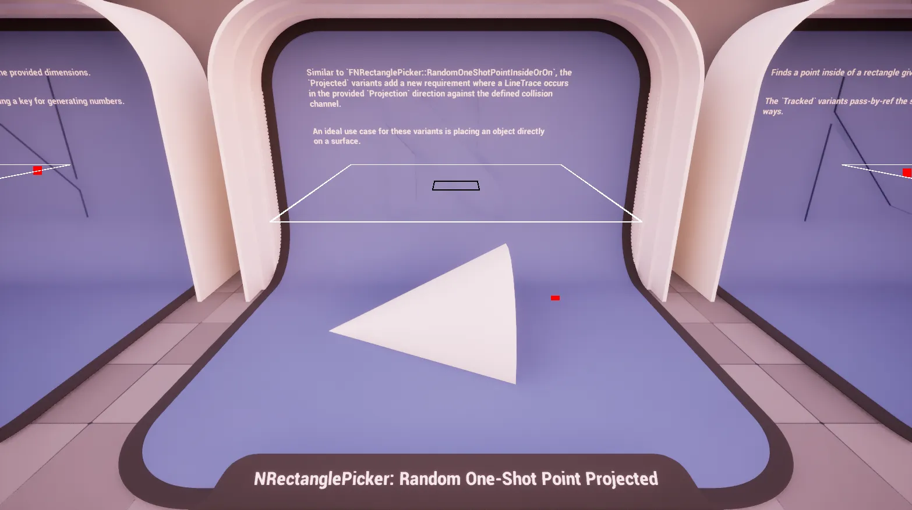
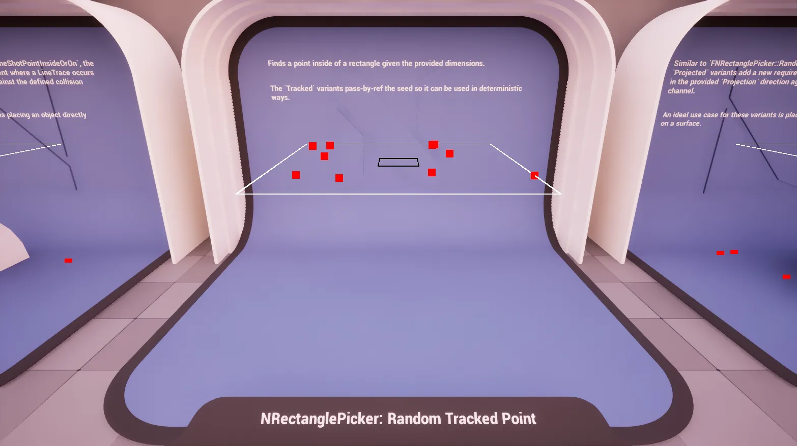
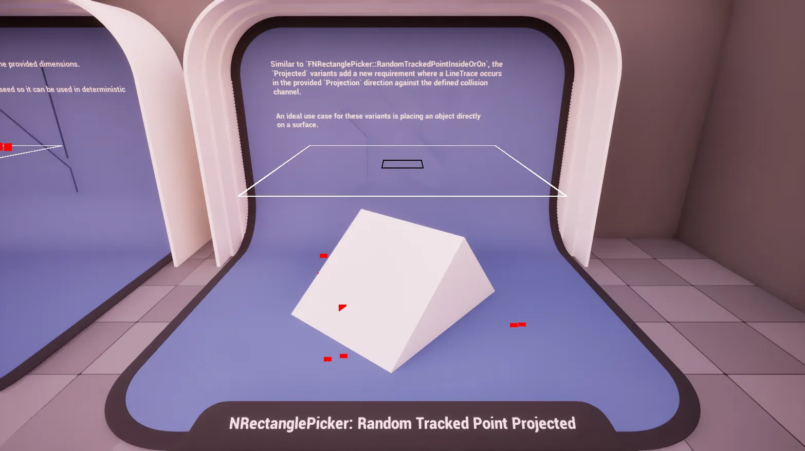

import TypeDetails from '../../../../src/components/TypeDetails';

# Rectangle

<TypeDetails icon="ue-blueprint-function-library" base="UBlueprintFunctionLibrary" type="UNRectanglePickerLibrary" typeExtra="/ FNRectanglePicker" headerFile="NexusActorPools/Public/NRectanglePickerLibrary.h" />

Provides various functions for generating points the plane of a rectangle using different random generation strategies (deterministic, non-deterministic, seeded).

The `UNRectanglePickerLibrary` wraps the native `FNRectanglePicker` functionality in a **Blueprint** friendly manner. Should you be wanting to utilize a picker in _native_ code it is best to directly reference `FNRectanglePicker` directly to avoid the abstraction layer as it has a similar API.

## Methods

:::tip

There are **Simple** variants of all of these methods which removes the inner exclusion when not needed as a minor optimization.

:::

### Next Point (IO)

 

Generates a deterministic point ***[i]nside or [o]n*** the boundary of a rectangle.

:::info

Uses `FNRandom::Deterministic` to ensure reproducible results.

:::

### Next Point Projected (IO)

Generates a deterministic point ***[i]nside or [o]n*** the boundary of a rectangle, then projects it onto a surface in the world.

:::info

Uses `FNRandom::Deterministic` to ensure reproducible results.

:::

### Random Point (IO)

Generates a random point ***[i]nside or [o]n*** the boundary of a rectangle.

### Random Point Projected (IO)

Generates a random point ***[i]nside or [o]n*** the boundary of a rectangle, then projects it onto a surface in the world.

### Random One-Shot Point (IO)

Generates a random point ***[i]nside or [o]n*** the boundary of a rectangle using a provided seed.

### Random One-Shot Point Projected (IO)

Generates a random point ***[i]nside or [o]n*** the boundary of a rectangle using a provided seed, then projects it onto a surface in the world.

### Random Tracked Point (IO)

Generates a random point ***[i]nside or [o]n*** the boundary of a rectangle using a tracked seed.

### Random Tracked Point Projected (IO)

Generates a random point ***[i]nside or [o]n*** the boundary of a rectangle using simple dimensions and a tracked seed, then projects it onto a surface in the world.

## Parameters

|Variant|Parameter|Type|Description|Default|
|:--|:--|:--|:--|:--|
| _Base_ | Origin | `FVector&` |The center world point of the rectangle. ||
| _Base_ | MinimumDimensions | `FVector2D` | The minimum dimensions of the rectangle (X = width, Y = height). ||
| _Base_ | MaximumDimensions | `FVector2D` | The maximum dimensions of the rectangle (X = width, Y = height). ||
| **Simple** | Dimensions | `FVector2D` | The dimensions of the rectangle. |
| **Projected** | WorldContextObject | `UObject*` | Object that provides access to the world, usally auto-filled in Blueprint. | `WorldContext` |
| **Projected** | Projection | `FVector` | Direction and distance for the line trace. | `FVector(0,0,-500.f)` |
| **Projected** | CollisionChannel | `ECollisionChannel` | The collision channel to use for tracing. | `ECC_WorldStatic` |
| **Tracked** | Seed | `int32&` | The seed to be used when generating, and altered for determinism. | |
| **One-Shot** | Seed | `int32` | The throw-away seed used when generating. | |