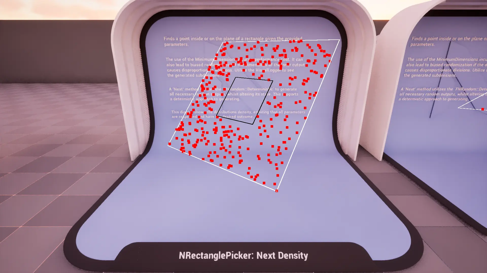
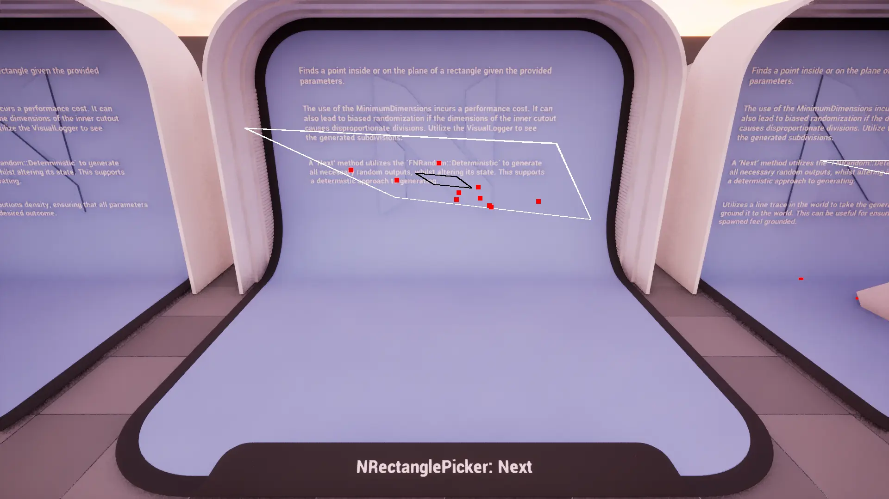
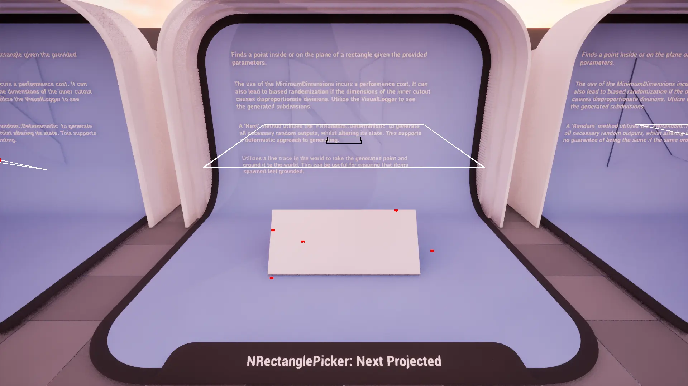
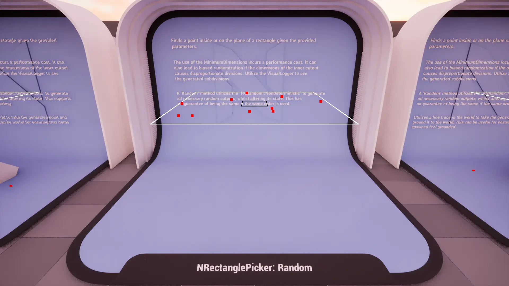
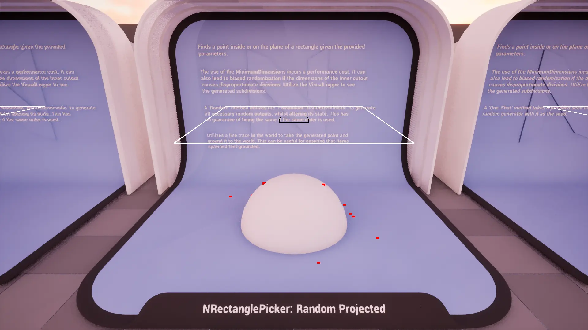
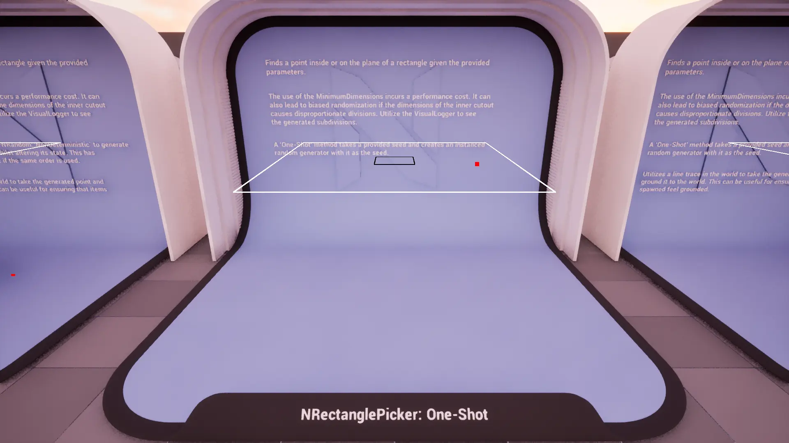
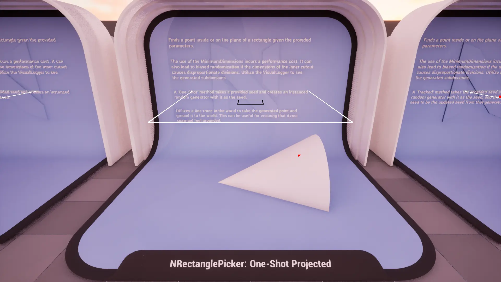
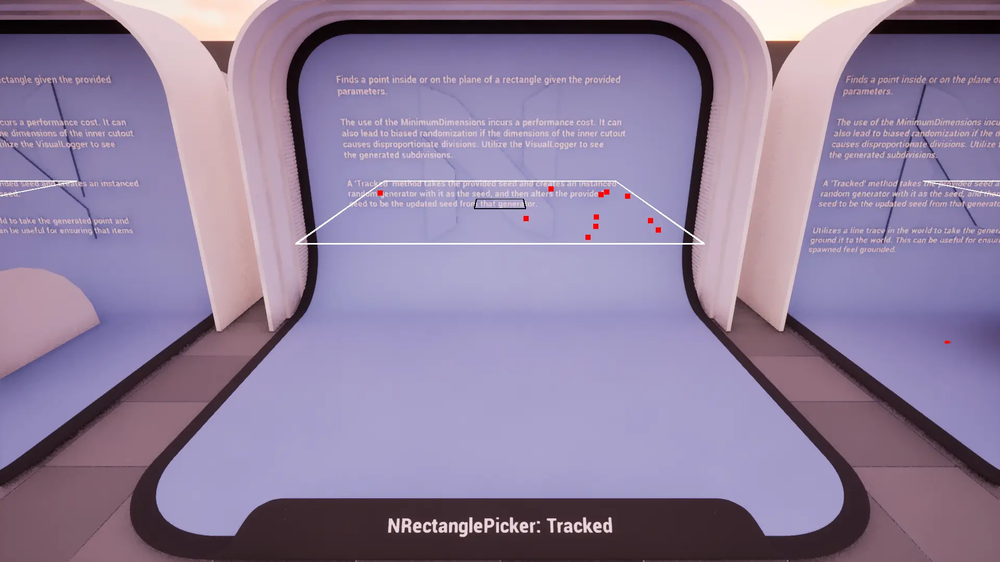
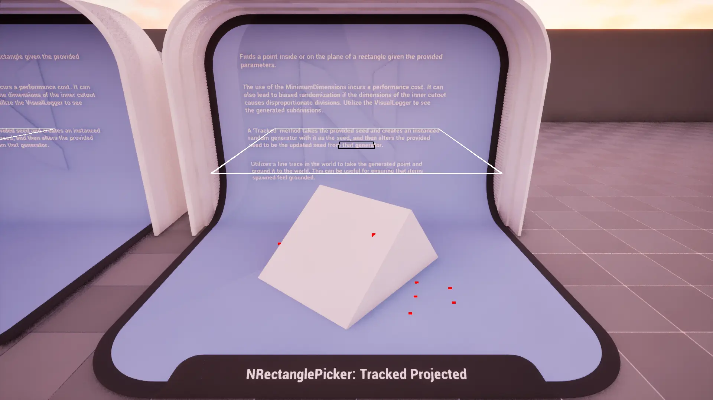

import TypeDetails from '../../../../src/components/TypeDetails';

# Rectangle

<TypeDetails icon="ue-blueprint-function-library" base="UBlueprintFunctionLibrary" type="UNRectanglePickerLibrary" typeExtra="/ FNRectanglePicker" headerFile="NexusActorPools/Public/NRectanglePickerLibrary.h" />

Provides various functions for generating points the plane of a **rectangle** using different random generation strategies (deterministic, non-deterministic, seeded).

The `UNRectanglePickerLibrary` wraps the native `FNRectanglePicker` functionality in a **Blueprint** friendly manner. Should you be wanting to utilize a picker in _native_ code it is best to directly reference `FNRectanglePicker` directly to avoid the abstraction layer as it has a similar API.

## Methods

### Next Point

 

Generates a deterministic point inside or on the boundary of a rectangle.

:::info

Uses `FNRandom::Deterministic` to ensure reproducible results.

:::

### Random Point

Generates a random point inside or on the boundary of a rectangle.

:::info

Uses `FNRandom::NonDeterministic` to produce pseudo-random results.

:::

### One-Shot Point

Generates a random point inside or on the boundary of a rectangle using a provided seed.

### Tracked Point

Generates a random point inside or on the boundary of a rectangle using a tracked seed.

## FNRectanglePickerParams

:::warning

It is important to be aware of the **performance penalty** when using `MinimumDimensions`. It is only included for special use cases where absolutely necessary. It can also create biased results when selecting points as it has to create a series of ranges first which can be used; their shapes and sizes are directly related to the inner dimensions.

:::

### Base
|Parameter|Type|Description|Default|
|:--|:--|:--|:--|
| Count | `int` | The number of points to generate in a single pass. | `1` |
| CachedWorld | `TObjectPtr<UWorld>` | The world for line tracing and drawing. | |
| ProjectionMode | `ENPickerProjectionMode` | Should the point be projected somewhere? | `ENPickerProjectionMode::None` |
| Projection | `FVector` | Direction and distance for the line trace. | `FVector(0,0,-500.f)` |
| CollisionChannel | `TEnumAsByte<ECollisionChannel>` | The collision channel to use for tracing. | `ECC_WorldStatic` |

### Box
|Parameter|Type|Description|Default|
|:--|:--|:--|:--|
| Origin | `FVector` | The center point when attempting to generate new points. | `FVector::ZeroVector` |
| MinimumDimensions | `FVector2D` |The inner dimensions of the rectangle (X = width, Y = height). | `FVector2D::ZeroVector` |
| MaximumDimensions | `FVector2D` | The outer dimensions of the rectangle (X = width, Y = height). | `FVector2D(1.f,1.f)` |
| Rotation | `FRotator` | The rotation of the rectangle plane. | `FRotator::ZeroRotator` |