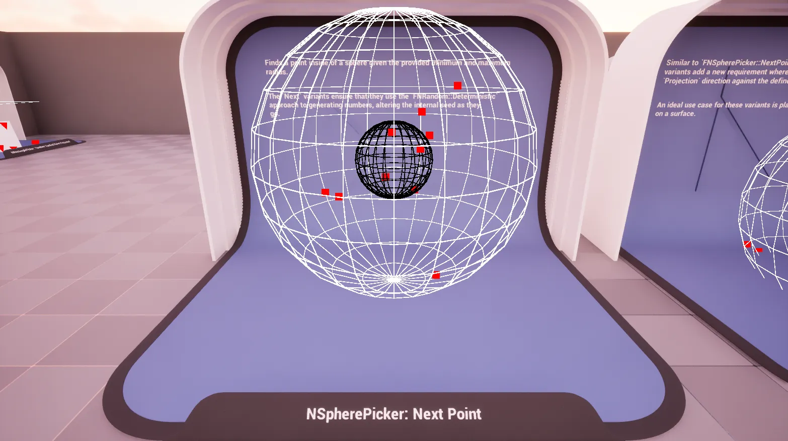
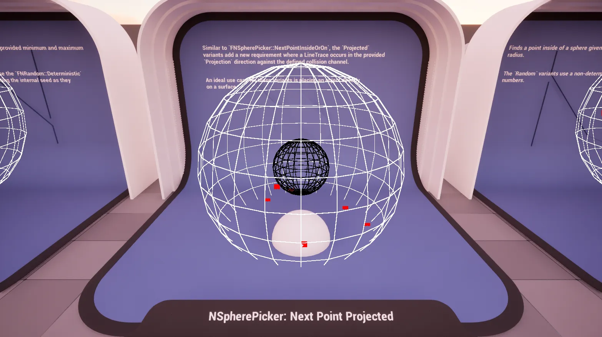
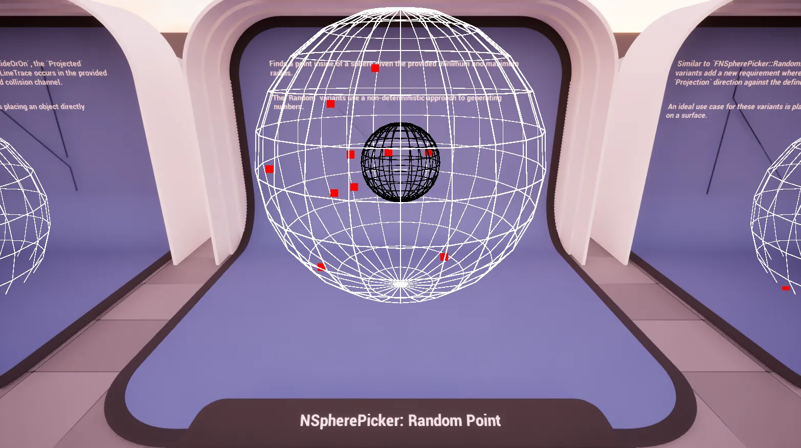
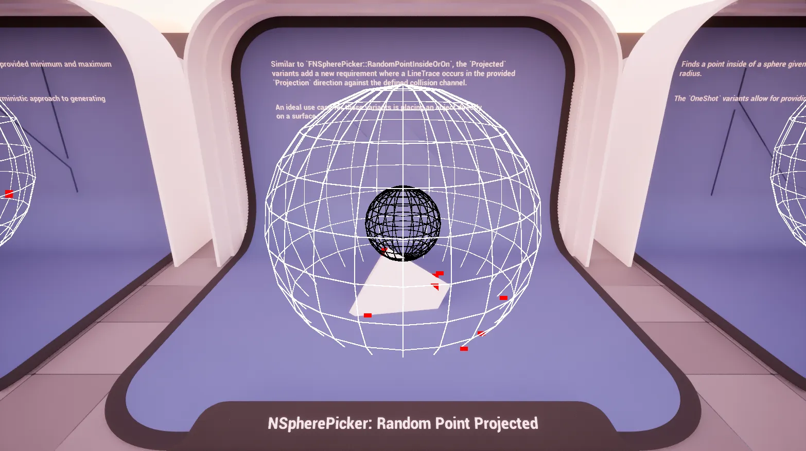
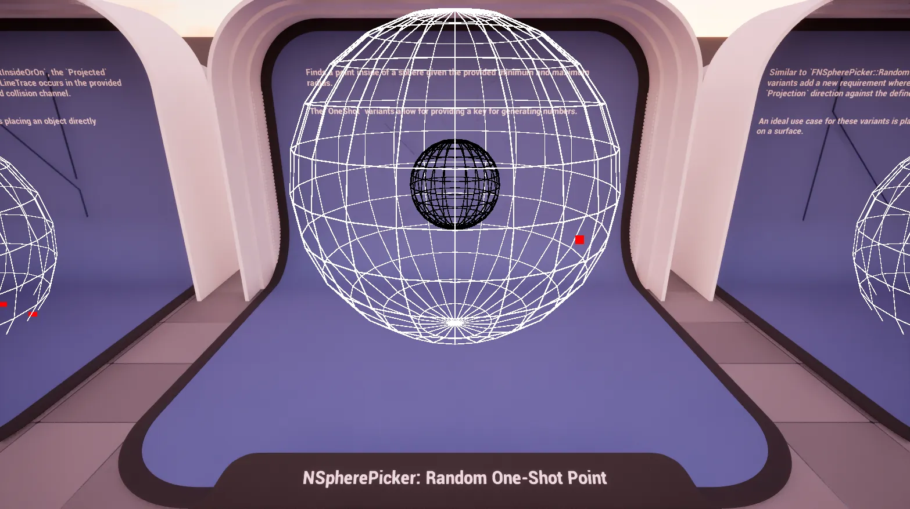
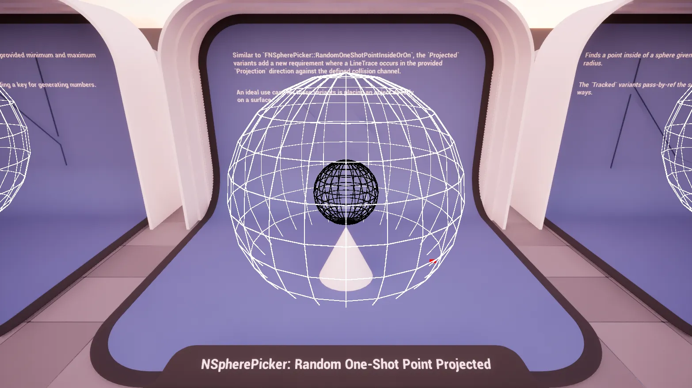
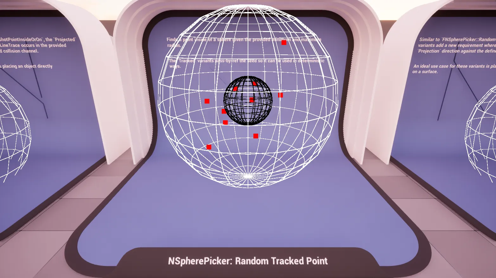
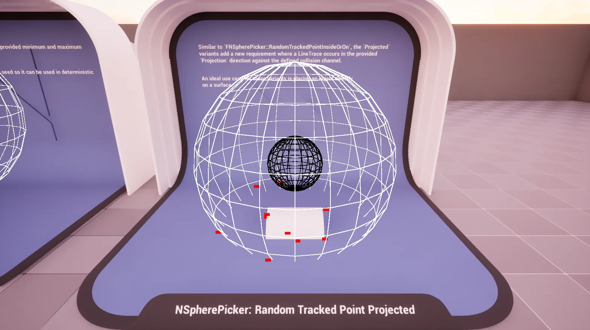

import TypeDetails from '../../../../src/components/TypeDetails';

# Sphere

<TypeDetails icon="ue-blueprint-function-library" base="UBlueprintFunctionLibrary" type="UNSpherePickerLibrary" typeExtra="/ FNSpherePicker" headerFile="NexusActorPools/Public/NSpherePickerLibrary.h" />

Provides various functions for generating points ***[i]nside or [o]n*** the surface of a **sphere** using different random generation strategies (deterministic, non-deterministic, seeded).

The `UNSpherePickerLibrary` wraps the native `FNSpherePicker` functionality in a **Blueprint** friendly manner. Should you be wanting to utilize a picker in _native_ code it is best to directly reference `FNSpherePicker` directly to avoid the abstraction layer as it has a similar API.

## Methods

:::tip

There are **Simple** variants of all of these methods which removes the inner exclusion when not needed as a minor optimization.

:::

### Next Point (IO)

 

Generates a deterministic point ***[i]nside or [o]n*** the surface of a sphere.

:::info

Uses `FNRandom::Deterministic` to ensure reproducible results.

:::

### Next Point Projected (IO)

Generates a deterministic point ***[i]nside or [o]n*** the surface of a sphere, then projects it onto a surface in the world.

:::info

Uses `FNRandom::Deterministic` to ensure reproducible results.

:::

### Random Point (IO)

Generates a random point ***[i]nside or [o]n*** the surface of a sphere.

### Random Point Projected (IO)

Generates a random point ***[i]nside or [o]n*** the surface of a sphere, then projects it onto a surface in the world.

### Random One-Shot Point (IO)

Generates a random point ***[i]nside or [o]n*** the surface of a sphere using a provided seed.

### Random One-Shot Point Projected (IO)

Generates a random point ***[i]nside or [o]n*** the surface of a sphere using a provided seed, then projects it onto a surface in the world.

### Random Tracked Point (IO)

Generates a random point ***[i]nside or [o]n*** the surface of a sphere while tracking the random seed state.

### Random Tracked Point Projected (IO)

Generates a random point ***[i]nside or [o]n*** the surface of a sphere while tracking the random seed state, then projects it onto a surface in the world.

## Parameters

|Variant|Parameter|Type|Description|Default|
|:--|:--|:--|:--|:--|
| _Base_ | Origin | `FVector&` | The center world point of the sphere. ||
| _Base_ | MinimumRadius | `float` | The minimum radius of the sphere (inner bound). ||
|  _Base_ | MaximumRadius | `float` |The maximum radius of the sphere (outer bound). ||
| _Simple_ | Radius | `float` | The radius of the sphere. ||
| **Projected** | WorldContextObject | `UObject*` | Object that provides access to the world, usally auto-filled in Blueprint. | `WorldContext` |
| **Projected** | Projection | `FVector` | Direction and distance for the line trace. | `FVector(0,0,-500.f)` |
| **Projected** | CollisionChannel | `ECollisionChannel` | The collision channel to use for tracing. | `ECC_WorldStatic` |
| **Tracked** | Seed | `int32&` | The seed to be used when generating, and altered for determinism. | |
| **One-Shot** | Seed | `int32` | The throw-away seed used when generating. | |