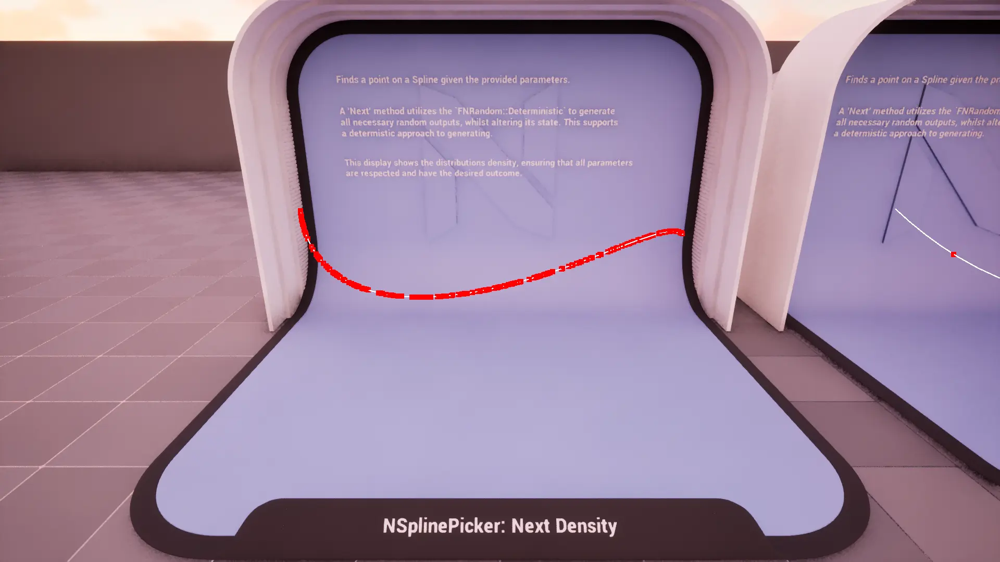
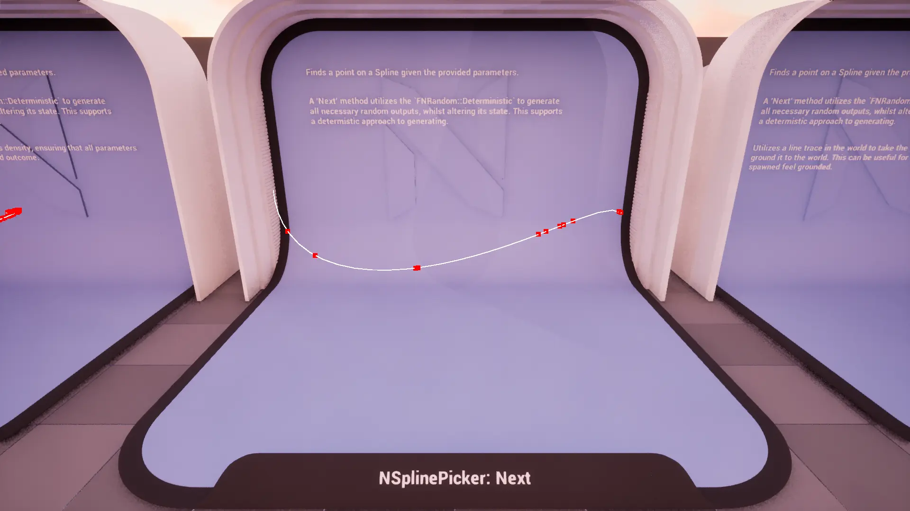
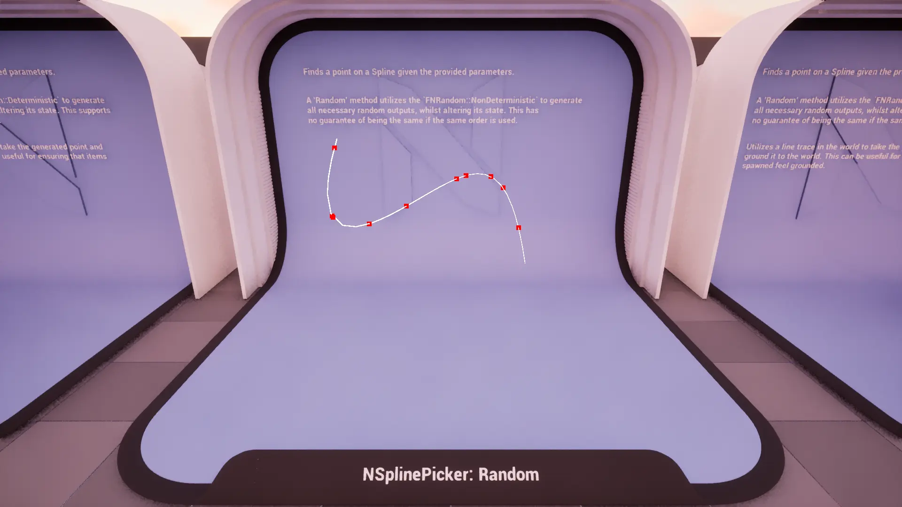
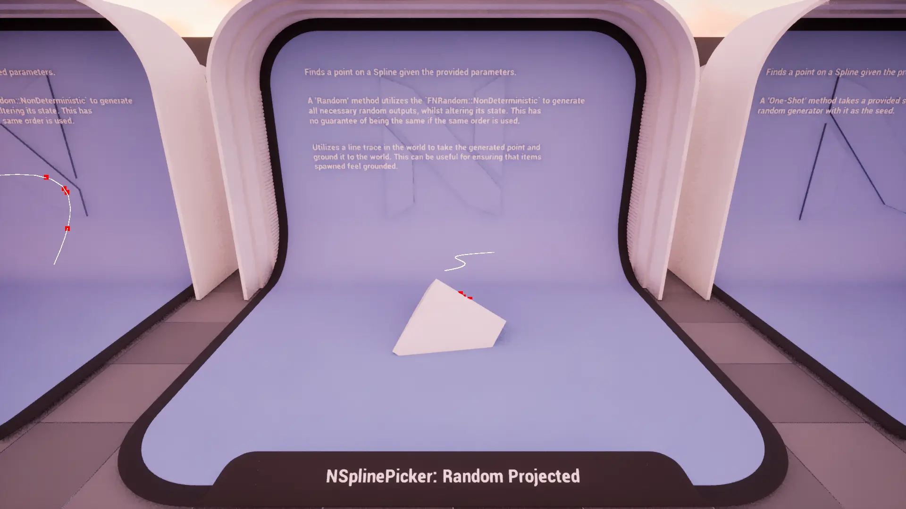
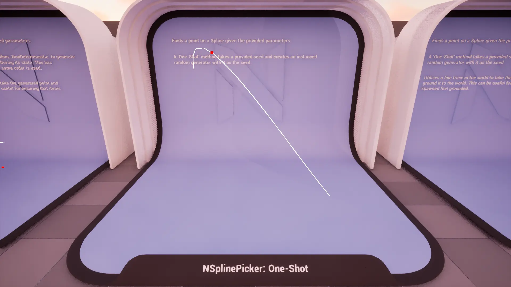
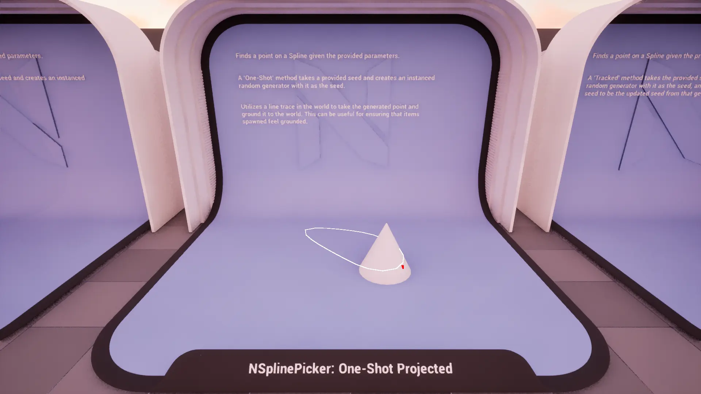
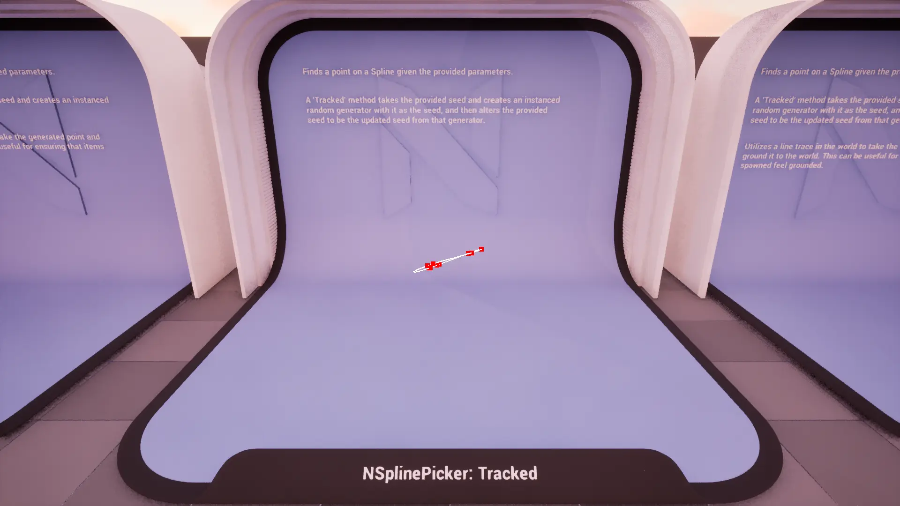
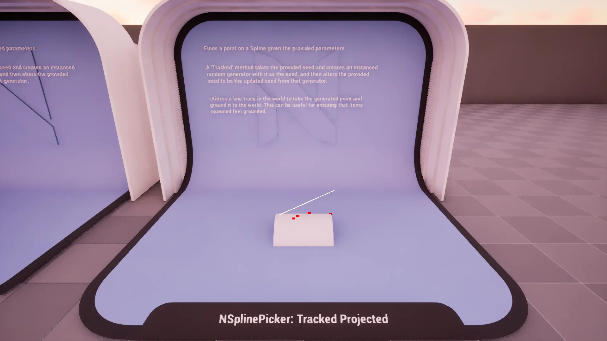

import TypeDetails from '../../../../src/components/TypeDetails';

# Spline

<TypeDetails icon="ue-blueprint-function-library" base="UBlueprintFunctionLibrary" type="UNSplinePickerLibrary" typeExtra="/ FNSplinePicker" headerFile="NexusActorPools/Public/NSplinePickerLibrary.h" />

Provides various functions for generating points along a `USplineComponent` spline using different random generation strategies (deterministic, non-deterministic, seeded).

The `UNSplinePickerLibrary` wraps the native `FNSplinePicker` functionality in a **Blueprint** friendly manner. Should you be wanting to utilize a picker in _native_ code it is best to directly reference `FNSplinePicker` directly to avoid the abstraction layer as it has a similar API.

## Methods

### Next Point

Generates a deterministic point on a `USplineComponent`'s spline.

:::info

Uses `FNRandom::Deterministic` to ensure reproducible results.

:::

### Random Point

Generates a random point on a `USplineComponent`'s spline.

:::info

Uses `FNRandom::NonDeterministic` to produce pseudo-random results.

:::

### One-Shot Point

Generates a random point on a `USplineComponent`'s spline using a provided seed.
nerates a random point on a `USplineComponent`'s spline using a provided seed, then projects it to the world.

### Tracked Point

Generates a random point on a `USplineComponent`'s spline while tracking the random seed state.

## FNSplinePickerParams

### Base
|Parameter|Type|Description|Default|
|:--|:--|:--|:--|
| Count | `int` | The number of points to generate in a single pass. | `1` |
| CachedWorld | `TObjectPtr<UWorld>` | The world for line tracing and drawing. | |
| ProjectionMode | `ENPickerProjectionMode` | Should the point be projected somewhere? | `ENPickerProjectionMode::None` |
| Projection | `FVector` | Direction and distance for the line trace. | `FVector(0,0,-500.f)` |
| CollisionChannel | `TEnumAsByte<ECollisionChannel>` | The collision channel to use for tracing. | `ECC_WorldStatic` |

### Spline
|Parameter|Type|Description|Default|
|:--|:--|:--|:--|
| SplineComponent | `TObjectPtr<USplineComponent>` | The spline component to generate points on. | `nullptr` |