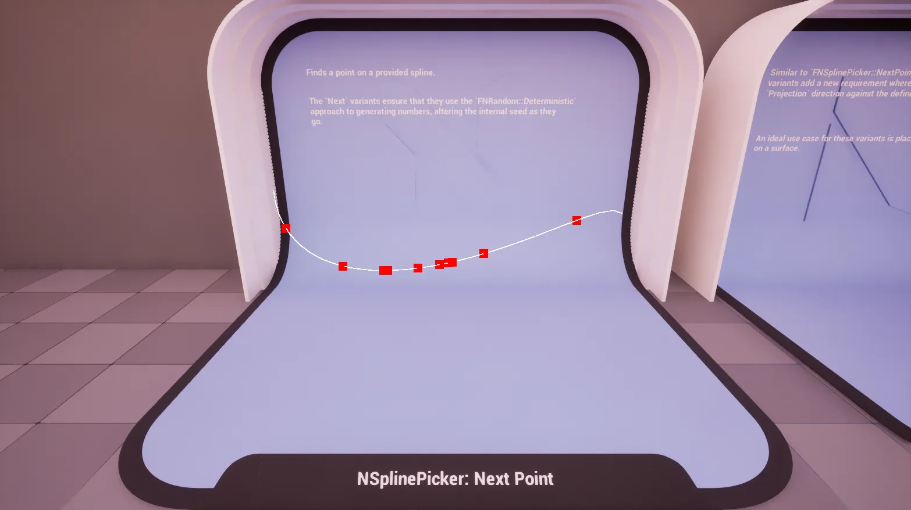
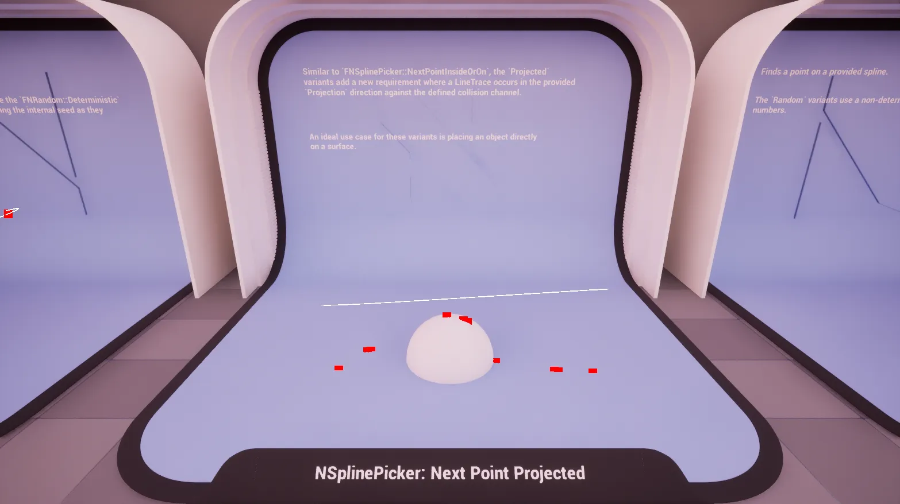
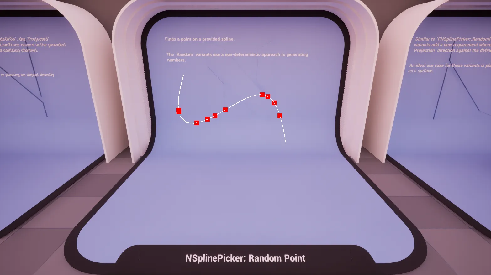
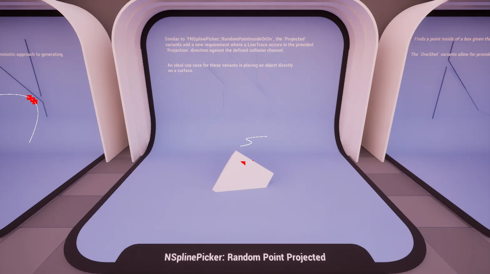
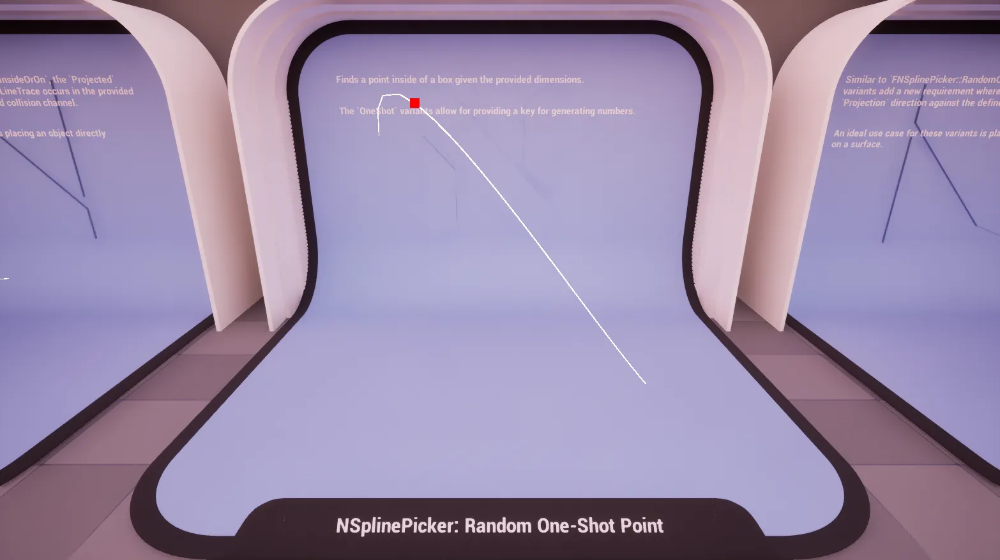
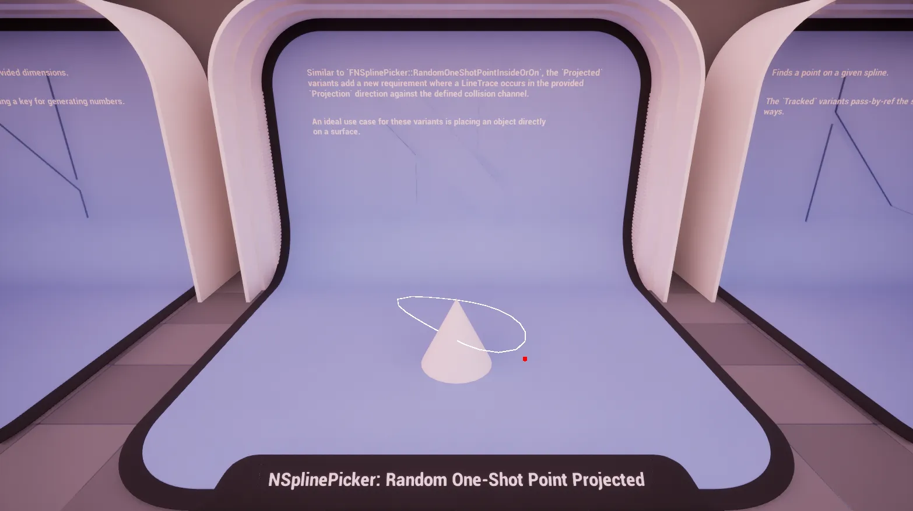
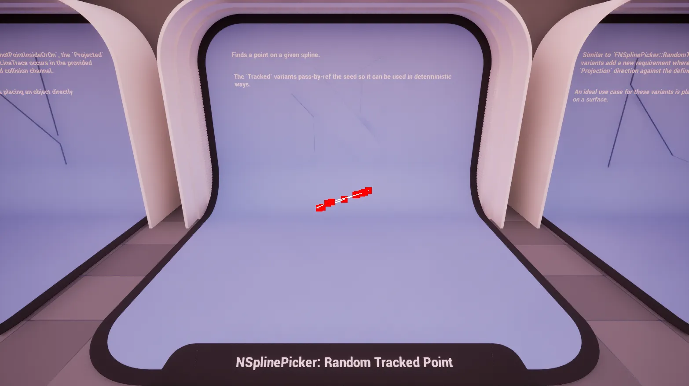
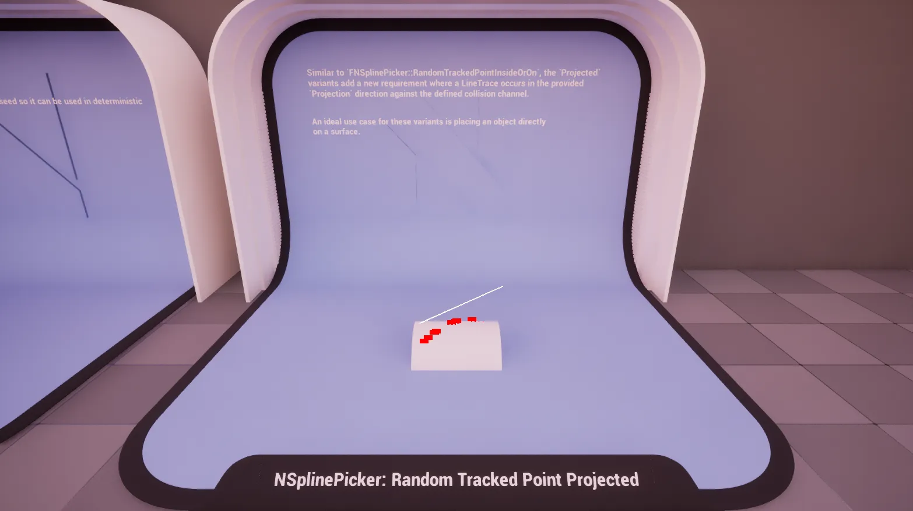

import TypeDetails from '../../../../src/components/TypeDetails';

# Spline

<TypeDetails icon="ue-blueprint-function-library" base="UBlueprintFunctionLibrary" type="UNSplinePickerLibrary" typeExtra="/ FNSplinePicker" headerFile="NexusActorPools/Public/NSplinePickerLibrary.h" />

Provides various functions for generating points along a `USplineComponent` spline using different random generation strategies (deterministic, non-deterministic, seeded).

The `UNSplinePickerLibrary` wraps the native `FNSplinePicker` functionality in a **Blueprint** friendly manner. Should you be wanting to utilize a picker in _native_ code it is best to directly reference `FNSplinePicker` directly to avoid the abstraction layer as it has a similar API.

## Methods

### Next Point (On)

 

Generates a deterministic point on a `USplineComponent`'s spline.

:::info

Uses `FNRandom::Deterministic` to ensure reproducible results.

:::

### Next Point Projected (On)

Generates a deterministic point on a `USplineComponent`'s spline, then projects it to the world.

:::info

Uses `FNRandom::Deterministic` to ensure reproducible results.

:::

### Random Point (On)

Generates a random point on a `USplineComponent`'s spline.

### Random Point Projected (On)

Generates a random point on a `USplineComponent`'s spline, then projects it to the world.

### Random One-Shot Point (On)

Generates a random point on a `USplineComponent`'s spline using a provided seed.

### Random One-Shot Point Projected (On)

Generates a random point on a `USplineComponent`'s spline using a provided seed, then projects it to the world.

### Random Tracked Point (On)

Generates a random point on a `USplineComponent`'s spline while tracking the random seed state.

### Random Tracked Point Projected (On)

Generates a random point on a `USplineComponent`'s spline while tracking the random seed state, then projects it to the world.

## Parameters

|Variant|Parameter|Type|Description|Default|
|:--|:--|:--|:--|:--|
| _Base_ | SplineComponent | `USplineComponent*` |The spline component to generate points on. ||
| **Projected** | Projection | `FVector` | Direction and distance for the line trace. | `FVector(0,0,-500.f)` |
| **Projected** | CollisionChannel | `ECollisionChannel` | The collision channel to use for tracing. | `ECC_WorldStatic` |
| **Tracked** | Seed | `int32&` | The seed to be used when generating, and altered for determinism. | |
| **One-Shot** | Seed | `int32` | The throw-away seed used when generating. | |