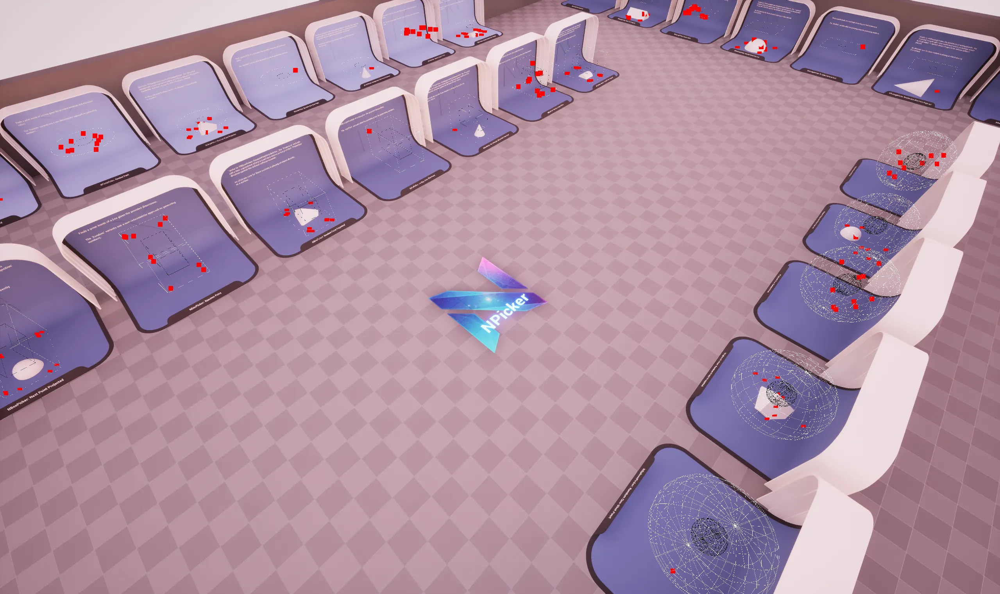

import DocCardList from '@theme/DocCardList';
import PluginDetails from '../../../src/components/PluginDetails';

# Picker

<PluginDetails moduleName="NexusPicker" />

This plugin provides a suite of tools for generating random and deterministic points within various geometric shapes and along splines.  

- **Multiple Shape Types**: Generate points across a wide variety of shapes and specialized components.
- **Various Strategies**: Different number generating strategies allowing for developers to define their own "random".
- **Blueprint Integration**: Full Blueprint support through mirrored function definitions.

Essentially solving the common game development problem of _"how do I randomly but intelligently place things in my world"_ with a comprehensive, performance-oriented solution.

## Samples

The `DEMO_NPicker` sample map is available once you have enabled the `NEXUS Samples: Picker` plugin. This is found in the `NEXUS Samples` category in the `Edit > Plugins` window.

The map shows at runtime all of the different distributions available through the different picking methods.