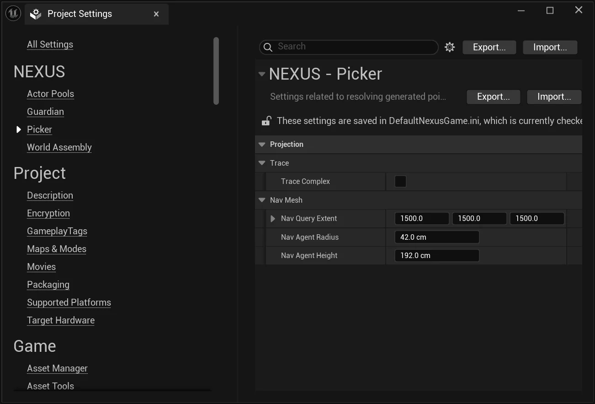

# Project Settings

From the `Edit > Project Settings` window, find the **Picker** section.

These values control how a generated point is resolved onto geometry or the navmesh when a picker's [`ProjectionMode`](types/picker-params.md#projection-mode) is set to something other than `None`. They are read once per generation call on the **Game thread**, so a change applies to every picker in the project. Pickers left at `ProjectionMode::None` ignore these settings entirely.

## Projection

All settings live under a single **Projection** category, split into **Trace** and **NavMesh** subgroups that mirror the two projection modes.

### Trace

Consumed when [`ProjectionMode`](types/picker-params.md#projection-mode) is `Line Trace (Collision)`.

| Setting | Description | Default |
| :-- | --- | :-- |
| `Trace Complex` | Trace against complex (per-polygon) collision instead of simple collision when projecting points onto geometry. | `false` |

### NavMesh

Consumed when [`ProjectionMode`](types/picker-params.md#projection-mode) is `Nearest NavMesh Point (V1)`.

| Setting | Description | Default |
| :-- | --- | :-- |
| `Nav Query Extent` | Half-extent of the box searched when projecting a generated point onto the navmesh. Widen it if points fail to resolve. | `(1500, 1500, 1500)` |
| `Nav Agent Radius` | Radius (cm) of the navigation agent used to resolve a navmesh location for a generated point. | `42.0` |
| `Nav Agent Height` | Height (cm) of the navigation agent used to resolve a navmesh location for a generated point. | `192.0` |

:::info

These settings replace the former `FNPickerUtils` static configuration members. Moving them into project settings makes the projection defaults discoverable, editor-editable, and persisted per-project rather than reset to their defaults on every launch.

:::

## See Also

- [PickerParams](types/picker-params.md) — its `ProjectionMode` decides which of these settings (if any) apply.
- [SettingsUtils](../core/types/settings-utils.md) — supplies the shared container/category every NEXUS settings class registers under.
